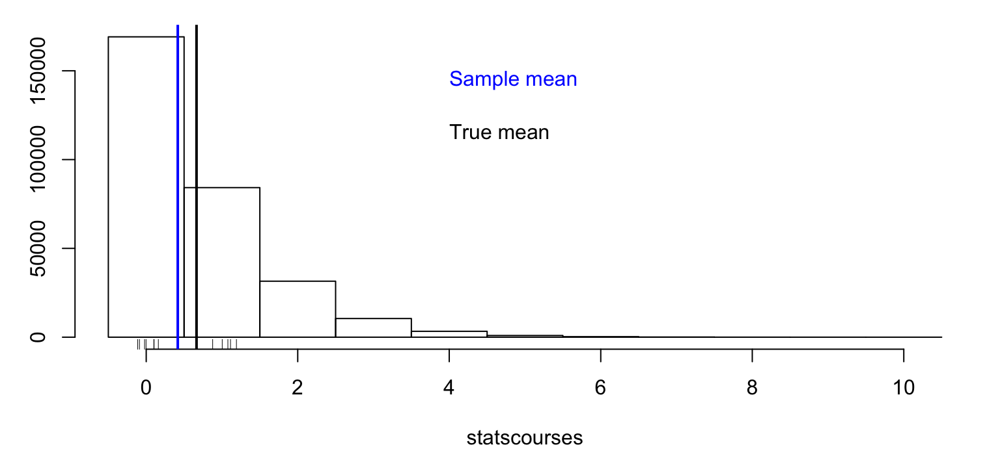
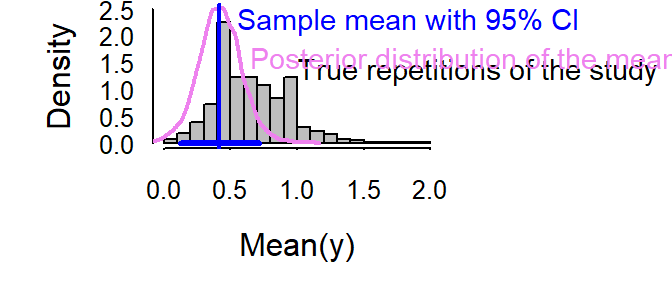
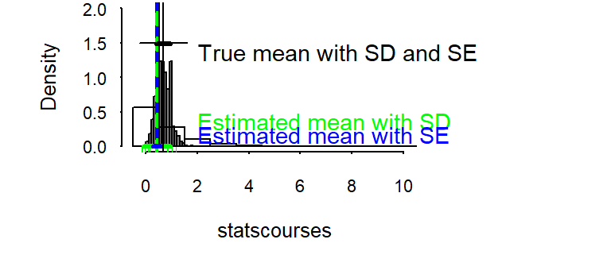
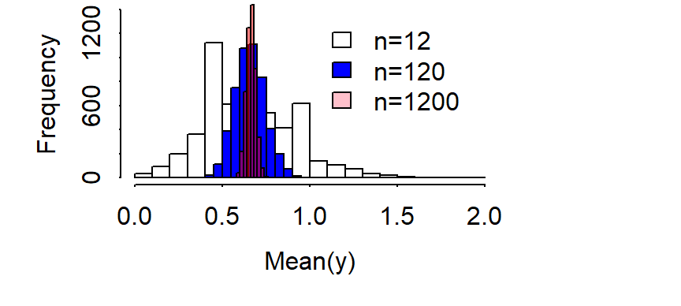
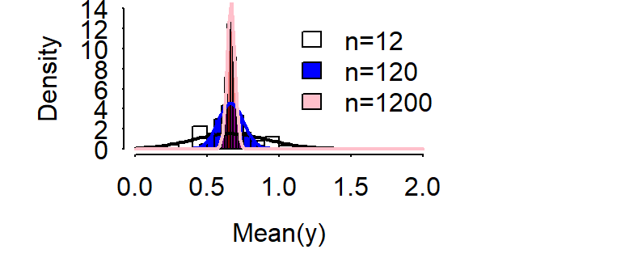
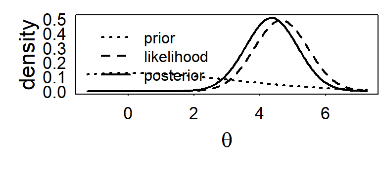
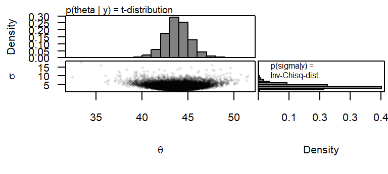

# Prerequisites: What is R and basic statistical terms


## What is R?
* download for free: www.r-project.org 
* authors of first version: Robert Gentleman and Ross Ihaka, University of Auckland
* since 1997: R development core team
* R is a programming language


## Why using R?
* we program the statistical analyses
* we have to know what we do (no clicking)
* analyses are documented and reproducible
* we can write own functions
* methods can be shared (CRAN)

R is easy to learn (intuitive), less strict syntax, slow  
e.g. compared to Python or Julia


## Working with R
### Console and Editor
R Console and Editor (mostly RStudio)

\begin{center}
  \includegraphics[width=1.00\textwidth]{images/RConsole.png}
\end{center}


## Scale of measurement


Scale   | Examples          | Properties        | Coding in R | 
:-------|:------------------|:------------------|:--------------------|
Nominal | Sex, genotype, habitat  | Identity (values have a unique meaning) | `factor()` |
Ordinal | Elevational zones | Identity and magnitude (values have an ordered relationship) | `ordered()` |
Numeric | Discrete: counts;  continuous: body weight, wing length | Identity, magnitude, and equal intervals | `intgeger()` `numeric()` |


## Correlations

###Basics
  
- variance $\hat{\sigma^2} = s^2 = \frac{1}{n-1}\sum_{i=1}^{n}(x_i-\bar{x})^2$  
  
    
      
- standard deviation $\hat{\sigma} = s = \sqrt{s^2}$  
  
    
  
- covariance $q = \frac{1}{n-1}\sum_{i=1}^{n}((x_i-\bar{x})*(y_i-\bar{y}))$  


### Pearson correlation coefficient
  
standardized covariance


  $r=\frac{\sum_{i=1}^{n}(x_i-\bar{x})(y_i-\bar{y})}{\sqrt{\sum_{i=1}^{n}(x_i-\bar{x})^2\sum_{i=1}^{n}(y_i-\bar{y})^2}}$


### Spearman correlation coefficient
rank correlation  
correlation between rank(x) and rank(y)  
  
  robust against outliers

### Kendall's tau
rank correlation  

I = number of pairs (i,k) for which $(x_i < x_k)$ & $(y_i > y_k)$ or viceversa  
$\tau = 1-\frac{4I}{(n(n-1))}$


## Principal components analyses PCA
rotation of the coordinate system

<div class="figure" style="text-align: left">

<p class="caption">(\#fig:unnamed-chunk-2)Principal components are eigenvectors of the covariance or correlation matrix</p>
</div>


rotation of the coordinate system so that   

* first component explains most variance  
* second component explains most of the remaining variance and is perpendicular to the first one  
* third component explains most of the remaining variance and is perpendicular to the first two  
* ...  

$(x,y)$ becomes $(pc1, pc2)$  
where  
$pc1_i= b_{11} x_i + b_{12} y_i$  
$pc2_i = b_{21} x_i + b_{22} y_i$ with $b_{jk}$ being loadings


```r
pca <- princomp(cbind(x,y), cor=TRUE)
loadings(pca)
```

```
## 
## Loadings:
##   Comp.1 Comp.2
## x  0.707  0.707
## y  0.707 -0.707
## 
##                Comp.1 Comp.2
## SS loadings       1.0    1.0
## Proportion Var    0.5    0.5
## Cumulative Var    0.5    1.0
```
loadings of a component can be multiplied by -1


proportion of variance explained by each component  
number of components = number of variables

```r
summary(pca)
```

```
## Importance of components:
##                           Comp.1    Comp.2
## Standard deviation     1.2798982 0.6015485
## Proportion of Variance 0.8190697 0.1809303
## Cumulative Proportion  0.8190697 1.0000000
```
outlook: components with low variance are shrinked to a higher degree in Ridge regression


## Inferential statistics
\begin{center}
  \includegraphics[width=1.00\textwidth]{images/Amrhein_PeerJ2018.png}
\end{center}

https://peerj.com/preprints/26857

> there is never a "yes-or-no" answer  
> there will always be uncertainty  
Amrhein (2017)

Statistical analyses is quantifying uncertainty.


Quantification of uncertainty only possible if  
  
1. the mechanisms under study are known
2. the observations are a random sample from the population of interest

Solutions:  
1. working with models and reporting assumptions  
2. study design

> reported uncertainties always are too small!


Example: Number of stats courses before starting a PhD among all PhD students

```r
# simulate the virtual true data
set.seed(235325)   # set seed for random number generator

# simulate fake data of the whole population
statscourses <- rpois(300000, rgamma(300000, 2, 3))  

# draw a random sample from the population
n <- 12            # sample size
y <- sample(statscourses, 12, replace=FALSE)         
```





We observe the sample mean, what do we know about the population mean?  

Frequentist solution: How would the sample mean scatter, if we repeat the study many times?  

Bayesian solution: For any possible value, what is the probability that it is the true population mean?  



Standard deviation and standard error  



SE = SD/sqrt(n)  
  
SE = SD of posterior distribution


## Central limit theorem / law of large numbers
  
    



normal distribution = Gaussian distribution  
 
 $p(\theta) = \frac{1}{\sqrt{2\pi}\sigma}exp(-\frac{1}{2\sigma^2}(\theta -\mu)^2)$  
   
     
       
   $E(\theta) = \mu$, $var(\theta) = \sigma^2$, $mode(\theta) = \mu$


  
    



## Bayes theorem

  
  
$P(A|B) = \frac{P(B|A)P(A)}{P(B)}$  

sex    | flowers        | wine           | **sum**               | 
:------|:---------------|:---------------|:------------------|
female | 2  | 1  | **3** |
male   | 2  | 2  | **4** |
-------|----------------|----------------|-------------------|
**sum**    | **4**| **3**| **7** |

What is the probability that the person likes wine given it is a female?  
$P(A) =$ likes wine $= 0.43$  
$P(B) =$ female $= 0.43$   

$P(B|A) =$ proportion of females among the wine liker $= 0.33$

Knowing the person's sex increases the knowledge of the birthday preference.


## Bayes theorem for continuous parameters

$p(\theta|y) = \frac{p(y|\theta)p(\theta)}{p(y)} = \frac{p(y|\theta)p(\theta)}{\int p(y|\theta)p(\theta) d\theta}$    


$p(\theta|y)$: posterior distribution

$p(y|\theta)$: likelihood, data model

$p(\theta)$: prior distribution

$p(y)$: scaling constant


### Single parameter model

$p(y|\theta) = Norm(\theta, \sigma)$, with $\sigma$ known 
  
  
$p(\theta) = Norm(\mu_0, \tau_0)$  

$p(\theta|y) = Norm(\mu_n, \tau_n)$, where
 $\mu_n= \frac{\frac{1}{\tau_0^2}\mu_0 + \frac{n}{\sigma^2}\bar{y}}{\frac{1}{\tau_0^2}+\frac{n}{\sigma^2}}$ and
 $\frac{1}{\tau_n^2} = \frac{1}{\tau_0^2} + \frac{n}{\sigma^2}$
  
    
  $\bar{y}$ is a sufficient statistics  
  $p(\theta) = Norm(\mu_0, \tau_0)$ is a conjugate prior for $p(y|\theta) = Norm(\theta, \sigma)$, with $\sigma$ known.


Posterior mean = weighted average between prior mean and $\bar{y}$ with weights
equal to the precisions ($\frac{1}{\tau_0^2}$ and $\frac{n}{\sigma^2}$)



### A model with two parameters
$p(y|\theta, \sigma) = Norm(\theta, \sigma)$ 
  
\begin{center}
  \includegraphics[width=0.5\textwidth]{images/snowfinch.jpg}
\end{center}


```r
# weight (g)
y <- c(47.5, 43, 43, 44, 48.5, 37.5, 41.5, 45.5)
n <- length(y)
```


$p(y|\theta, \sigma) = Norm(\theta, \sigma)$ 
  
    
$p(\theta, \sigma) = N-Inv-\chi^2(\mu_0, \sigma_0^2/\kappa_0; v_0, \sigma_0^2)$ conjugate prior

  
$p(\theta,\sigma|y) = \frac{p(y|\theta, \sigma)p(\theta, \sigma)}{p(y)} = N-Inv-\chi^2(\mu_n, \sigma_n^2/\kappa_n; v_n, \sigma_n^2)$, with  

  
$\mu_n= \frac{\kappa_0}{\kappa_0+n}\mu_0 + \frac{n}{\kappa_0+n}\bar{y}$  
  
  $\kappa_n = \kappa_0+n$  
  
  $v_n = v_0 +n$  
  
  $v_n\sigma_n^2=v_0\sigma_0^2+(n-1)s^2+\frac{\kappa_0n}{\kappa_0+n}(\bar{y}-\mu_0)^2$

  
 $\bar{y}$ and $s^2$ are sufficient statistics  


Joint, marginal and conditional posterior distributions



## t-distribution
marginal posterior distribution of a normal mean with unknown variance and conjugate prior distribution
