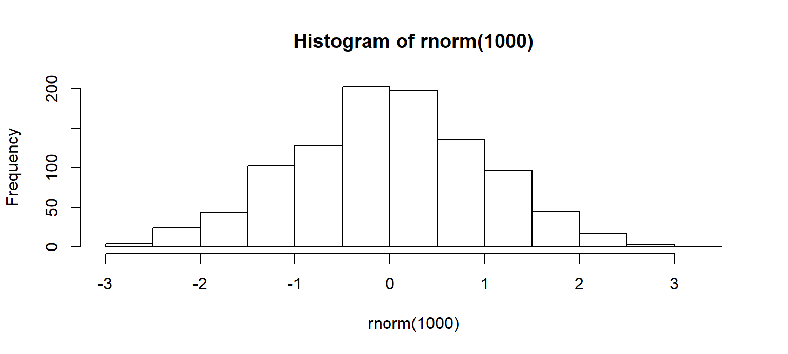

# Probability distributions {#distributions}

## Introduction


```r
hist(rnorm(1000))
```

<div class="figure">

<p class="caption">(\#fig:test)Das ist ein Versuch.</p>
</div>


## Normal distribution
xxx

## Poisson distribution
xxx

## Gamma distribution
xxx


