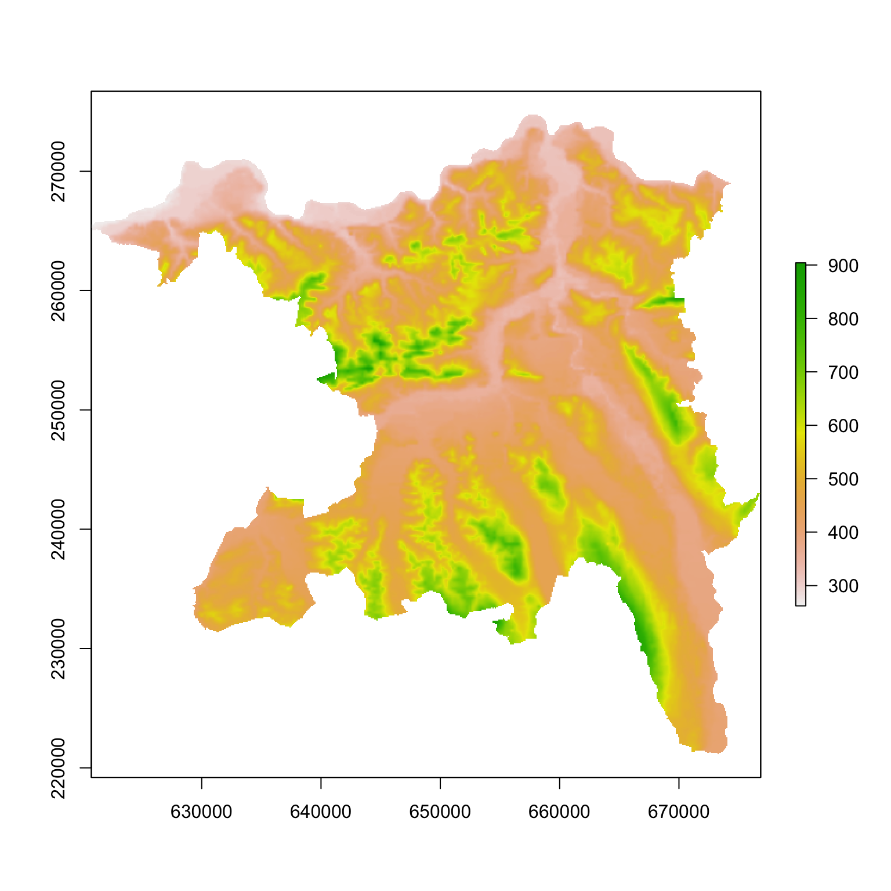
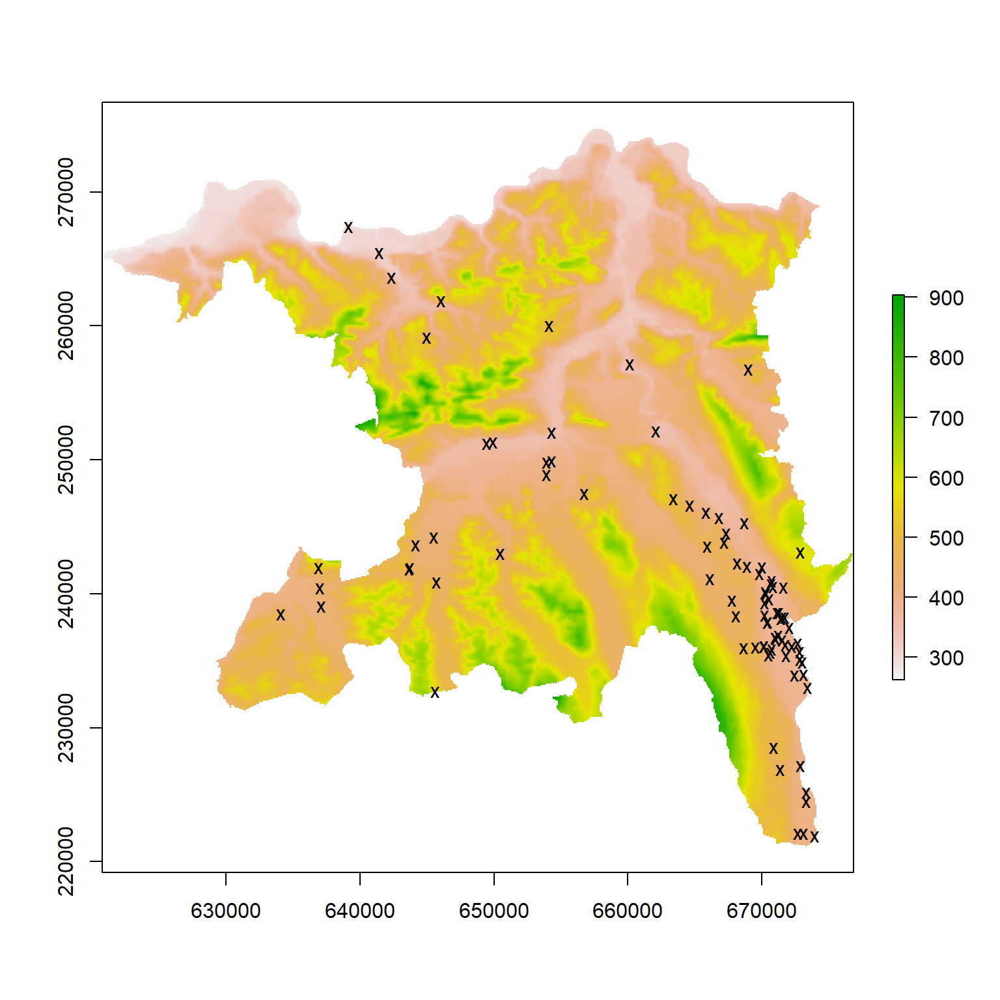

# Spatial analyses and maps {#rgis}


- Almost all the things that we can do with traditional geographic information system we can also do within R.
- If we do it in R we get the useful benefits of a script approach that allows for reproducible analyses (see Chapter \@ref(reproducible)) and that can be scaled to many more objects or larger data sets.
- Here we simply introduce the packages and functions that we most often use when working with spatial data.

## Data types
### Raster data {#rasterdata}
Very broadly speaking, we divide spatial data into two categories, raster data and all other types of data for points, lines or polygons. Raster data consists of a grid (i.e. a matrix) where each cell of the grid contains one or several values representing the spatial information. The R-package `raster` is very efficient for raster data. 

We can use the function `raster()` to load raster data from files. Most of the common file formats for raster data such as .geotiff, .tif or .grd are supported. However, raster data can also be converted from tables with one column for the x-coordinates, one column for the y-coordinates and one column for the spatial information. The coordinates must be from a regular grid. For example the freely available [topographic data of Switzerland](https://www.bfs.admin.ch/bfs/de/home/dienstleistungen/geostat/geodaten-bundesstatistik/topografie.html) are collected on a 100m x 100m grid. In the following example the tibble `elevations` contains the elevation data from the canton of Aargau and is converted into raster data using the function `rasterFromXYZ()`.


```r
library(raster)
ra <- rasterFromXYZ(elevation)
plot(ra)
```

<div class="figure">

<p class="caption">(\#fig:unnamed-chunk-3)Meter above sea leavel (m) accross the canton Aargau in Switzerland.</p>
</div>

### Geometry data
All geometry data types are composed of points. The spatial location of a point is defined by its x and y coordinates. Using several points one can then define lines (sequence of points connected by straight lines) and polygons (sequence of points that form a closed ring). Points, lines and plygons are the geometries we usually work with. We use the package `sf` to work with geometry data types. Its functions are very efficient to work with all spatial data other than raster data. It also links to GDAL (i.e. a computer software library for reading and writing raster and vector geospatial data formats) and proj.4 (i.e. a library for performing conversions between cartographic projections), which are important tools when woring with different sources of spatial data.

We can used the function `st_read()` to read geometry data from file or database. In the following example, however, we convert the tibble `frogs` into a simple feature collection. The data file `frogs`, formatted as a tibble, contains different columns including the counts, variables that describe the ponds as well as the spatial coordinates of the counts. The simple feature collection looks rather similar to the original tibble, however instead of the x and y colomns it now contains the column geometry. With the simple feature collection we can work pretty much in the same way as we use to work with tibbles. For example we can filter only the data from 2011, select the geometries and plot them on the top of the raster with the elevation across the entire canton of Aargau (see \@ref(rasterdata) for the raster data).


```r
library(sf)
dat <- frogs %>% st_as_sf(coords = c("x", "y"))
plot(ra)
dat %>% filter(year == 2011) %>% 
  st_geometry() %>% 
  plot(add = TRUE, pch = "x")
```

<div class="figure">

<p class="caption">(\#fig:unnamed-chunk-4)Locations of the ponds where frogs were counted in 2011. The background image shows the elevation (meter above sea level).</p>
</div>

## Basic functions
In this chapter we shortly describe some functions that we often use when working with spatial data in R.

### Coordinate systems
An important aspect of spatial data is the coordinate reference system (CRS). A CRS determines for instance where the center of the map is, the units for the coordinates and others. [PROJ.4](https://proj4.org/#) is an open source software library that is commonly used for CRS transformation. Most commonly used CRSs have been assigned a HERE IS SOMETHING MISSING. The EPSG (European Petroleum Survey Group) code is a unique ID that can be used to identify a CRS. Thus if we know the EPSG code it is rather simple to transform spatial data into other CRS. To search for the correct EPSG code we can use https://www.epsg-registry.org or http://www.spatialreference.org

The following code shows how to assign the CRS of existing data and how to transform the coordinate system for raster data and sf data, respectively.


```r
# Assign CRS for raster data
crs(ra) <- CRS("+init=epsg:21781")

# Assign CRS for sf data
st_crs(dat) <- 21781

# Transfrom raster data to WGS84
projectRaster(ra, crs = CRS("+init=epsg:4326"))

# Transfrom sf data to WGS84
st_transform(dat, crs = 4326)
```


## Further reading
- [Geocomputation with R](https://geocompr.robinlovelace.net): This online-book is aimed at people who want to do spatial data analysis, visualization and modeling using open source software and reproducible workflows. 

- [Spatial Data Analysis and Modeling with R](http://rspatial.org/index.html): Online introduction to do spatial analyses with R. Good introduction to coordinate systems and projections.


