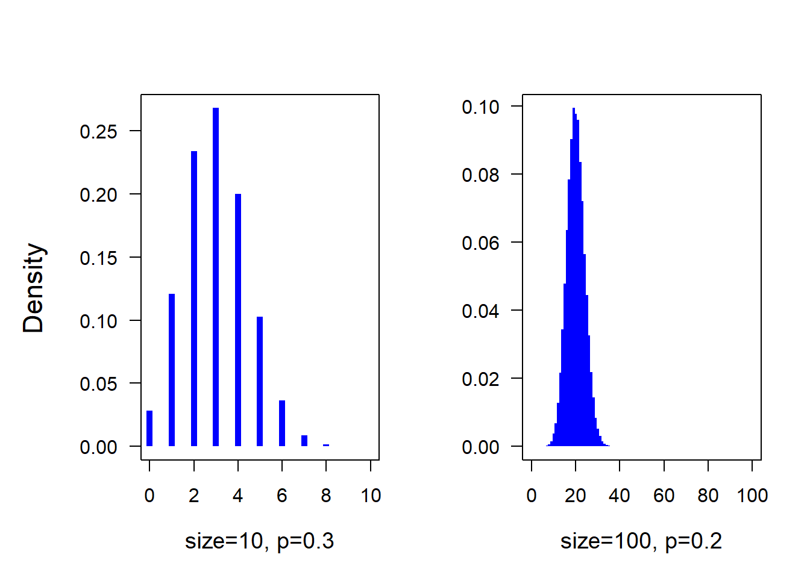
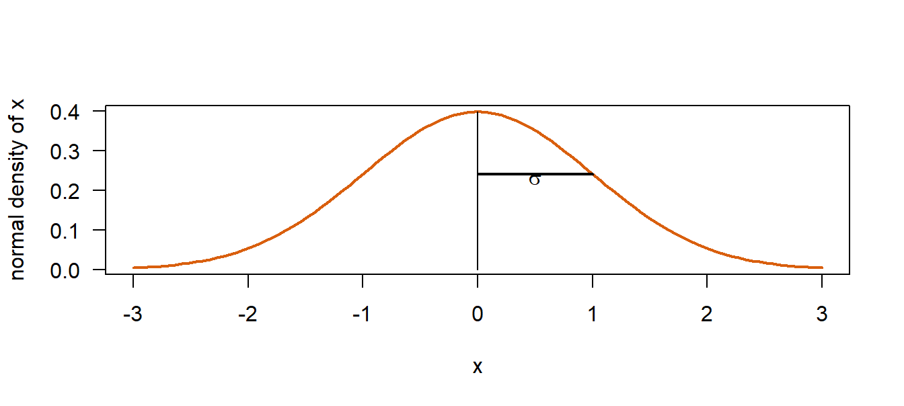
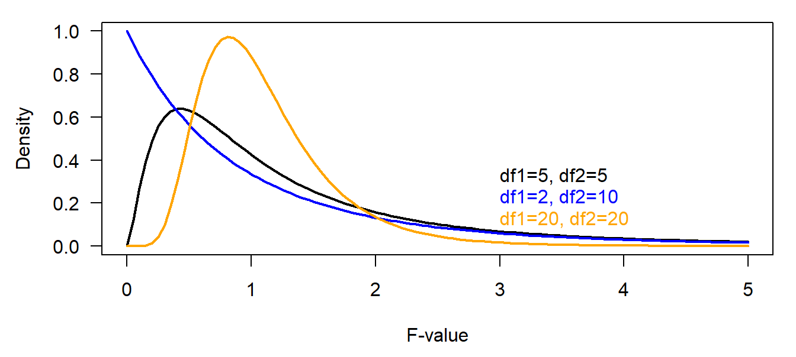

# Probability distributions {#distributions}

## Introduction

In Bayesian statistics, probability distributions are used for two fundamentally different purposes. First, they are used to describe distributions of data. These distributions are also called data distributions. Second, probability distributions are used to express information or knowledge about parameters. Such distributions are called prior or posterior distributions. The data distributions are part of descriptive statistics, whereas prior and posterior distributions are part of inferential statistics. The usage of probability distributions for describing data does not differ between frequentist and Bayesian statistics. Classically, the data distribution is known as "model assumption". Specifically to Bayesian statistics is the formal expression of statistical uncertainty (or "information" or "knowledge") by prior and posterior distributions. We here introduce some of the most often used probability distributions and present how they are used in statistics. 

Probability distributions are grouped into discrete and continuous distributions. Discrete distributions define for any discrete value the probability that exactly this value occurs. They are usually used as data distributions for discrete data such as counts. The function that describes a discrete distribution is called a probability function (their values are probabilities, i.e. a number between 0 and 1). Continuous distributions describe how continuous values are distributed. They are used as data distributions for continuous measurements such as body size and also as prior or posterior distributions for parameters such as the mean body size. Most parameters are measured on a continuous scale. The function that describes continuous distributions is called density function. Its values are non-negative and the area under the density function equals one. The area under a density function corresponds to probabilities. For example, the area under the density function above the value 2 corresponds to the proportion of data with values above 2 if the density function describes data, or it corresponds to the probability that the parameter takes on a value bigger than 2 if the density function is a posterior distribution.  


## Discrete distributions

### Bernoulli distribution {#bernoulli-dist}

Bernoulli distributed data take on the exact values 0 or 1. The value 1 occurs with probability $p$.    

$x \sim Bernoulli(p)$  

The probability function is $p(x) = p^x(1-p)^{1-x}$. 
The expected value is $E(x) = p$ and the variance is $Var(x) = p(1-p)$.

The flipping experiment of a fair coin produces Bernoulli distributed data with $p=0.5$ if head is taken as one and tail is taken as zero. The Bernoulli distribution is usually used as a data model for binary data such as whether a nest box is used or not, whether a seed germinated or not, whether a species occurs or not in a plot etc. 

### Binomial distribution {#binomial-dist}

The binomial distribution describes the number of ones among a predefined number of Bernoulli trials. For example, the number of heads among 20 coin flips, the number of used nest boxes among the 50 nest boxes of the study area, or the number of seed that germinated among the 10 seeds in the pot. Binomially distributed data are counts with an upper limit ($n$).

$x \sim binomial(p,n)$ 

The probability function is $p(x) = {n\choose x} p^x(1-p)^{(n-x)}$.
The expected value is $E(x) = np$ and the variance is $Var(x) = np(1-p)$.


<div class="figure">

<p class="caption">(\#fig:unnamed-chunk-1)Two examples of a binomial distribution. size: number of trials (the argument in the corresponding R function, for example in rbinom, is called size). p: success probability.</p>
</div>


### Poisson distribution

The Poisson distribution describes the distribution of counts without upper boundary, i.e., when we know how many times something happened but we do not know how many times it did not happen. A typical Poisson distributed variable is the number of raindrops in equally-sized grid cells on the floor, if we can assume that every rain drop falls down completely independent of the other raindrops and at a completely random point. 

$x \sim Poisson(\lambda)$  

The probability function is $p(x) = \frac{1}{x!}\lambda^xexp(-\lambda)$. It is implemented in the R-function `dpois`.
The expected values is $E(x) = \lambda$ and the variance is $Var(x) = \lambda$.

An important property of the Poisson distribution is that it has only one parameter $\lambda$. As a consequence, it does not allow for any combination of means and variances. In fact, they are assumed to be the same. In the real world, most count data do not behave like rain drops, that means variances of count data are in most real world examples not equal to the mean as assumed by the Poisson distribution. Therefore, when using the Poisson distribution as a data model, it is important to check for overdispersion.

Further, note that not all variables measured as an integer number are count data! For example, the number of days an animal spends in a specific area before moving away looks like a count. However, it is a continuous measurement. The duration an animal spends in a specific areas could also be measured in hours or minutes. The Poisson model assumes that the counts are all events that happened. However, an emigration of an animal is just one event, independent of how long it stayed.  


### Negative-binomial distribution

The negative-binomial distribution represents the number of zeros which occur in a sequence of Bernoulli trials before a target number of ones is reached. It is hard to see this situation in, e.g., the number of individuals counted on plots. Therefore, we were reluctant to introduce this distribution in our old book [@KornerNievergelt2015]. However, the negative-binomial distribution often fits much better to count data than the Poisson model because it has two parameters and therefore allows for fitting both the mean and the variance to the data. Therefore, we started using the negative-binomial distribution as a data model more often. 
$x \sim negative-binomial(p,n)$ 

Its probability function is rather complex:  

$p(x) = \frac{\Gamma(x+n)}{\Gamma(n) x!} p^n (1-p)^x$  with $\Gamma$ being the Gamma-function. Luckily, the negative-binomial probability function is implemented in the R-function `dnegbin`.   
The expected value of the negative-binomial distribution is $E(x) = n\frac{(1-p)}{p}$ and the variance is $Var(x) = n\frac{(1-p)}{p^2}$.
We like to specify the distribution using the mean and the scale parameter $x \sim negativ-binomial(\mu,\theta)$, because in practice we often specify a linear predictor for the logarithm of the mean $\mu$. 


## Continuous distributions

### Beta distribution

The beta distribution is restricted to the range [0,1]. It describes the knowledge about a probability parameter. Therefore, it is usually used as a prior or posterior distribution for probabilities. The beta distribution sometimes is used as a data model for continuous probabilities, However, it is difficult to get a good fit of such models, because measured proportions often take on values of zero and ones which is not allowed in most (but not all) beta distributions, thus this distribution does not describe the variance of measured proportions correctly. However, for describing knowledge of a proportion parameter, it is a very convenient distribution with two parameters. 

$x \sim beta(a,b)$

Its density function is $p(x) = \frac{\Gamma(a+b)}{\Gamma(a)\Gamma(b)}x^{a-1}(1-x)^{b-1}$. The R-function `dbeta`does the rather complicated calculations for us.

The expected value of a beta distribution is $E(x) = \frac{a}{(a+b)}$ and the variance is $Var(x) = \frac{ab}{(a+b)^2(a+b+1)}$. The $beta(1,1)$ distribution is equal to the $uniform(0,1)$ distribution. The higher the sum of $a$ and $b$, the more narrow is the distribution (Figure \@ref(fig:betadist)).

<div class="figure">

<p class="caption">(\#fig:betadist)Beta distributions with different parameter values.</p>
</div>


### Normal distribution {#normdist}

The normal, or Gaussian distribution is widely used since a long time in statistics. It describes the distribution of measurements that vary because of a sum of random errors. Based on the central limit theorem, sample averages are approximately normally distributed (\@ref(basics)).    
 
$x \sim normal(\mu, \sigma^2)$  
 
The density function is $p(x) = \frac{1}{\sqrt{2\pi}\sigma}exp(-\frac{1}{2\sigma^2}(x -\mu)^2)$ and it is implemented in the R-function `dnorm`. 
     
The expected value is $E(x) = \mu$ and the variance is $Var(x) = \sigma^2$.

The variance parameter can be specified to be a variance, a standard deviation or a precision. Different software (or authors) have different habits, e.g., R and Stan use the standard deviation sigma $\sigma$, whereas BUGS (WinBugs, OpenBUGS or jags) use the precision, which is the inverse of the variance $\tau= \frac{1}{\sigma^2} $.

The normal distribution is used as a data model for measurements that scatter symmetrically around a mean, such as body size (in m), food consumption (in g), or body temperature (°C). 
The normal distribution also serves as prior distribution for parameters that can take on negative or positive values. The larger the variance, the flatter (less informative) is the distribution.

The standard normal distribution is a normal distribution with a mean of zero and a variance of one, $z \sim normal(0, 1)$. The standard normal distribution is also called the z-distribution. Or, a z-variable is a variable with a mean of zero and a standard deviation of one.


```r
x <- seq(-3, 3, length=100)
y <- dnorm(x) # density function of a standard normal distribution
dat <- tibble(x=x,y=y)
plot(x,y, type="l", lwd=2, col="#d95f0e", las=1, ylab="normal density of x")
segments(0, dnorm(1), 1, dnorm(1), lwd=2)
segments(0, dnorm(0), 0, 0)
text(0.5, 0.23, expression(sigma))
```

<div class="figure">

<p class="caption">(\#fig:normdistplot)Standard normal distribution</p>
</div>

Plus minus one times the standard deviation ($\sigma$) from the mean includes around 68% of the area under the curve (corresponding to around 68% of the data points in case the normal distribution is used as a data model, or 68% of the prior or posterior mass if the normal distribution is used to describe the knowledge about a parameter). Plus minus two times the standard deviation includes around 95% of the area under the curve. 


### Gamma distribution

The gamma distribution is a continuous probability distribution for strictly positive values (zero is not included). The shape of the gamma distribution is right skewed with a long upper tail, whereas most of the mass is centered around a usually small value. It has two parameters, the shape $\alpha$ and the inverse scale $\beta$.

$x \sim gamma(\alpha,\beta)$

Its density function is $p(x) = \frac{\beta^{\alpha}}{\Gamma(\alpha)} x^{(\alpha-1)} exp(-\beta x)$, or `dgamma` in R. The expected value is $E(x) = \frac{\alpha}{\beta}$ and the variance is $Var(x) = \frac{\alpha}{\beta^2}$.

The gamma distribution is becoming more and more popular as a data model for durations (time to event) or other highly right skewed continuous measurements that do not have values of zero. 

The gamma distribution is a conjugate prior distribution for the mean of a Poisson distribution and for the precision parameter of a normal distribution. However, in hierarchical models with normally distributed random effects, it is not recommended to use the gamma distribution as a prior distribution for the among-group variance [@Gelman.2006]. The Cauchy or folded t-distribution seem to have less influence on the posterior distributions of the variance parameters. 


### Cauchy distribution {#cauchydistri}

The Cauchy distribution is a symmetric distribution with much heavier tails compared to the normal distribution. 

$ x \sim Cauchy(a,b)$

Its probability density function is $p(x) = \frac{1}{\pi b[1+(\frac{x-a}{b})^2]}$. The mean and the variance of the Cauchy distribution are not defined. The median is $a$. 
The part of the Cauchy distribution for positive values, i.e.,  half of the Cauchy distribution, is often used as a prior distribution for variance parameters. 


### t-distribution

The t-distribution is the marginal posterior distribution of a the mean of a sample with unknown variance when conjugate prior distributions are used to obtain the posterior distribution. The t-distribution has three parameters, the degrees of freedom $v$, the location $\mu$ and the scale $\sigma$.

$x \sim t(v, \mu, \sigma)$

Its density function is $p(x) = \frac{\Gamma((v+1)/2)}{\Gamma(v/2)\sqrt{v\pi}\sigma}(1+\frac{1}{v}(\frac{x-\mu}{\sigma})^2)^{-(v+1)/2}$. Its expected value is $E(x) = \mu$ for $v>1$ and the variance is $Var(x) = \frac{v}{v-2}\sigma ^2$ for $v>2$.

The t-distribution is sometimes used as data model. Because of its heavier tails compared to the normal model, the model parameters are less influenced by measurement errors when a t-distribution is used instead of a normal distribution. This is called "robust statistics". 

Similar to the Cauchy distribution, the folded t-distribution, i.e., the positive part of the t-distribution, can serve as a prior distribution for variance parameters.


### F-distribution

The F-distribution is not important in Bayesian statistics. 
Ratios of sample variances drawn from populations with equal variances follow an F-distribution. The density function of the F-distribution is even more complicated than the one of the t-distribution! We do not copy it here. Further, we have not yet met any Bayesian example where the F-distribution is used (that does not mean that there is no). It is used in frequentist analyses in order to compare variances, e.g. within ANOVAs. If two variances only differ because of natural variance in the data (nullhypothesis) then $\frac{Var(X_1)}{Var(X_2)}\sim F_{df_1,df_2}$.

<div class="figure">

<p class="caption">(\#fig:unnamed-chunk-2)Different density functions of the F statistics</p>
</div>


