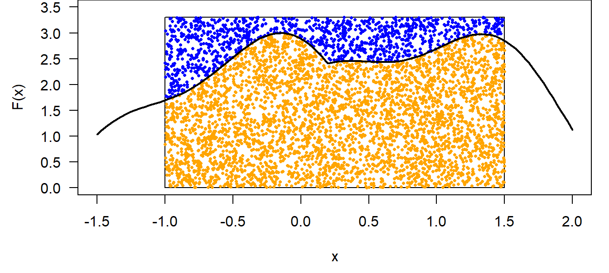

# Additional basic material {#addbasics}

THIS CHAPTER IS UNDER CONSTRUCTION!!! 

## Chisquare test
The chisquare test is used for two frequentist purposes.  
1. Testing for correlations between two categorical variables.  
2. Comparison of two distributions (goodness of fit test)

When testing for correlations between two categorical variables, then the nullhypothesis is "there is no correlation". The data can be displayed in cross-tables. 

```r
# Example: correlation between birthday preference and car ownership
load("RData/datacourse.RData")
table(dat$birthday, dat$car)
```

```
##          
##           N Y
##   flowers 6 1
##   wine    9 6
```

Given the nullhypothesis is true, we expect that the distribution of the data in each column of the cross-table is similar to the distribution of the row-sums. And, the distribution of the data in each row should be similar to the distribution of the column-sums. The chisquare test statistics $\chi^2$ measures the deviation of the data from this expected distribution of the data in the cross-table. 

For calculating the chisquare test statistics $\chi^2$, we first have to obtain for each cell in the cross-table the expected value $E_{ij}$ = rowsum*colsum/total.

$\chi^2$ measures the difference between the observed $O_{ij}$ and expected $E_{ij}$ values as:  
$\chi^2=\sum_{i=1}^{m}\sum_{j=1}^{k}\frac{(O_{ij}-E_{ij})^2}{E_{ij}}$ where $m$ is the number of rows and $k$ is the number of columns. 
The $\chi^2$-distribution has 1 parameter, the degrees of freedom $v$ = $(m-1)(k-1)$.


R is calculating the $\chi^2$ value for specific cross-tables, and it is also giving the p-values, i.e., the probability of obtaining the observed or a higher $\chi^2$ value given the nullhypothesis is true by comparing the observed $\chi^2$ with the corresponding chisquare distribution.


```r
chisq.test(table(dat$birthday, dat$car))
```

```
## 
## 	Pearson's Chi-squared test with Yates' continuity correction
## 
## data:  table(dat$birthday, dat$car)
## X-squared = 0.51084, df = 1, p-value = 0.4748
```

The warning (that is suppressed in the rmarkdown version, but that you will see if you run the code on your own computer) is given, because in our example some cells have counts less than 5. In such cases, the Fisher's exact test should be preferred. This test calculates the p-value analytically using probability theory, whereas the chisquare test relies on the assumption that the  $\chi^2$ value follows a chisquare distribution. The latter assumption holds better for larger sample sizes.


```r
fisher.test(table(dat$birthday, dat$car))
```

```
## 
## 	Fisher's Exact Test for Count Data
## 
## data:  table(dat$birthday, dat$car)
## p-value = 0.3501
## alternative hypothesis: true odds ratio is not equal to 1
## 95 percent confidence interval:
##    0.3153576 213.8457248
## sample estimates:
## odds ratio 
##   3.778328
```

 


## 3 methods for getting the posterior distribution

* analytically
* approximation
* Monte Carlo simulation

### Monte Carlo simulation (parametric bootstrap)  
  
Monte Carlo integration: numerical solution of $\int_{-1}^{1.5} F(x) dx$ 



sim is solving a mathematical problem by simulation
How sim is simulating to get the marginal distribution of $\mu$:


### Grid approximation
  
$p(\theta|y) = \frac{p(y|\theta)p(\theta)}{p(y)}$ 
  
For example, one coin flip (Bernoulli model) 
  
data: y=0  (a tail)  
likelihood: $p(y|\theta)=\theta^y(1-\theta)^{(1-y)}$


### Markov chain Monte Carlo simulations

* Markov chain Monte Carlo simulation (BUGS, Jags)
* Hamiltonian Monte Carlo (Stan)


## Analysis of variance ANOVA
The aim of an ANOVA is to compare means of groups. In a frequentist analysis, this is done by comparing the between-group with the within-group variance. The result of a Bayesian analysis is the joint posterior distribution of the group means.

<div class="figure">

<p class="caption">(\#fig:unnamed-chunk-9)Number of stats courses students have taken before starting a PhD in relation to their feeling about statistics.</p>
</div>

In the frequentist ANOVA, the following three sum of squared distances (SS) are used to calculate the total, the between- and within-group variances:  
Total sum of squares =  SST = $\sum_1^n{(y_i-\bar{y})^2}$  
Within-group SS = SSW = $\sum_1^n{(y_i-\bar{y_g})^2}$: unexplained variance  
Between-group SS = SSB = $\sum_1^g{n_g(\bar{y_g}-\bar{y})^2}$: explained variance  

The between-group and within-group SS sum to the total sum of squares: SST=SSB+SSW. Attention: this equation is only true in any case for a simple one-way ANOVA (just one grouping factor). If the data are grouped according to more than one factor (such as in a two- or three-way ANOVA), then there is one single solution for the equation only when the data is completely balanced, i.e. when there are the same number of observations in all combinations of factor levels. For non-balanced data with more than one grouping factor, there are different ways of calculating the SSBs, and the result of the F-test described below depends on the order of the predictors in the model.   

<div class="figure">

<p class="caption">(\#fig:unnamed-chunk-10)Visualisation of the total, between-group and within-group sum of squares. Points are observations; long horizontal line is the overall mean; short horizontal lines are group specific means.</p>
</div>


In order to make SSB and SSW comparable, we have to divide them by their degrees of freedoms. For the within-group SS, SSW, the degrees of freedom is the number of obervations minus the number of groups ($g$), because $g$ means have been estimated from the data. If the $g$ means are fixed and $n-g$ data points are known, then the last $g$ data points are defined, i.e., they cannot be chosen freely. For the between-group SS, SSB, the degrees of freedom is the number of groups  minus 1 (the minus 1 stands for the overall mean).   

* MSB = SSB/df_between, MSW = SSW/df_within  

It can be shown (by mathematicians) that, given the nullhypothesis, the mean of all groups are equal $m_1 = m_2 = m_3$, then the mean squared errors between groups (MSB) is expected to be equal to the mean squared errors within the groups (MSW). Therefore, the ration MSB/MSW is  expected to follow an F-distribution given the nullhypothesis is true.

* MSB/MSW ~ F(df_between, df_within)


The Bayesian analysis for comparing group means consists of calculating the posterior distribution for each group mean and then drawing inference from these posterior distributions. 
A Bayesian one-way ANOVA involves the following steps:  
1. Decide for a data model: We, here, assume that the measurements are normally distributed around the group means. In this example here, we transform the outcome variable in order to better meet the normal assumption. Note: the frequentist ANOVA makes exactly the same assumptions. We can write the data model: $y_i\sim Norm(\mu_i,\sigma)$ with $mu_i= \beta_0 + \beta_1I(group=2) +\beta_1I(group=3)$, where the $I()$-function is an indicator function taking on 1 if the expression is true and 0 otherwise. This model has 4 parameters: $\beta_0$,  $\beta_1$, $\beta_2$ and $\sigma$. 


```r
# fit a normal model with 3 different means
mod <- lm(log(nrcourses+1)~statsfeeling, data=dat)
```

2. Choose a prior distribution for each model parameter: In this example, we choose flat prior distributions for each parameter. By using these priors, the result should not remarkably be affected by the prior distributions but almost only reflect the information in the data. We choose so-called improper prior distributions. These are completely flat distributions that give all parameter values the same probability. Such distributions are called improper because the area under the curve is not summing to 1 and therefore, they cannot be considered to be proper probability distributions. However, they can still be used to solve the Bayesian theorem.  

3. Solve the Bayes theorem: The solution of the Bayes theorem for the above priors and model is implemented in the function sim of the package arm. 


```r
# calculate numerically the posterior distributions of the model 
# parameters using flat prior distributions
nsim <- 5000
set.seed(346346)
bsim <- sim(mod, n.sim=nsim)
```

4. Display the joint posterior distributions of the group means  


```r
# calculate group means from the model parameters
newdat <- data.frame(statsfeeling=levels(factor(dat$statsfeeling)))
X <- model.matrix(~statsfeeling, data=newdat)
fitmat <- matrix(ncol=nsim, nrow=nrow(newdat))
for(i in 1:nsim) fitmat[,i] <- X%*%bsim@coef[i,]
hist(fitmat[1,], freq=FALSE, breaks=seq(-2.5, 4.2, by=0.1), main=NA, xlab="Group mean of log(number of courses +1)", las=1, ylim=c(0, 2.2))
hist(fitmat[2,], freq=FALSE, breaks=seq(-2.5, 4.2, by=0.1), main=NA, xlab="", las=1, add=TRUE, col=rgb(0,0,1,0.5))
hist(fitmat[3,], freq=FALSE, breaks=seq(-2.5, 4.2, by=0.1), main=NA, xlab="", las=1, add=TRUE, col=rgb(1,0,0,0.5))
legend(2,2, fill=c("white",rgb(0,0,1,0.5), rgb(1,0,0,0.5)), legend=levels(factor(dat$statsfeeling)))
```

<div class="figure">

<p class="caption">(\#fig:unnamed-chunk-13)Posterior distributions of the mean number of stats courses PhD students visited before starting the PhD grouped according to their feelings about statistics.</p>
</div>

Based on the posterior distributions of the group means, we can extract derived quantities depending on our interest and questions. Here, for example, we could extract the posterior probability of the hypothesis that students with a positive feeling about statistics have a better education in statistics than those with a neutral or negative feeling about statistics.  


```r
# P(mean(positive)>mean(neutral))
mean(fitmat[3,]>fitmat[2,])
```

```
## [1] 0.8754
```

```r
# P(mean(positive)>mean(negative))
mean(fitmat[3,]>fitmat[1,])
```

```
## [1] 0.9798
```


## Bayesian way of analysing correlations between categorical variables
For a Bayesian analysis of cross-table data, a data model has to be found. There are several possibilities that could be used:  

* a so-called log-linear model (Poisson model) for the counts in each cell of the cross-table.  
* a binomial or a multinomial model for obtaining estimates of the proportions of data in each cell

These models provide possibilities to explore the patterns in the data in more details than a chisquare test. 


```r
# log-linear model
mod <- glm(count~birthday+car + birthday:car, 
           data=datagg, family=poisson)
bsim <- sim(mod, n.sim=nsim)
round(t(apply(bsim@coef, 2, quantile, 
              prob=c(0.025, 0.5, 0.975))),2)
```

```
##                    2.5%   50% 97.5%
## (Intercept)        0.99  1.79  2.58
## birthdaywine      -0.60  0.41  1.43
## carY              -3.89 -1.77  0.29
## birthdaywine:carY -0.94  1.38  3.65
```
The interaction parameter measures the strength of the correlation. To quantitatively understand what a parameter value of 1.39 means, we have to look at the interpretation of all parameter values. We do that here quickly without a thorough explanation, because we already explained the Poisson model in chapter 8 of [@KornerNievergelt2015].

The intercept 1.79 corresponds to the logarithm of the count in the cell "flowers" and "N" (number of students who prefer flowers as a birthday present and who do not have a car), i.e., $exp(\beta_0)$ = 6. The exponent of the second parameter corresponds to the multiplicative difference between the counts in the cells "flowers and N" and "wine and N", i.e., count in the cell "wine and N" = $exp(\beta_0)exp(\beta_1)$ = exp(1.79)exp(0.41) = 9. The third parameter measures the multiplicative difference in the counts between the cells "flowers and N" and "flowers and Y", i.e., count in the cell "flowers and Y" = $exp(\beta_0)exp(\beta_2)$ = exp(1.79)exp(-1.79) = 1. Thus, the third parameter is the difference in the logarithm of the counts between the car owners and the car-free students for those who prefer flowers. The interaction parameter is the difference of this difference between the students who prefer wine and those who prefer flowers. This is difficult to intuitively understand. Here is another try to formulate it: The interaction parameter measures the difference in the logarithm of the counts in the cross-table between the row-differences between the columns. Maybe it becomes clear, when we extract the count in the cell "wine and Y" from the model parameters: $exp(\beta_0)exp(\beta_1)exp(\beta_2)exp(\beta_3)$ = exp(1.79)exp(0.41)exp(-1.79)exp(1.39) = 6.  


Alternatively, we could estimate the proportions of flower and wine preferers within each group of car owners and car-free students using a binomial model. For an explanation of the binomial model, see chapter 8 of [@KornerNievergelt2015].


```r
# binomial model
tab <- table(dat$car,dat$birthday)
mod <- glm(tab~rownames(tab),  family=binomial)
bsim <- sim(mod, n.sim=nsim)
```

<div class="figure">

<p class="caption">(\#fig:unnamed-chunk-18)Estimated proportion of students that prefer flowers over wine as a birthday present among the car-free students (N) and the car owners (Y). Given are the median of the posterior distribution (circle). The bar extends between the 2.5% and 97.5% quantiles of the posterior distribution.</p>
</div>


## Summary

