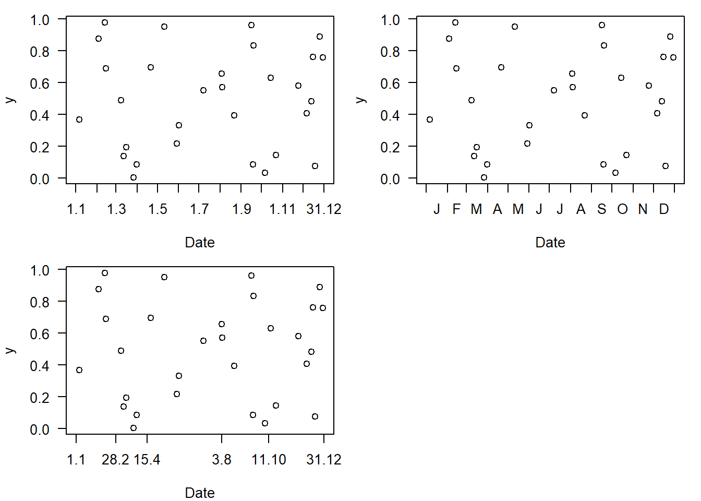
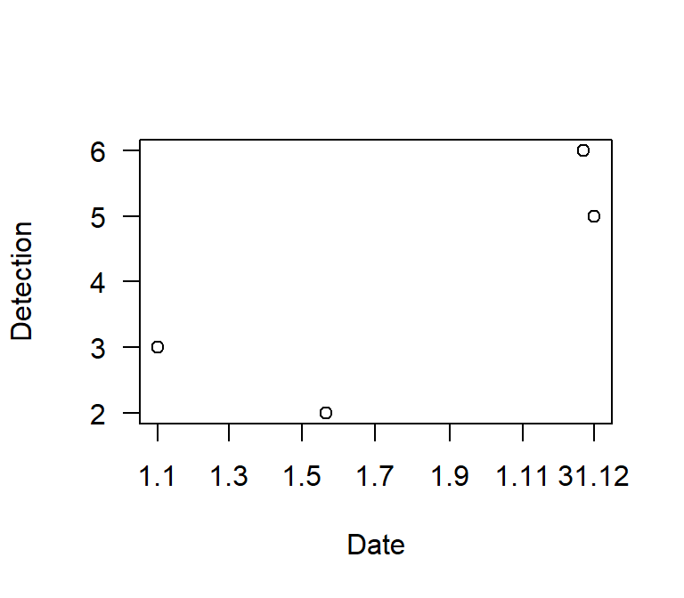

# Further topics {#furthertopics}

This is a collection of short introductions or links with commented R code that cover other topics that might be useful for ecologists.

## Bioacoustic analyse
Bioacoustic analyses are nicely covered in a blog by [Marcelo Araya-Salas](https://marce10.github.io).

## Python {#python}
Like R, python is a high-level programming language that is used by many ecologists. The [reticulate](https://rstudio.github.io/reticulate/index.html) package provides a comprehensive set of tools for interoperability between Python and R. 

## Some R
This book does not introduce R (see Chapter \@ref(PART-I) for a few resources). But there are some R codes that we regularly use and that may not be easily available on the internet. Certainly, there are other solutions to the issues presented here - we just show, how we do it.

### Date on x-axis
When date is a predictor in a model, we often use the day of year (or julian day, 1-365) as a covariate (unless only a short period is used, often with polynomials, see \@ref(transformationspolynomials), and if it stretches the entire year, ideally also as circular variable, see \@ref(transformationscircular); an alternative would be to use month as a fixed factor). On plots, we can plot the day of year, but it is nice and more understandable, if we plot selected real dates, e.g. 1.1, 1.3, 1.5 etc. Here are two options how this can be achieved using R base (there might be easy ggplot-options, too).


```r
# creating a code file with day, month and date:
ttt <- c(31,28,31,30,31,30,31,31,30,31,30,31)  # days per month
code_doy <- data.frame(day=unlist(sapply(as.list(ttt),function(x){seq(1:x)})),
                        month=rep(1:12,times=ttt),
                        doy=1:365)
code_doy$date <- paste(code_doy$day,code_doy$month,sep=".")
# this is very base coding... sure there are date-formats that help, but 5 lines is not that much, either, and you
# have no issues with leap days etc messing things up

# some data:
dat <- data.frame(doy = sample(1:365,30),
                  y = runif(30))
```


```r
par(mfrow=c(2,2), mar=c(4,4,1,1))
plot(dat$doy, dat$y, xlab="Date",ylab="y",las=1,xaxt="n", xlim=c(1,365))
  # first a tick at month-changes (on half-days... it would also be ok to tick at the first of each month...):
t.x.lab <- code_doy$day==1
axis(1,code_doy$doy[t.x.lab]-0.5,labels=F,gap.axis = 0)
  # and the last tick:
axis(1,365.5,labels=F,gap.axis = 0)
  # choose whatever dates you want to label on x, e.g. regular labels:
t.x.lab <- (code_doy$day==1 & code_doy$month %in% seq(1,11,by=2)) | code_doy$date=="31.12"
axis(1,code_doy$doy[t.x.lab],code_doy$date[t.x.lab],gap.axis = 0, tick=F)

# month first-letter in the middle between the ticks:
plot(dat$doy, dat$y, xlab="Date",ylab="y",las=1,xaxt="n", xlim=c(1,365))
t.x.lab <- code_doy$day==1   # same as above
axis(1,code_doy$doy[t.x.lab]-0.5,labels=F,gap.axis = 0)
axis(1,365.5,labels=F,gap.axis = 0)
  # month first-letter:
t.x.1 <- c(code_doy$doy[code_doy$day==1]-0.5,365.5)  # month borders, including end of year
axis(1,t.x.1[-1]-diff(t.x.1)/2, substring(month.name,1,1),tick=F, gap.axis=0)

# any selected dates:
plot(dat$doy, dat$y, xlab="Date",ylab="y",las=1,xaxt="n", xlim=c(1,365))
  # now: any dates that might be important for your message:
t.x.lab <- code_doy$date %in% c("1.1","28.2","15.4","3.8","11.10","31.12")
axis(1,code_doy$doy[t.x.lab],code_doy$date[t.x.lab],gap.axis = 0)
```

<div class="figure">

<p class="caption">(\#fig:unnamed-chunk-2)Displaying (simulated) data with date on the x-axis with custom labelling. Code version 1.</p>
</div>

Here a version with date-format objects that might also be handy (and adaptable in many ways).


```r
t.x.lab <- as.Date(paste0(c("1.1","1.3","1.5","1.7","1.9","1.11","31.12"),".2024"),format="%d.%m.%Y")
t.x.lab2 <- paste(as.numeric(format(t.x.lab,"%d")),as.numeric(format(t.x.lab,"%m")),sep=".")

plot(as.Date(c("01.01.2024","21.05.2024","22.12.2024","31.12.2024"),format="%d.%m.%Y"),c(3,2,6,5), xaxt="n",
     xlab="Date",ylab="Detection", las=1)
axis(1,t.x.lab,t.x.lab2,gap.axis = 0)
```

<div class="figure">

<p class="caption">(\#fig:unnamed-chunk-3)Displaying (simulated) data with date on the x-axis with custom labelling. Code version 2.</p>
</div>


