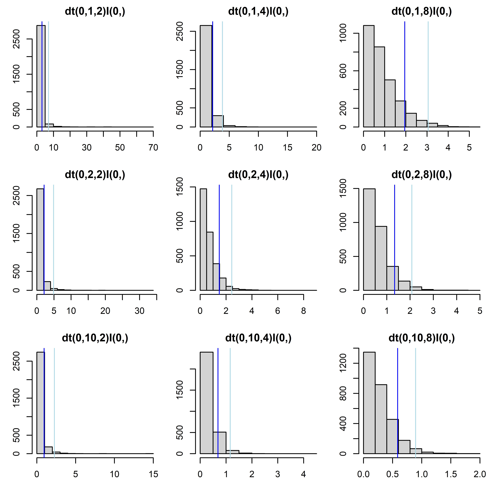

# Prior distributions {#priors}

## Introduction

The prior is an integral part of a Bayesian model. We must specify one.  

When to use informative priors: In practice (management, politics etc.) we would like to base our decisions on all information available. Therefore, we consider it to be responsible including informative priors in applied research whenever possible. Priors allow combining information from the literature with information in data or combining information from different data sets.

When using non-informative, flat or weakly informative priors: in basic research when results should only report the information in the current data set it may be reasonable to use non-informative priors. Results from a case study may later be used in a meta-analyses that assumes independence across the different studies included. However, flat priors are not always non-informative, may lead to overconfidence in spuriously large effects (similar to frequentist methods) and may be accompanied by computational difficulties. Therefore, weakly informative priors are recommended [@Lemoine.2019].

## How to choose a prior {#choosepriors}

The Stan development team gives a profound and up-to-date [prior choice recommendation](https://github.com/stan-dev/stan/wiki/Prior-Choice-Recommendations). We are not yet sure what we can further add here that may be useful, as we normally check the prior choice recommendation by the Stan development team.

<!-- Tabelle von Fränzi (CourseIII_glm_glmmm/course2018/presentations_handouts/presentations) -->

Further references: 
@Lemoine.2019  
@Gelman.2006

### Priors for variance parameters

@Gelman.2006 discusses advantages of using folded t-distributions or cauchy distributions as prior distributions for variance parameters in hierarchical models. 

When specifying t-distributions, we find it hard to imagine how the distributions looks like with what parameter values. Therefore, we simulate values from different distributions and look at the histograms. Because the parameterisation of the t-distribution differs among software language, it is important to use the software the model is finally fitted in Figure \@ref(fig:tdjags) we give some examples of folded t-distributions specified in jags using different values for the precision (second parameter) and degrees of freedom (third parameter).  

(\#fig:tdjags)Folded t-distributions with different precisions and degrees of freedom. The panel titles give the jags code of the distribution. Dark blue vertical lines indicate 90% quantiles, light-blue lines indicate 98% quantiles.

Todo: give examples for Stan

## Prior sensitivity

Todo: it may be helpful to present a worked-through example of a prior sensitivity analysis?

