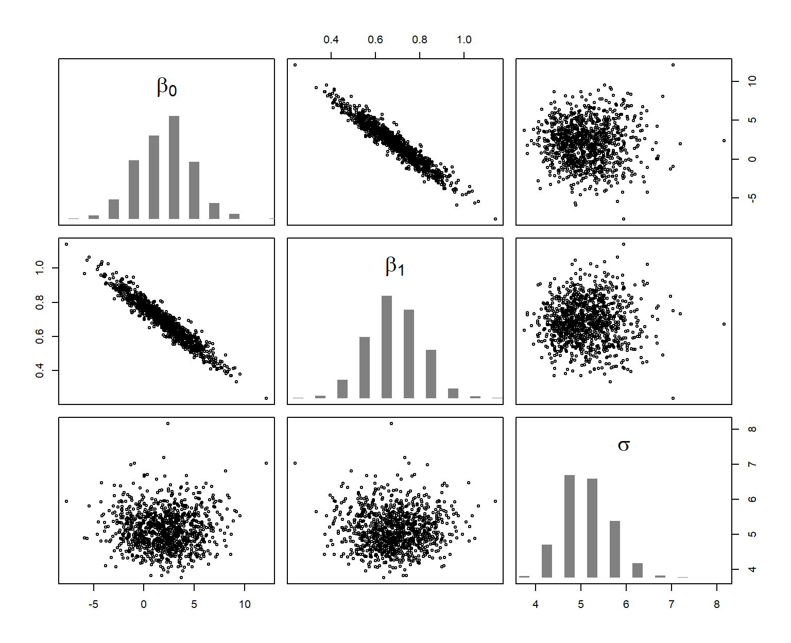
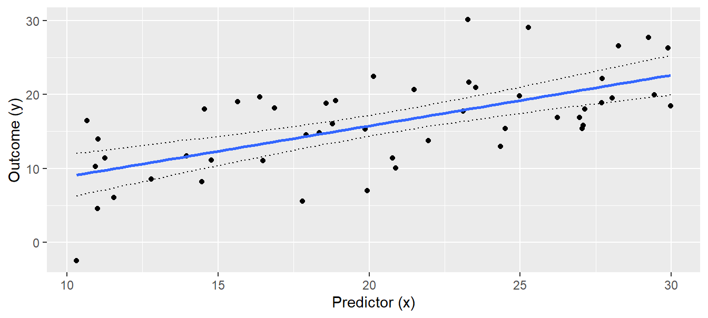
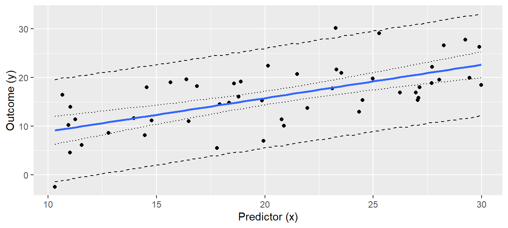
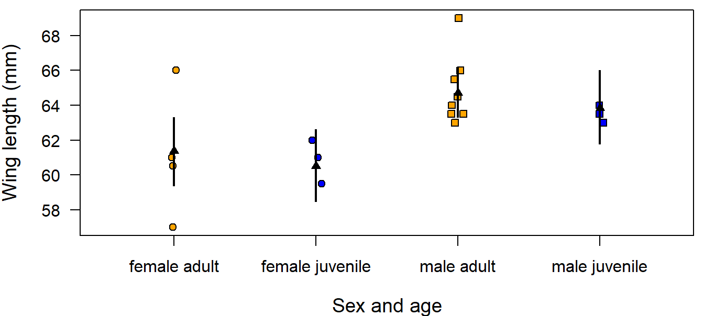
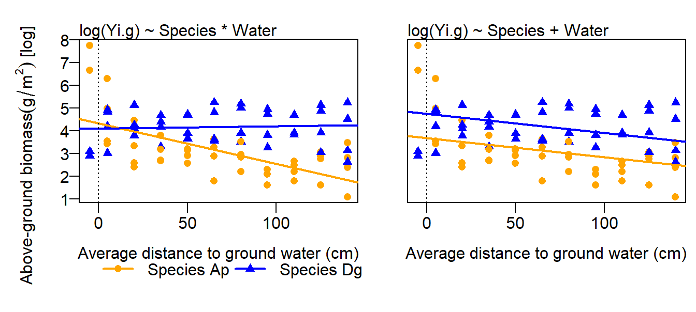

# Normal Linear Models{#lm}

<a href="" target="_blank"></a>

------

## Linear regression


### Background

Linear regression is the basis of a large part of applied statistical analysis. Analysis of variance (ANOVA) and analysis of covariance (ANCOVA) can be considered special cases of linear regression, and generalized linear models are extensions of linear regression. 

Typical questions that can be answered using linear regression are: How does $y$ change with changes in $x$? How is y predicted from $x$? An ordinary linear regression (i.e., one numeric  $x$  and one numeric $y$  variable) can be represented by a scatterplot of $y$ against $x$. We search for the line that fits best and describe how the observations scatter around this regression line (see Fig. \@ref(fig:figlm) for an example). The model formula of a simple linear regression with one continuous predictor variable $x_i$ (the subscript $i$ denotes the $i=1,\dots,n$ data points) is:

\begin{align} 
  \mu_i &=\beta_0 + \beta_1 x_i \\
  y_i &\sim normal(\mu_i, \sigma^2)
  (\#eq:lm)
\end{align}

While the first part of Equation \@ref(eq:lm) describes the regression line, the second part describes how the data points, also called observations, are distributed around the regression line (Figure \@ref(fig:illlm)). In other words: the observation $y_i$ stems from a normal distribution with mean $\mu_i$ and variance $\sigma^2$. The mean of the normal distribution, $\mu_i$ , equals the sum of the intercept ($b_0$ ) and the product of the slope ($b_1$) and the continuous predictor value, $x_i$.

Equation \@ref(eq:lm) is called the data model, because it describes mathematically the process that has (or, better, that we think has) produced the data. This nomenclature also helps to distinguish data models from models for parameters such as prior or posterior distributions.

The differences between observation $y_i$ and the predicted values $\mu_i$ are the residuals (i.e., $\epsilon_i=y_i-\mu_i$). Equivalently to Equation \@ref(eq:lm), the regression could thus be written as:

\begin{align} 
  y_i &= \beta_0 + \beta_1 x_i + \epsilon_i\\
  \epsilon_i &\sim normal(0, \sigma^2)
  (\#eq:lmalternativ)
\end{align} 

We prefer the notation in Equation \@ref(eq:lm) because, in this formula, the stochastic part (second row) is nicely separated from the deterministic part (first row) of the model, whereas, in the second notation \@ref(eq:lmalternativ) the first row contains both stochastic and deterministic parts. 

For illustration, we here simulate a data set and below fit a linear regression to these simulated data. The advantage of simulating data is that the following analyses can be reproduced without having to read data into R. Further, for simulating data, we need to translate the algebraic model formula into R language which helps us understanding the model structure.


```r
set.seed(34)            # set a seed for the random number generator
# define the data structure
n <- 50                 # sample size
x <- runif(n, 10, 30)   # sample values of the predictor variable

# define values for each model parameter
sigma <- 5              # standard deviation of the residuals
b0 <- 2                 # intercept
b1 <- 0.7               # slope

# simulate y-values from the model
mu <- b0 + b1 * x       # define the regression line (deterministic part)
y <- rnorm(n, mu, sd = sigma) # simulate y-values

# save data in a data.frame
dat <- tibble(x = x, y = y)
```


<div class="figure">

<p class="caption">(\#fig:illlm)Illustration of a linear regression. The blue line represents the deterministic part of the model, i.e., here regression line. The stochastic part is represented by a probability distribution, here the normal distribution. The normal distribution changes its mean but not the variance along the x-axis, and it describes how the data are distributed. The blue line and the orange distribution together are a statistical model, i.e., an abstract representation of the data which is given in black.</p>
</div>


Using matrix notation equation \@ref(eq:lm) can also be written in one row:

$$\boldsymbol{y} \sim 
  Norm(\boldsymbol{X} \boldsymbol{\beta}, \sigma^2\boldsymbol{I})$$

where $\boldsymbol{ I}$ is the $n \times n$ identity matrix (it transforms the variance parameter to a  $n \times n$ matrix with its diagonal elements equal $\sigma^2$ ; $n$ is the sample size). The multiplication by $\boldsymbol{ I}$ is necessary because we use vector notation, $\boldsymbol{y}$ instead of $y_{i}$ . Here, $\boldsymbol{y}$  is the vector of all observations, whereas $y_{i}$ is a single observation, $i$. When using vector notation, we can write the linear predictor of the model, $\beta_0 + \beta_1 x_i$ , as a multiplication of the vector of the model coefficients

$$\boldsymbol{\beta} =
  \begin{pmatrix} 
    \beta_0 \\ 
    \beta_1 
  \end{pmatrix}$$

times the model matrix

$$\boldsymbol{X} = 
  \begin{pmatrix} 
      1     & x_1   \\ 
      \dots & \dots \\ 
      1     & x_n
  \end{pmatrix}$$

where $x_1 , \dots, x_n$ are the observed values for the predictor variable, $x$. The first column of $\boldsymbol{X}$ contains only ones because the values in this column are multiplied with the intercept, $\beta_0$ . To the intercept, the product of the second element of $\boldsymbol{\beta}$, $\beta_1$ , with each element in the second column of $\boldsymbol{X}$ is added to obtain the predicted value for each observation, $\boldsymbol{\mu}$:

\begin{align} 
\boldsymbol{X \beta}=
\begin{pmatrix} 
      1     & x_1   \\ 
      \dots & \dots \\ 
      1     & x_n
  \end{pmatrix} 
  \times 
  \begin{pmatrix} 
	\beta_0 \\ 
	\beta_1 
\end{pmatrix} =
  \begin{pmatrix} 
	\beta_0 + \beta_1x_1 \\ 
	\dots \\
	\beta_0 + \beta_1x_n
\end{pmatrix}=
\begin{pmatrix} 
	\hat{y}_1 \\
  \dots \\
	\hat{y}_n 
\end{pmatrix} =
\boldsymbol{\mu}
(\#eq:lmmatrix)
\end{align} 


### Fitting a Linear Regression in R
In Equation \@ref(eq:lm), the fitted values $\mu_i$ are directly defined by the model coefficients, $\beta_{0}$ and $\beta_{1}$ . Therefore, when we can estimate $\beta_{0}$, $\beta_{1}$ , and $\sigma^2$, the model is fully defined. The last parameter $\sigma^2$ describes how the observations scatter around the regression line and relies on the assumption that the residuals are normally distributed. The estimates for the model parameters of a linear regression are obtained by searching for the best fitting regression line. To do so, we search for the regression line that minimizes the sum of the squared residuals. This model fitting method is called the least-squares method, abbreviated as LS. It has a very simple solution using matrix algebra [see e.g., @Aitkin.2009]. 

The least-squares estimates for the model parameters of a linear regression are obtained in R using the function `lm`. 


```r
mod <-  lm(y ~ x, data = dat)
coef(mod)
```

```
## (Intercept)           x 
##   2.0049517   0.6880415
```

```r
summary(mod)$sigma
```

```
## [1] 5.04918
```

The object “mod” produced by `lm` contains the estimates for the intercept, $\beta_0$ , and the slope, $\beta_1$. The residual standard deviation $\sigma^2$ is extracted using the function `summary`. We can show the result of the linear regression as a line in  a scatter plot with the covariate (`x`) on the x-axis and the observations (`y`) on the y-axis (Fig. \@ref(fig:figlm)).

<div class="figure">

<p class="caption">(\#fig:figlm)Linear regression. Black dots = observations, blue solid line = regression line, orange dotted lines = residuals. The fitted values lie where the orange dotted lines touch the blue regression line.</p>
</div>

Conclusions drawn from a model depend on the model assumptions. When model assumptions are violated, estimates usually are biased and inappropriate conclusions can be drawn. We devote Chapter \@ref(residualanalysis) to the assessment of model assumptions, given its importance.

### Drawing Conclusions

To answer the question about how strongly $y$ is related to $x$ taking into account statistical uncertainty we look at the joint posterior distribution of $\boldsymbol{\beta}$ (vector that contains $\beta_{0}$ and $\beta_{1}$ ) and $\sigma^2$ , the residual variance. The function `sim` calculates the joint posterior distribution and renders a simulated values from this distribution. 

<font size="1"> 
<div style="border: 2px solid grey;">
What does `sim` do?  
It simulates parameter values from the joint posterior distribution of a model assuming flat prior distributions. For a normal linear regression, it first draws a random value, $\sigma^*$ from the marginal posterior distribution of $\sigma$, and then draws random values from the conditional posterior distribution for $\boldsymbol{\beta}$ given $\sigma^*$  [@Gelman.2014].

The conditional posterior distribution of the parameter vector $\boldsymbol{\beta}$, $p(\boldsymbol{\beta}|\sigma^*,\boldsymbol{y,X})$ can be analytically derived. With flat prior distributions, it is a uni- or multivariate normal distribution $p(\boldsymbol{\beta}|\sigma^*,\boldsymbol{y,X})=normal(\boldsymbol{\hat{\beta}},V_\beta,(\sigma^*)^2)$ with:

\begin{align}
  \boldsymbol{\hat{\beta}=(\boldsymbol{X^TX})^{-1}X^Ty}
  (\#eq:sim)
\end{align} 

and $V_\beta = (\boldsymbol{X^T X})^{-1}$. 

The marginal posterior distribution of $\sigma^2$ is independent of specific values of $\boldsymbol{\beta}$. It is, for flat prior distributions, an inverse chi-square distribution $p(\sigma^2|\boldsymbol{y,X})=Inv-\chi^2(n-k,\sigma^2)$, where $\sigma^2 = \frac{1}{n-k}(\boldsymbol{y}-\boldsymbol{X,\hat{\beta}})^T(\boldsymbol{y}-\boldsymbol{X,\hat{\beta}})$, and $k$ is the number of parameters. The marginal posterior distribution of $\boldsymbol{\beta}$ can be obtained by integrating the conditional posterior distribution $p(\boldsymbol{\beta}|\sigma^2,\boldsymbol{y,X})=normal(\boldsymbol{\hat{\beta}},V_\beta\sigma^2)$ over the distribution of $\sigma^2$ . This results in a uni- or multivariate $t$-distribution.  

Because `sim` simulates values $\beta_0^*$ and $\beta_1^*$ always conditional on $\sigma^*$, a triplet of values ($\beta_0^*$, $\beta_1^*$, $\sigma^*$) is one draw of the joint posterior distribution. When we visualize the distribution of the simulated values for one parameter only, ignoring the values for the other, we display the marginal posterior distribution of that parameter. Thus, the distribution of all simulated values for the parameter $\beta_0$ is a $t$-distribution even if a normal distribution has been used for simulating the values. The $t$-distribution is a consequence of using a different $\sigma^2$-value for every draw of $\beta_0$.
</div>
</font>

Using the function `sim` from the package, we can draw values from the joint posterior distribution of the model parameters and describe the marginal posterior distribution of each model parameter using these simulated values.


```r
library(arm)
nsim <- 1000
bsim <- sim(mod, n.sim = nsim)
```

The function `sim` simulates (in our example) 1000 values from the joint posterior distribution of the three model parameters $\beta_0$ , $\beta_1$, and $\sigma$. These simulated values are shown in Figure \@ref(fig:simfirstexample).

<div class="figure">

<p class="caption">(\#fig:simfirstexample)Joint (scatterplots) and marginal (histograms) posterior distribution of the model parameters. The six scatterplots show, using different axes, the three-dimensional cloud of 1000 simulations from the joint posterior distribution of the three parameters.</p>
</div>

The posterior distribution describes, given the data and the model, which values relative to each other are more likely to correspond to the parameter value we aim at measuring. It expresses the uncertainty of the parameter estimate. It shows what we know about the model parameter after having looked at the data and given the model is realistic.

The 2.5% and 97.5% quantiles of the marginal posterior distributions can be used as 95% uncertainty intervals of the model parameters. The function `coef` extracts the simulated values for the beta coefficients, returning a matrix with *nsim* rows and the number of columns corresponding to the number of parameters. In our example, the first column contains the simulated values from the posterior distribution of the intercept and the second column contains values from the posterior distribution of the slope. The "2" in the second argument of the apply-function (see Chapter \@ref(rmisc)) indicates that the `quantile` function is applied columnwise.


```r
apply(X = coef(bsim), MARGIN = 2, FUN = quantile, probs = c(0.025, 0.975)) %>% 
  round(2)
```

```
##       (Intercept)    x
## 2.5%        -2.95 0.44
## 97.5%        7.17 0.92
```

We also can calculate an uncertainty interval of the estimated residual standard deviation, $\hat{\sigma}$.


```r
quantile(bsim@sigma, probs = c(0.025, 0.975)) %>% 
  round(1)
```

```
##  2.5% 97.5% 
##   4.2   6.3
```

We can further get a posterior probability for specific hypotheses, such as “The slope parameter is larger than 1” or “The slope parameter is larger than 0.5”. These probabilities are the proportion of simulated values from the posterior distribution that are larger than 1 and 0.5, respectively.


```r
sum(coef(bsim)[,2] > 1) / nsim     # alternatively: mean(coef(bsim)[,2]>1)
```

```
## [1] 0.008
```

```r
sum(coef(bsim)[,2] > 0.5) / nsim
```

```
## [1] 0.936
```

From this, there is very little evidence in the data that the slope is larger than 1, but we are quite confident that the slope is larger than 0.5 (assuming that our model is realistic).

We often want to show the effect of $x$ on $y$ graphically, with information about the uncertainty of the parameter estimates included in the graph. To draw such effect plots, we use the simulated values from the posterior distribution of the model parameters. From the deterministic part of the model, we know the regression line $\mu = \beta_0 + \beta_1 x_i$. The simulation from the joint posterior distribution of $\beta_0$ and $\beta_1$ gives 1000 pairs of intercepts and slopes that describe 1000 different regression lines. We can draw these regression lines in an x-y plot (scatter plot) to show the uncertainty in the regression line estimation (Fig. \@ref(fig:figlmer1), left). Note, that in this case it is not advisable to use `ggplot` because we draw many lines in one plot, which makes `ggplot` rather slow.


```r
par(mar = c(4, 4, 0, 0))
plot(x, y, pch = 16, las = 1, 
     xlab = "Outcome (y)")
for(i in 1:nsim) {
  abline(coef(bsim)[i,1], coef(bsim)[i,2], col = rgb(0, 0, 0, 0.05))
}
```

<div class="figure">

<p class="caption">(\#fig:figlmer1)Regression with 1000 lines based on draws form the joint posterior distribution for the intercept and slope parameters to visualize the uncertainty of the estimated regression line.</p>
</div>

A more convenient way to show uncertainty is to draw the 95% uncertainty interval, CrI, of the regression line. To this end, we first define new x-values for which we would like to have the fitted values (about 100 points across the range of x will produce smooth-looking lines when connected by line segments). We save these new x-values within the new tibble `newdat`. Then, we create a new model matrix that contains these new x-values (`newmodmat`) using the function `model.matrix`. We then calculate the 1000 fitted values for each element of the new x (one value for each of the 1000 simulated regressions, Fig. \@ref(fig:figlmer1)), using matrix multiplication (%*%). We save these values in the matrix “fitmat”. Finally, we extract the 2.5% and 97.5% quantiles for each x-value from fitmat, and draw the lines for the lower and upper limits of the credible interval (Fig. \@ref(fig:figlmer2)).


```r
# Calculate 95% credible interval
newdat <- tibble(x = seq(10, 30, by = 0.1))
newmodmat <- model.matrix( ~ x, data = newdat)
fitmat <- matrix(ncol = nsim, nrow = nrow(newdat))
for(i in 1:nsim) {fitmat[,i] <- newmodmat %*% coef(bsim)[i,]}
newdat$CrI_lo <- apply(fitmat, 1, quantile, probs = 0.025)
newdat$CrI_up <- apply(fitmat, 1, quantile, probs = 0.975)

# Make plot
regplot <- 
  ggplot(dat, aes(x = x, y = y)) +
  geom_point() +
  geom_smooth(method = lm, se = FALSE) +
  geom_line(data = newdat, aes(x = x, y = CrI_lo), lty = 3) +
  geom_line(data = newdat, aes(x = x, y = CrI_up), lty = 3) +
  labs(x = "Predictor (x)", y = "Outcome (y)")
regplot
```

<div class="figure">

<p class="caption">(\#fig:figlmer2)Regression with 95% credible interval of the posterior distribution of the fitted values.</p>
</div>

The interpretation of the 95% uncertainty interval is straightforward: We are 95% sure that the true regression line is within the credible interval (given the data and the model). As with all statistical results, this interpretation is only valid in the model world (if the world would look like the model). The larger the sample size, the narrower the interval, because each additional data point increases information about the true regression line.

The uncertainty interval measures statistical uncertainty of the regression line, but it does not describe how new observations would scatter around the regression line. If we want to describe where future observations will be, we have to report the posterior predictive distribution. We can get a sample of random draws from the posterior predictive distribution $\hat{y}|\boldsymbol{\beta},\sigma^2,\boldsymbol{X}\sim normal( \boldsymbol{X \beta, \sigma^2})$ using the simulated joint posterior distributions of the model parameters, thus taking the uncertainty of the parameter estimates into account. We draw a new $\hat{y}$-value from $normal( \boldsymbol{X \beta, \sigma^2})$ for each simulated set of model parameters. Then, we can visualize the 2.5% and 97.5% quantiles of this distribution for each new x-value.


```r
# increase number of simulation to produce smooth lines of the posterior
# predictive distribution
set.seed(34)
nsim <- 50000
bsim <- sim(mod, n.sim=nsim)
fitmat <- matrix(ncol=nsim, nrow=nrow(newdat))
for(i in 1:nsim) fitmat[,i] <- newmodmat%*%coef(bsim)[i,]

# prepare matrix for simulated new data
newy <- matrix(ncol=nsim, nrow=nrow(newdat)) 

# for each simulated fitted value, simulate one new y-value
for(i in 1:nsim) {
  newy[,i] <- rnorm(nrow(newdat), mean = fitmat[,i], sd = bsim@sigma[i])
}

# Calculate 2.5% and 97.5% quantiles
newdat$pred_lo <- apply(newy, 1, quantile, probs = 0.025)
newdat$pred_up <- apply(newy, 1, quantile, probs = 0.975)

# Add the posterior predictive distribution to plot
regplot +
  geom_line(data = newdat, aes(x = x, y = pred_lo), lty = 2) +
  geom_line(data = newdat, aes(x = x, y = pred_up), lty = 2)
```

<div class="figure">

<p class="caption">(\#fig:figlmer3)Regression line with 95% uncertainty interval (dotted lines) and the 95% interval of the simulated predictive distribution (broken lines). Note that we increased the number of simulations to 50,000 to produce smooth lines.</p>
</div>

Of future observations, 95% are expected to be within the interval defined by the broken lines in Fig. \@ref(fig:figlmer3). Increasing sample size will not give a narrower predictive distribution because the predictive distribution primarily depends on the residual variance $\sigma^2$ which is a property of the data that is independent of sample size.

The way we produced Fig. \@ref(fig:figlmer3) is somewhat tedious compared to how easy we could have obtained the same figure using frequentist methods: `predict(mod, newdata = newdat, interval = "prediction")` would have produced the y-values for the lower and upper lines in Fig. \@ref(fig:figlmer3) in one R-code line. However, once we have a simulated sample of the posterior predictive distribution, we have much more information than is contained in the frequentist prediction interval. For example, we could give an estimate for the proportion of observations greater than 20, given $x = 25$.


```r
sum(newy[newdat$x == 25, ] > 20) / nsim
```

```
## [1] 0.44504
```

Thus, we expect 44% of future observations with $x = 25$ to be higher than 20. We can extract similar information for any relevant threshold value.

Another reason to learn the more complicated R code we presented here, compared to the frequentist methods, is that, for more complicated models such as mixed models, the frequentist methods to obtain confidence intervals of fitted values are much more complicated than the Bayesian method just presented. The latter can be used with only slight adaptations for mixed models and also for generalized linear mixed models.

### Interpretation of the R summary output
The solution for $\boldsymbol{\beta}$ is the Equation \@ref(eq:lmmatrix). Most statistical software, including R, return an estimated frequentist standard error for each $\beta_k$. We extract these standard errors together with the estimates for the model parameters using the `summary` function.


```r
summary(mod)
```

```
## 
## Call:
## lm(formula = y ~ x, data = dat)
## 
## Residuals:
##      Min       1Q   Median       3Q      Max 
## -11.5777  -3.6280  -0.0532   3.9873  12.1374 
## 
## Coefficients:
##             Estimate Std. Error t value    Pr(>|t|)    
## (Intercept)   2.0050     2.5349   0.791       0.433    
## x             0.6880     0.1186   5.800 0.000000507 ***
## ---
## Signif. codes:  0 '***' 0.001 '**' 0.01 '*' 0.05 '.' 0.1 ' ' 1
## 
## Residual standard error: 5.049 on 48 degrees of freedom
## Multiple R-squared:  0.412,	Adjusted R-squared:  0.3998 
## F-statistic: 33.63 on 1 and 48 DF,  p-value: 0.0000005067
```

The summary output first gives a rough summary of the residual distribution. However, we will do more rigorous residual analyses in Chapter \@ref(residualanalysis). The estimates of the model coefficients follow. The column "Estimate" contains the estimates for the intercept $\beta_0$ and the slope $\beta_1$ . The column "Std. Error" contains the estimated (frequentist) standard errors of the estimates. The last two columns contain the t-value and the p-value of the classical t-test for the null hypothesis that the coefficient equals zero. The last part of the summary output gives the parameter $\sigma$ of the model, named "residual standard error" and the residual degrees of freedom.

We think the name "residual standard error" for "sigma" is confusing, because $\sigma$ is not a measurement of uncertainty of a parameter estimate like the standard errors of the model coefficients are. $\sigma$ is a model parameter that describes how the observations scatter around the fitted values, that is, it is a standard deviation. It is independent of sample size, whereas the standard errors of the estimates for the model parameters will decrease with increasing sample size. Such a standard error of the estimate of $\sigma$, however, is not given in the summary output. Note that, by using Bayesian methods, we could easily obtain the standard error of the estimated $\sigma$ by calculating the standard deviation of the posterior distribution of $\sigma$. 

The $R^2$ and the adjusted $R^2$ measure the proportion of variance in the outcome variable $y$ that is explained by the predictors in the model. $R^2$ is calculated from the sum of squared residuals, $SSR = \sum_{i=1}^{n}(y_i - \hat{y})$, and the "total sum of squares", $SST = \sum_{i=1}^{n}(y_i - \bar{y})$, where $\bar{y})$ is the mean of $y$. $SST$ is a measure of total variance in $y$ and $SSR$
 is a measure of variance that cannot be explained by the model, thus $R^2 = 1- \frac{SSR}{SST}$ is a measure of variance that can be explained by the model. If $SSR$ is close to $SST$, $R^2$ is close to zero and the model cannot explain a lot of variance. The smaller $SSR$, the closer $R^2$ is to 1. This version of $R2$ approximates 1 if the number of model parameters approximates sample size even if none of the predictor variables correlates with the outcome. It is exactly 1 when the number of model parameters equals sample size, because $n$ measurements can be exactly described by $n$ parameters. The adjusted $R^2$, $R^2 = \frac{var(y)-\hat\sigma^2}{var(y)}$ takes sample size $n$ and the number of model parameters $k$ into account (see explanation to variance in chapter \@ref(basics)). Therefore, the adjusted $R^2$ is recommended as a measurement of the proportion of explained variance.

## Linear model with one categorical predictor (one-way ANOVA)

The aim of analysis of variance (ANOVA) is to compare means of an outcome variable $y$ between different groups. To do so in the frequentist’s framework, variances between and within the groups are compared using F-tests (hence the name “analysis of variance”). When doing an ANOVA in a Bayesian way, inference is based on the posterior distributions of the group means and the differences between the group means.

One-way ANOVA means that we only have one predictor variable, specifically a categorical predictor variable (in R defined as a "factor"). We illustrate the one-way ANOVA based on an example of simulated data (Fig. \@ref(fig:figanova)). We have measured weights of 30 virtual individuals for each of 3 groups. Possible research questions could be: How big are the differences between the group means? Are individuals from group 2 heavier than the ones from group 1? Which group mean is higher than 7.5 g?


```r
# settings for the simulation
set.seed(626436)
b0 <- 12        # mean of group 1 (reference group)
sigma <- 2      # residual standard deviation
b1 <- 3         # difference between group 1 and group 2
b2 <- -5        # difference between group 1 and group 3
n <- 90         # sample size

# generate data
group <- factor(rep(c("group 1","group 2", "group 3"), each=30))
simresid <- rnorm(n, mean=0, sd=sigma)  # simulate residuals
y <- b0 + 
  as.numeric(group=="group 2") * b1 + 
  as.numeric(group=="group 3") * b2 + 
  simresid
dat <- tibble(y, group)

# make figure
dat %>% 
  ggplot(aes(x = group, y = y)) +
  geom_boxplot(fill = "orange") +
  labs(y = "Weight (g)", x = "") +
  ylim(0, NA)
```

<div class="figure">

<p class="caption">(\#fig:figanova)Weights (g) of the 30 individuals in each group. The dark horizontal line is the median, the box contains 50% of the observations (i.e., the interquartile range), the whiskers mark the range of all observations that are less than 1.5 times the interquartile range away from the edge of the box.</p>
</div>

An ANOVA is a linear regression with a categorical predictor variable instead of a continuous one. The categorical predictor variable with $k$ levels is (as a default in R) transformed to $k-1$ indicator variables. An indicator variable is a binary variable containing 0 and 1 where 1 indicates a specific level (a category of the predictor variable). Often, one indicator variable is constructed for every level except for the reference level. In our example, the categorical variable is "group" with the three levels "group 1", "group 2", and "group 3" ($k = 3$). Group 1 is taken as the reference level (default in R is the first in the alphabeth), and for each of the other two groups an indicator variable is constructed, $I(group_i = 2)$ and $I(group_i = 3)$. The function $I()$ gives out 1, if the expression is true and 0 otherwise. We can write the model as a formula:

\begin{align} 
  \mu_i &=\beta_0 + \beta_1 I(group_i=2) + \beta_1 I(group_i=3) \\
  y_i &\sim normal(\mu_i, \sigma^2)
  (\#eq:anova)
\end{align}

where $y_i$ is the $i$-th observation (weight measurement for individual $i$ in our example), and $\beta_{0,1,2}$ are the model coefficients. The residual variance is $\sigma^2$. The model coefficients $\beta_{0,1,2}$ constitute the deterministic part of the model. From the model formula it follows that the group means, $m_g$, are:

\begin{align} 
  m_1 &=\beta_0 \\
  m_2 &=\beta_0 + \beta_1 \\
  m_3 &=\beta_0 + \beta_2 \\
  (\#eq:anovamw)
\end{align}

There are other possibilities to describe three group means with three parameters, for example:

\begin{align} 
  m_1 &=\beta_1 \\
  m_2 &=\beta_2 \\
  m_3 &=\beta_3 \\
  (\#eq:anovamwalt)
\end{align}

In this case, the model formula would be:

\begin{align} 
  \mu_i &= \beta_1 I(group_i=1) + \beta_2 I(group_i=2) + \beta_3 I(group_i=3) \\
  y_i &\sim Norm(\mu_i, \sigma^2)
  (\#eq:anovaalt)
\end{align}

The way the group means are calculated within a model is called the parameterization of the model. Different statistical software use different parameterizations. The parameterization used by R by default is the one shown in Equation \@ref(eq:anova). R automatically takes the first level as the reference (the first level is the first one alphabetically unless the user defines a different order for the levels). The mean of the first group (i.e., of the first factor level) is the intercept, $b_0$ , of the model. The mean of another factor level is obtained by adding, to the intercept, the estimate of the corresponding parameter (which is the difference from the reference group mean). 

The parameterization of the model is defined by the model matrix. In the case of a one-way ANOVA, there are as many columns in the model matrix as there are factor levels (i.e., groups); thus there are k factor levels and k model coefficients. Recall from Equation \@ref(eq:lmmatrix) that for each observation, the entry in the $j$-th column of the model matrix is multiplied by the $j$-th element of the model coefficients and the $k$ products are summed to obtain the fitted values. For a data set with $n = 5$ observations of which the first two are from group 1, the third from group 2, and the last two from group 3, the model matrix used for the parameterization described in Equation \@ref(eq:anovamw) and defined in R by the formula `~ group` is

\begin{align} 
\boldsymbol{X}=
\begin{pmatrix} 
      1 & 0 & 0 \\ 
      1 & 0 & 0 \\ 
      1 & 1 & 0 \\ 
      1 & 0 & 1 \\ 
      1 & 0 & 1 \\ 
  \end{pmatrix}
\end{align} 

If parameterization of Equation \@ref(eq:anovamwalt) (corresponding R formula: `~ group - 1`) were used,

\begin{align} 
\boldsymbol{X}=
\begin{pmatrix} 
      1 & 0 & 0 \\ 
      1 & 0 & 0 \\ 
      0 & 1 & 0 \\ 
      0 & 0 & 1 \\ 
      0 & 0 & 1 \\ 
  \end{pmatrix}
\end{align} 


To obtain the parameter estimates for model parameterized according to Equation \@ref(eq:anovamw) we fit the model in R:


```r
# fit the model
mod <- lm(y~group, data=dat)  

# parameter estimates 
mod
```

```
## 
## Call:
## lm(formula = y ~ group, data = dat)
## 
## Coefficients:
##  (Intercept)  groupgroup 2  groupgroup 3  
##       12.367         2.215        -5.430
```

```r
summary(mod)$sigma
```

```
## [1] 1.684949
```

The "Intercept" is $\beta_0$. The other coefficients are named with the factor name ("group") and the factor level (either "group 2" or "group 3"). These are $\beta_1$ and $\beta_2$ , respectively. Before drawing conclusions from an R output we need to examine whether the model assumptions are met, that is, we need to do a residual analysis as described in Chapter \@ref(residualanalysis).

Different questions can be answered using the above ANOVA: What are the group means? What is the difference in the means between group 1 and group 2? What is the difference between the means of the heaviest and lightest group? In a Bayesian framework we can directly assess how strongly the data support the hypothesis that the mean of the group 2 is larger than the mean of group 1. We first simulate from the posterior distribution of the model parameters.


```r
library(arm)
nsim <- 1000
bsim <- sim(mod, n.sim=nsim)
```

Then we obtain the posterior distributions for the group means according to the parameterization of the model formula (Equation \@ref(eq:anovamw)).


```r
m.g1 <- coef(bsim)[,1]  
m.g2 <- coef(bsim)[,1] + coef(bsim)[,2] 
m.g3 <- coef(bsim)[,1] + coef(bsim)[,3] 
```

The histograms of the simulated values from the posterior distributions of the three means are given in Fig. \@ref(fig:figanovares). The three means are well separated and, based on our data, we are confident that the group means differ. From these simulated posterior distributions we obtain the means and use the 2.5% and 97.5% quantiles as limits of the 95% uncertainty intervals (Fig. \@ref(fig:figanovares), right).


```r
# save simulated values from posterior distribution in  tibble
post <- 
  tibble(`group 1` = m.g1, `group 2` = m.g2, `group 3` = m.g3) %>% 
  gather("groups", "Group means") 

# histograms per group
leftplot <- 
  ggplot(post, aes(x = `Group means`, fill = groups)) +
  geom_histogram(aes(y=..density..), binwidth = 0.5, col = "black") +
  labs(y = "Density") +
  theme(legend.position = "top", legend.title = element_blank())

# plot mean and 95%-CrI
rightplot <- 
  post %>% 
  group_by(groups) %>% 
  dplyr::summarise(
    mean = mean(`Group means`),
    CrI_lo = quantile(`Group means`, probs = 0.025),
    CrI_up = quantile(`Group means`, probs = 0.975)) %>% 
  ggplot(aes(x = groups, y = mean)) +
  geom_point() +
  geom_errorbar(aes(ymin = CrI_lo, ymax = CrI_up), width = 0.1) +
  ylim(0, NA) +
  labs(y = "Weight (g)", x ="")

multiplot(leftplot, rightplot, cols = 2)
```

<div class="figure">

<p class="caption">(\#fig:figanovares)Distribution of the simulated values from the posterior distributions of the group means (left); group means with 95% uncertainty intervals obtained from the simulated distributions (right).</p>
</div>

To obtain the posterior distribution of the difference between the means of group 1 and group 2, we simply calculate this difference for each draw from the joint posterior distribution of the group means.


```r
d.g1.2 <- m.g1 - m.g2
mean(d.g1.2)
```

```
## [1] -2.209551
```

```r
quantile(d.g1.2, probs = c(0.025, 0.975))
```

```
##      2.5%     97.5% 
## -3.128721 -1.342693
```

The estimated difference is -2.2095511. In the small model world, we are 95% sure that the difference between the means of group 1 and 2 is between -3.1287208 and -1.3426929.

How strongly do the data support the hypothesis that the mean of group 2 is larger than the mean of group 1? To answer this question we calculate the proportion of the draws from the joint posterior distribution for which the mean of group 2 is larger than the mean of group 1.


```r
sum(m.g2 > m.g1) / nsim 
```

```
## [1] 1
```

This means that in all of the 1000 simulations from the joint posterior distribution, the mean of group 2 was larger than the mean of group 1. Therefore, there is a very high probability (i.e., it is close to 1; because probabilities are never exactly 1, we write >0.999) that the mean of group 2 is larger than the mean of group 1.


## Other variants of normal linear models: Two-way anova, analysis of covariance and multiple regression

Up to now, we introduced normal linear models with one predictor only. We can add more predictors to the model and these can be numerical or categorical ones. Traditionally, models with 2 or 3 categorical predictors are called two-way or three-way ANOVA, respectively. Models with a mixture of categorical and numerical predictors are called ANCOVA. And, models containing only numerical predictors are called multiple regressions. Nowadays, we only use the term "normal linear model" as an umbrella term for all these types of models. 
While it is easy to add additional predictors in the R formula of the model, it becomes more difficult to interpret the coefficients of such multi-dimensional models. Two important topics arise with multi-dimensional models, *interactions* and *partial effects*. We dedicate partial effects the full next chapter and introduce interactions in this chapter using two examples. The first, is a model including two categorical predictors and the second is a model with one categorical and one numeric predictor. 

### Linear model with two categorical predictors (two-way ANOVA)
In the first example, we ask how large are the differences in wing length between age and sex classes of the Coal tit *Periparus ater*. Wing lengths were measured on 19 coal tit museum skins with known sex and age class.


```r
data(periparusater)
dat <- tibble(periparusater) # give the data a short handy name
dat$age <- recode_factor(dat$age, "4"="adult", "3"="juvenile") # replace EURING code
dat$sex <- recode_factor(dat$sex, "2"="female", "1"="male")    # replace EURING code
```

To describe differences in wing length between the age classes or between the sexes a normal linear model with two categorical predictors is fitted to the data. The two predictors are specified on the right side of the model formula separated by the "+" sign, which means that the model is an additive combination of the two effects (as opposed to an interaction, see following). 


```r
mod <- lm(wing ~ sex + age, data=dat)
```

After having seen that the residual distribution does not appear to violate the model assumptions (as assessed with diagnostic residual plots, see Chapter \@ref(residualanalysis)), we can draw inferences. We first have a look at the model parameter estimates:


```r
mod
```

```
## 
## Call:
## lm(formula = wing ~ sex + age, data = dat)
## 
## Coefficients:
## (Intercept)      sexmale  agejuvenile  
##     61.3784       3.3423      -0.8829
```

```r
summary(mod)$sigma
```

```
## [1] 2.134682
```

R has taken the first level of the factors age and sex (as defined in the data.frame dat) as the reference levels. The intercept is the expected wing length for individuals having the reference level in age and sex, thus adult female. The other two parameters provide estimates of what is to be added to the intercept to get the expected wing length for the other levels. The parameter `sexmale` is the average difference between females and males. We can conclude that in males have in average a 3.3 mm longer wing than females. Similarly, the parameter `agejuvenile` measures the differences between the age classes and we can conclude that, in average, juveniles have a 0.9 shorter wing than adults. When we insert the parameter estimates into the model formula, we get the receipt to calculate expected values for each age and sex combination: 

$\hat{y_i} = \hat{\beta_0} + \hat{\beta_1}I(sex=male) + \hat{\beta_2}I(age=juvenile)$ which yields  
$\hat{y_i}$ = 61.4 $+$ 3.3 $I(sex=male) +$ -0.9 $I(age=juvenile)$.

Alternatively, we could use matrix notation. We construct a new data set that contains one virtual individual for each age and sex class. 

```r
newdat <- tibble(expand.grid(sex=factor(levels(dat$sex)),
                      age=factor(levels(dat$age))))
# expand.grid creates a data frame with all combination of values given
newdat
```

```
## # A tibble: 4 × 2
##   sex    age     
##   <fct>  <fct>   
## 1 female adult   
## 2 male   adult   
## 3 female juvenile
## 4 male   juvenile
```

```r
newdat$fit <- predict(mod, newdata=newdat)  # fast way of getting fitted values
# or
Xmat <- model.matrix(~sex+age, data=newdat) # creates a model matrix
newdat$fit <- Xmat %*% coef(mod)
```

For this new data set the model matrix contains four rows (one for each combination of age class and sex) and three columns. The first column contains only ones because the values of this column are multiplied by the intercept ($\beta_0$) in the matrix multiplication. The second column contains an indicator variable for males (so only the rows corresponding to males contain a one) and the third column has ones for juveniles.

\begin{align} 
\hat{y} = 
\boldsymbol{X \hat{\beta}} =
\begin{pmatrix} 
      1 & 0 & 0 \\ 
      1 & 1 & 0 \\ 
      1 & 0 & 1 \\
      1 & 1 & 1 \\
  \end{pmatrix} 
  \times 
  \begin{pmatrix} 
	61.4 \\ 
	3.3 \\
	-0.9 
\end{pmatrix} =
  \begin{pmatrix} 
	61.4 \\ 
	64.7 \\
	60.5 \\
	63.8
\end{pmatrix} =
\boldsymbol{\mu}
(\#eq:lmmatrix)
\end{align} 

The result of the matrix multiplication is a vector containing the expected wing length for adult and juvenile females and adult and juvenile males.  

When creating the model matrix with `model.matrix` care has to be taken that the columns in the model matrix match the parameters in the vector of model coefficients. To achieve that, it is required that the model formula is identical to the model formula of the model (same order of terms!), and that the factors in newdat are identical in their levels and their order as in the data the model was fitted to.

To describe the uncertainty of the fitted values, we use 2000 sets of parameter values of the joint posterior distribution to obtain 2000 values for each of the four fitted values. These are stored in the object "fitmat". In the end, we extract for every fitted value, i.e., for every row in fitmat, the 2.5% and 97.5% quantiles as the lower and upper limits of the 95% uncertainty interval.


```r
nsim <- 2000
bsim <- sim(mod, n.sim=nsim)
fitmat <- matrix(ncol=nsim, nrow=nrow(newdat))
for(i in 1:nsim) fitmat[,i] <- Xmat %*% coef(bsim)[i,] 
newdat$lwr <- apply(fitmat, 1, quantile, probs=0.025)
newdat$upr <- apply(fitmat, 1, quantile, probs=0.975)
```


```r
dat$sexage <- factor(paste(dat$sex, dat$age))
newdat$sexage <- factor(paste(newdat$sex, newdat$age))
dat$pch <- 21
dat$pch[dat$sex=="male"] <- 22
dat$col="blue"
dat$col[dat$age=="adult"] <- "orange"

par(mar=c(4,4,0.5,0.5))
plot(wing~jitter(as.numeric(sexage), amount=0.05), data=dat, las=1, 
     ylab="Wing length (mm)", xlab="Sex and age", xaxt="n", pch=dat$pch, 
     bg=dat$col, cex.lab=1.2, cex=1, cex.axis=1, xlim=c(0.5, 4.5))
axis(1, at=c(1:4), labels=levels(dat$sexage), cex.axis=1)

segments(as.numeric(newdat$sexage), newdat$lwr, as.numeric(newdat$sexage), newdat$upr, lwd=2,
         lend="butt")
points(as.numeric(newdat$sexage), newdat$fit, pch=17)
```

<div class="figure">

<p class="caption">(\#fig:fgwingpa)Wing length measurements on 19 museumm skins of coal tits per age class and sex. Fitted values are from the additive model (black triangles) and from the model including an interaction (black dots). Vertical bars = 95% uncertainty intervals.</p>
</div>


We can see that the fitted values are not equal to the arithmetic means of the groups; this is especially clear for juvenile males. The fitted values are constrained because only three parameters were used to estimate four means. In other words, this model assumes that the age difference is equal in both sexes and, vice versa, that the difference between the sexes does not change with age. If the effect of sex changes with age, we would include an *interaction* between sex and age in the model. Including an interaction adds a fourth parameter enabling us to estimate the group means exactly. In R, an interaction is indicated with the `:` sign.


```r
mod2 <- lm(wing ~ sex + age + sex:age, data=dat)

# alternative formulations of the same model:
# mod2 <- lm(wing ~ sex * age, data=dat)
# mod2 <- lm(wing ~ (sex + age)^2, data=dat)
```


The formula for this model is $\hat{y_i} = \hat{\beta_0} + \hat{\beta_1}I(sex=male) + \hat{\beta_2}I(age=juvenile) + \hat{\beta_3}I(age=juvenile)I(sex=male)$. From this formula we get the following expected values for the sexes and age classes:  

for adult females: $\hat{y} = \beta_0$  
for adult males: $\hat{y} = \beta_0 + \beta_1$  
for juveniles females: $\hat{y} = \beta_0 + \beta_2$  
for juveniles males: $\hat{y} = \beta_0 + \beta_1 + \beta_2 + \beta_3$

The interaction parameter measures how much different between age classes is the difference between the sexes.  

To obtain the fitted values the R-code above can be recycled with two adaptations. First, the model name needs to be changed to "mod2". Second, importantly, the model matrix needs to be adapted to the new model formula. 

```r
newdat$fit2 <- predict(mod2, newdata=newdat)
bsim <- sim(mod2, n.sim=nsim)
Xmat <- model.matrix(~ sex + age + sex:age, data=newdat)
fitmat <- matrix(ncol=nsim, nrow=nrow(newdat))
for(i in 1:nsim) fitmat[,i] <- Xmat %*% coef(bsim)[i,] 
newdat$lwr2 <- apply(fitmat, 1, quantile, probs=0.025)
newdat$upr2 <- apply(fitmat, 1, quantile, probs=0.975)
print(newdat[,c(1:5,7:9)], digits=3)
```

```
## # A tibble: 4 × 8
##   sex    age      fit[,1]   lwr   upr  fit2  lwr2  upr2
##   <fct>  <fct>      <dbl> <dbl> <dbl> <dbl> <dbl> <dbl>
## 1 female adult       61.4  59.3  63.3  61.1  58.8  63.5
## 2 male   adult       64.7  63.3  66.2  64.8  63.3  66.4
## 3 female juvenile    60.5  58.4  62.6  60.8  58.2  63.4
## 4 male   juvenile    63.8  61.7  66.0  63.5  60.7  66.2
```

These fitted values are now exactly equal to the arithmetic means of each groups.


```r
tapply(dat$wing, list(dat$age, dat$sex), mean) # arithmetic mean per group
```

```
##            female     male
## adult    61.12500 64.83333
## juvenile 60.83333 63.50000
```

We can also see that the uncertainty of the fitted values is larger for the model with an interaction than for the additive model. This is because, in the model including the interaction, an additional parameter has to be estimated based on the same amount of data. Therefore, the information available per parameter is smaller than in the additive model. In the additive model, some information is pooled between the groups by making the assumption that the difference between the sexes does not depend on age. 

The degree to which a difference in wing length is ‘important’ depends on the context of the study. Here, for example, we could consider effects of wing length on flight energetics and maneuverability or methodological aspects like measurement error. Mean between-observer difference in wing length measurement is around 0.3 mm [@Jenni.1989]. Therefore, we may consider that the interaction is important because its point estimate is larger than 0.3 mm. 


```r
mod2
```

```
## 
## Call:
## lm(formula = wing ~ sex + age + sex:age, data = dat)
## 
## Coefficients:
##         (Intercept)              sexmale          agejuvenile  
##             61.1250               3.7083              -0.2917  
## sexmale:agejuvenile  
##             -1.0417
```

```r
summary(mod2)$sigma
```

```
## [1] 2.18867
```

Further, we think a difference of 1 mm in wing length may be relevant compared to the among-individual variation of which the standard deviation is around 2 mm. Therefore, we report the parameter estimates of the model including the interaction together with their uncertainty intervals.


Table: (\#tab:sumtabpa)Parameter estimates of the model for wing length of Coal tits with 95% uncertainty interval.

|Parameter           | Estimate|   lwr|   upr|
|:-------------------|--------:|-----:|-----:|
|(Intercept)         |    61.12| 58.85| 63.53|
|sexmale             |     3.71|  0.93|  6.59|
|agejuvenile         |    -0.29| -3.93|  3.36|
|sexmale:agejuvenile |    -1.04| -5.96|  3.90|

From these parameters we obtain the estimated differences in wing length between the sexes for adults of 3.7mm and the posterior probability of the hypotheses that males have an average wing length that is at least 1mm larger compared to females is `mean(bsim@coef[,2]>1)` which is 0.97. Thus, there is some evidence that adult Coal tit males have substantially larger wings than adult females in these data. However, we do not draw further conclusions on other differences from these data because statistical uncertainty is large due to the low sample size. 

### A linear model with a categorical and a numeric predictor (ANCOVA)

An analysis of covariance, ANCOVA, is a normal linear model that contains at least one factor and one continuous variable as predictor variables. The continuous variable is also called a covariate, hence the name analysis of covariance. An ANCOVA can be used, for example, when we are interested in how the biomass of grass depends on the distance from the surface of the soil to the ground water in two different species (*Alopecurus pratensis*, *Dactylis glomerata*). The two species were grown by @Ellenberg1953 in tanks that showed a gradient in distance from the soil surface to the ground water. The distance from the soil surface to the ground water is used as a covariate (‘water’). We further assume that the species react differently to the water conditions. Therefore, we include an interaction between species and water. The model formula is then
$\hat{y_i} = \beta_0 + \beta_1I(species=Dg) + \beta_2water_i + \beta_3I(species=Dg)water_i$  
$y_i \sim normal(\hat{y_i}, \sigma^2)$
 
To fit the model, it is important to first check whether the factor is indeed defined as a factor and the continuous variable contains numbers (i.e., numeric or integer values) in the data frame.


```r
data(ellenberg)
index <- is.element(ellenberg$Species, c("Ap", "Dg")) & complete.cases(ellenberg$Yi.g)
dat <- ellenberg[index,c("Water", "Species", "Yi.g")] # select two species
dat <- droplevels(dat)
str(dat)
```

```
## 'data.frame':	84 obs. of  3 variables:
##  $ Water  : int  5 20 35 50 65 80 95 110 125 140 ...
##  $ Species: Factor w/ 2 levels "Ap","Dg": 1 1 1 1 1 1 1 1 1 1 ...
##  $ Yi.g   : num  34.8 28 44.5 24.8 37.5 ...
```


Species is a factor with two levels and Water is an integer variable, so we are fine and we can fit the model 


```r
mod <- lm(log(Yi.g) ~ Species + Water + Species:Water, data=dat)
# plot(mod)  # 4 standard residual plots
```

We log-transform the biomass to make the residuals closer to normally distributed. So, the normal distribution assumption is met well. However, a slight banana shaped relationship exists between the residuals and the fitted values indicating a slight non-linear relationship between biomass and water. Further, residuals showed substantial autocorrelation because the grass biomass was measured in different tanks. Measurements from the same tank were more similar than measurements from different tanks after correcting for the distance to water. Thus, the analysis we have done here suffers from pseudoreplication. We will re-analyze the example data in a more appropriate way in Chapter \@ref(lmer).

Let's have a look at the model matrix (first and last six rows only).


```r
head(model.matrix(mod))  # print the first 6 rows of the matrix
```

```
##    (Intercept) SpeciesDg Water SpeciesDg:Water
## 24           1         0     5               0
## 25           1         0    20               0
## 26           1         0    35               0
## 27           1         0    50               0
## 28           1         0    65               0
## 29           1         0    80               0
```

```r
tail(model.matrix(mod))  # print the last 6 rows of the matrix
```

```
##     (Intercept) SpeciesDg Water SpeciesDg:Water
## 193           1         1    65              65
## 194           1         1    80              80
## 195           1         1    95              95
## 196           1         1   110             110
## 197           1         1   125             125
## 198           1         1   140             140
```


The first column of the model matrix contains only 1s. These are multiplied by the intercept in the matrix multiplication that yields the fitted values. The second column contains the indicator variable for species *Dactylis glomerata* (Dg). Species *Alopecurus pratensis* (Ap) is the reference level. The third column contains the values for the covariate. The last column contains the product of the indicator for species Dg and water. This column specifies the interaction between species and water.  

The parameters are the intercept, the difference between the species, a slope for water and the interaction parameter. 


```r
mod
```

```
## 
## Call:
## lm(formula = log(Yi.g) ~ Species + Water + Species:Water, data = dat)
## 
## Coefficients:
##     (Intercept)        SpeciesDg            Water  SpeciesDg:Water  
##         4.33041         -0.23700         -0.01791          0.01894
```

```r
summary(mod)$sigma
```

```
## [1] 0.9001547
```

These four parameters define two regression lines, one for each species (Figure \@ref(fig:fgbiom) Left). For Ap, it is $\hat{y_i} = \beta_0  + \beta_2water_i$, and for Dg it is $\hat{y_i} = (\beta_0 + \beta_1) + (\beta_2 + \beta_3)water_i$. Thus, $\beta_1$ is the difference in the intercept between the species and $\beta_3$ is the difference in the slope. 

<div class="figure">

<p class="caption">(\#fig:fgbiom)Aboveground biomass (g, log-transformed) in relation to distance to ground water and species (two grass species). Fitted values from a model including an interaction species x water (left) and a model without interaction (right) are added. The dotted line indicates water=0.</p>
</div>

As a consequence of including an interaction in the model, the interpretation of the main effects become difficult. From the above model output, we read that the intercept of the species Dg is lower than the intercept of the species Ap. However, from a graphical inspection of the data, we would expect that the average biomass of species Dg is higher than the one of species Ap. The estimated main effect of species is counter-intuitive because it is measured where water is zero (i.e, it is the difference in the intercepts and not between the mean biomasses of the species). Therefore, the main effect of species in the above model does not have a biologically meaningful interpretation. We have two possibilities to get a meaningful species effect. First, we could delete the interaction from the model (Figure \@ref(fig:fgbiom) Right). Then the difference in the intercept reflects an average difference between the species. However, the fit for such an additive model is much worth compared to the model with interaction, and an average difference between the species may not make much sense because this difference so much depends on water. Therefore, we prefer to use a model including the interaction and may opt for th second possibility. Second, we could move the location where water equals 0 to the center of the data by transforming, specifically centering, the variable water: $water.c = water - mean(water)$. When the predictor variable (water) is centered, then the intercept corresponds to the difference in fitted values measured in the center of the data.


For drawing biological conclusions from these data, we refer to Chapter \@ref(lmer), where we use a more appropriate model.


## Partial coefficients and some comments on collinearity {#collinearity}

Many biologists think that it is forbidden to include correlated predictor variables in a model. They use variance inflating factors (VIF) to omit some of the variables. However, omitting important variables from the model just because a correlation coefficient exceeds a threshold value can have undesirable effects. Here, we explain why and we present the usefulness and limits of partial coefficients (also called partial correlation or partial effects). We start with an example illustrating the usefulness of partial coefficients and then, give some guidelines on how to deal with collinearity.


As an example, we look at hatching dates of Snowfinches and how these dates relate to the date when snow melt started (first date in the season when a minimum of 5% ground is snow free). A thorough analyses of the data is presented by @Schano.2021. An important question is how well can Snowfinches adjust their hatching dates to the snow conditions. For Snowfinches, it is important to raise their nestlings during snow melt. Their nestlings grow faster when they are reared during the snow melt compared to after snow has completely melted, because their parents find nutrient rich insect larvae in the edges of melting snow patches. 


```r
load("RData/snowfinch_hatching_date.rda")

# Pearson's correlation coefficient
cor(datsf$elevation, datsf$meltstart, use = "pairwise.complete")
```

```
## [1] 0.3274635
```

```r
mod <- lm(meltstart~elevation, data=datsf)
100*coef(mod)[2] # change in meltstart with 100m change in elevation
```

```
## elevation 
##   2.97768
```

Hatching dates of Snowfinch broods were inferred from citizen science data from the Alps, where snow melt starts later at higher elevations compared to lower elevations. Thus, the start of snow melt is correlated with elevation (Pearson's correlation coefficient 0.33). In average, snow starts melting 3 days later with every 100m increase in elevation. 


```r
mod1 <- lm(hatchday.mean~meltstart, data=datsf)
mod1
```

```
## 
## Call:
## lm(formula = hatchday.mean ~ meltstart, data = datsf)
## 
## Coefficients:
## (Intercept)    meltstart  
##   167.99457      0.06325
```

From a a normal linear regression of hatching date on the snow melt date, we obtain an estimate of 0.06 days delay in hatching date with one day later snow melt. This effect sizes describes the relationship in the data that were collected along an elevational gradient. Along the elevational gradient there are many factors that change such as average temperature, air pressure or sun radiation. All these factors may have an influence on the birds decision to start breeding. Consequentily, from the raw correlation between hatching dates and start of snow melt we cannot conclude how Snowfinches react to changes in the start of snow melt because the correlation seen in the data may be caused by other factors changing with elevation (such a correlation is called "pseudocorrelation"). However, we are interested in the correlation between hatching date and date of snow melt independent of other factors changing with elevation. In other words, we would like to measure how much in average hatching date delays when snow melt starts one day later while all other factors are kept constant. This is called the partial effect of snow melt date. Therefore, we include elevation as a covariate in the model.  


```r
library(arm)
mod <- lm(hatchday.mean~elevation + meltstart, data=datsf)
mod
```

```
## 
## Call:
## lm(formula = hatchday.mean ~ elevation + meltstart, data = datsf)
## 
## Coefficients:
## (Intercept)    elevation    meltstart  
##  154.383936     0.007079     0.037757
```


From this model, we obtain an estimate of 0.04 days delay in hatching date with one day later snow melt at a given elevation. That gives a difference in hatching date between early and late years (around one month difference in snow melt date) at a given elevation of 1.13 days (Figure \@ref(fig:sfexfig)). We further get an estimate of 0.71 days later hatching date for each 100m shift in elevation. Thus, a 18.75 days later snow melt corresponds to a similar delay in average hatching date when elevation increases by 100m.    

When we estimate the coefficient within a constant elevation (coloured regression lines in Figure \@ref(fig:sfexfig)), it is lower than the raw correlation and closer to a causal relationship, because it is corrected for elevation. However, in observational studies, we never can be sure whether the partial coefficients can be interpreted as a causal relationship unless we include all factors that influence hatching date. Nevertheless, partial effects give much more insight into a system compared to univariate analyses because we can separated effects of simultaneously acting variables (that we have measured). The result indicates that Snowfinches may not react very sensibly to varying timing of snow melt, whereas at higher elevations they clearly breed later compared to lower elevations. 

<div class="figure">

<p class="caption">(\#fig:sfexfig)Illustration of the partial coefficient of snow melt date in a  model of hatching date. Panel A shows the entire raw data together with the regression lines drawn for three different elevations. The regression lines span the range of snow melt dates occurring at the respective elevation (shown in panel C). Panel B is the same as panel A, but zoomed in to the better see the regression lines and with an additional regression line (in black) from the model that does not take elevation into account.</p>
</div>


We have seen that it can be very useful to include more than one predictor variable in a model even if they are correlated with each other. In fact, there is nothing wrong with that. However, correlated predictors (collinearity) make things more complicated. 

For example, partial regression lines should not be drawn across the whole range of values of a variable, to avoid extrapolating out of data. At 2800 m asl snow melt never starts in the beginning of March. Therefore, the blue regression line would not make sense for snow melt dates in March.

Further, sometimes correlations among predictors indicate that these predictors measure the same underlying aspect and we are actually interested in the effect of this underlying aspect on our response. For example, we could include also the date of the end of snow melt. Both variables, the start and the end of the snow melt measure the timing of snow melt. Including both as predictor in the model would result in partial coefficients that measure how much hatching date changes when the snow melt starts one day later, while the end date is constant. That interpretation is a mixture of the effect of timing and duration rather than of snow melt timing alone. Similarly, the coefficient of the end of snow melt measures a mixture of duration and timing. Thus, if we include two variables that are correlated because they measure the same aspect (just a little bit differently), we get coefficients that are hard to interpret and may not measure what we actually are interested in. In such a cases, we get easier to interpret model coefficients, if we include just one variable of each aspect that we are interested in, e.g. we could include one timing variable (e.g. start of snow melt) and the duration of snow melt that may or may not be correlated with the start of snow melt.   
To summarize, the decision of what to do with correlated predictors primarily relies on the question we are interested in, i.e., what exactly should the partial coefficients be an estimate for. 

A further drawback of collinearity is that model fitting can become difficult. When strong correlations are present, model fitting algorithms may fail. If they do not fail, the statistical uncertainty of the estimates often becomes large. This is because the partial coefficient of one variable needs to be estimated for constant values of the other predictors in the model which means that a reduced range of values is available as illustrated in Figure \@ref(fig:sfexfig) C. However, if uncertainty intervals (confidence, credible or compatibility intervals) are reported alongside the estimates, then using correlated predictors in the same model is absolutely fine, if the fitting algorithm was successful.

The correlations per se can be interesting. Further readings on how to visualize and analyse data with complex correlation structures:  

- principal component analysis [@Manly.1994]  
- path analyses, e.g. @Shipley.2009  
- structural equation models [@Hoyle2012]

<a href="" target="_blank"></a>


## Ordered Factors and Contrasts {#orderedfactors}

In this chapter, we have seen that the model matrix is an $n \times k$ matrix (with $n$ = sample size and $k$ = number of model coefficients) that is multiplied by the vector of the $k$ model coefficients to obtain the fitted values of a normal linear model. The first column of the model matrix normally contains only ones. This column is multiplied by the intercept. The other columns contain the observed values of the predictor variables if these are numeric variables, or indicator variables (= dummy variables) for factor levels if the predictors are categorical variables (= factors). For categorical variables the model matrix can be constructed in a number of ways. How it is constructed determines how the model coefficients can be interpreted. For example, coefficients could represent differences between means of specific factor levels to the mean of the reference level. That is what we have introduced above. However, they could also represent a linear, quadratic or cubic effect of an ordered factor. Here, we show how this works.   

An ordered factor is a categorical variable with levels that have a natural order, for example, ‘low’, ‘medium’ and ‘high’. How do we tell R that a factor is ordered? The swallow data contain a factor ‘nesting_aid’ that contains the type aid provided in a barn for the nesting swallows. The natural order of the levels is none < support (e.g., a wooden stick in the wall that helps support a nest built by the swallow) < artificial_nest < both (support and artificial nest). However, when we read in the data R orders these levels alphabetically rather than according to the logical order.


```r
data(swallows)
levels(swallows$nesting_aid) 
```

```
## [1] "artif_nest" "both"       "none"       "support"
```

And with the function contrasts we see how R will construct the model matrix.


```r
contrasts(swallows$nesting_aid)
```

```
##            both none support
## artif_nest    0    0       0
## both          1    0       0
## none          0    1       0
## support       0    0       1
```

R will construct three dummy variables and call them ‘both’, ‘none’, and ‘support’. The variable ‘both’ will have an entry of one when the observation is ‘both’ and zero otherwise. Similarly, the other two dummy variables are indicator variables of the other two levels and ‘artif_nest’ is the reference level. The model coefficients can then be interpreted as the difference between ‘artif_nest’ and each of the other levels. The instruction how to transform a factor into columns of a model matrix is called the contrasts. 
Now, let's bring the levels into their natural order and define the factor as an ordered factor. 


```r
swallows$nesting_aid <- factor(swallows$nesting_aid, levels=c("none", "support", "artif_nest", "both"), ordered=TRUE)
levels(swallows$nesting_aid)
```

```
## [1] "none"       "support"    "artif_nest" "both"
```

The levels are now in the natural order. R will, from now on, use this order for analyses, tables, and plots, and because we defined the factor to be an ordered factor, R will use polynomial contrasts:

```r
contrasts(swallows$nesting_aid)
```

```
##              .L   .Q         .C
## [1,] -0.6708204  0.5 -0.2236068
## [2,] -0.2236068 -0.5  0.6708204
## [3,]  0.2236068 -0.5 -0.6708204
## [4,]  0.6708204  0.5  0.2236068
```

When using polynomial contrasts, R will construct three (= number of levels minus one) variables that are called ‘.L’, ‘.Q’, and ‘.C’ for linear, quadratic and cubic effects. The contrast matrix defines which numeric value will be inserted in each of the three corresponding columns in the model matrix for each observation, for example, an observation with ‘support’ in the factor ‘nesting_aid’ will get the values -0.224, -0.5 and 0.671 in the columns L, Q and C of the model matrix. These contrasts define yet another way to get 4 different group means:  
$m1 =  \beta_0 – 0.671* \beta_1 + 0.5*\beta_2 - 0.224* \beta_3$  
$m2 =  \beta_0 – 0.224* \beta_1 - 0.5*\beta_2 + 0.671* \beta_3$    
$m3 =  \beta_0 + 0.224* \beta_1 - 0.5*\beta_2 - 0.671* \beta_3$   
$m4 =  \beta_0 + 0.671* \beta_1 + 0.5*\beta_2 + 0.224* \beta_3$   

The group means are the same, independent of whether a factor is defined as ordered or not. The ordering also has no effect on the variance that is explained by the factor ‘nesting_aid’ or the overall model fit. Only the model coefficients and their interpretation depend on whether a factor is defined as ordered or not. When we define a factor as ordered, the coefficients can be interpreted as linear, quadratic, cubic, or higher order polynomial effects. The number of the polynomials will always be the number of factor levels minus one (unless the intercept is omitted from the model in which case it is the number of factor levels). Linear, quadratic, and further polynomial effects normally are more interesting for ordered factors than single differences from a reference level because linear and polynomial trends tell us something about consistent changes in the outcome along the ordered factor levels. Therefore, an ordered factor with k levels is treated like a covariate consisting of the centered level numbers (-1.5, -0.5, 0.5, 1.5 in our case with four levels) and k-1 orthogonal polynomials of this covariate are included in the model. Thus, if we have an ordered factor A with three levels, `y~A` is equivalent to `y~x+I(x^2)`, with x=-1 for the lowest, x=0 for the middle and x=1 for the highest level.
Note that it is also possible to define own contrasts if we are interested in specific differences or trends. However, it is not trivial to find meaningful and orthogonal (= uncorrelated) contrasts.


## Quadratic and Higher Polynomial Terms {#polynomials}

The straight regression line for the biomass of grass species Ap *Alopecurus pratensis* dependent on the distance to the ground water does not fit well (Figure \@ref(fig:fgbiom)). The residuals at low and high values of water tend to be positive and intermediate water levels are associated with negative residuals. This points out a possible violation of the model assumptions.
The problem is that the relationship between distance to water and biomass of species Ap is not linear. In real life, we often find non-linear relationships, but if the shape of the relationship is quadratic (plus, potentially, a few more polynomials) we can still use ‘linear modeling’ (the term 'linear' refers to the linear function used to describe the relationship between the outcome and the predictor variables: $f(x) = \beta_0 + \beta_1x + \beta_2x^2$ is a linear function compared to, e.g., $f(x) = \beta^x$, which is not a linear function). We simply add the quadratic term of the predictor variable, that is, water in our example, as a further predictor in the linear predictor:
$\hat{y_i} = \beta_0+\beta_1water_i+\beta_2water_i^2$.
A quadratic term can be fitted in R using the function `I()` which tells R that we want the squared values of distance to water. If we do not use `I()` the `^2` indicates a two-way interaction. The model specification is then `lm(log(Yi.g) ~ Water + I(Water^2), data=...)`. 
The cubic term would be added by `+I(Water^3)`.
As with interactions, a polynomial term changes the interpretation of lower level polynomials. Therefore, we normally include all polynomials up to a specific degree. Furthermore, polynomials are normally correlated (if no special transformation is used, see below) which could cause problems when fitting the model such as non-convergence. To avoid collinearity among polynomials, so called orthogonal polynomials can be used. These are polynomials that are uncorrelated. To that end, we can use the function `poly` which creates as many orthogonal polynomials of the variable as we want:
`poly(dat$Water, 2)` creates two columns, the first one can be used to model the linear effect of water, the second one to model the quadratic term of water:


```r
t.poly <- poly(dat$Water, 2)
dat$Water.l <- t.poly[,1]   # linear term for water
dat$Water.q <- t.poly[,2]   # quadratic term for water
mod <- lm(log(Yi.g) ~ Water.l + Water.q, data=dat)
```

When orthogonal polynomials are used, the estimated linear and quadratic effects can be interpreted as purely linear and purely quadratic influences of the predictor on the outcome. The function poly applies a specific transformation to the original variables. To reproduce the transformation (e.g. for getting the corresponding orthogonal polynomials for new data used to draw an effect plot), the function predict can be used with the poly-object created based on the original data.


```r
newdat <- data.frame(Water = seq(0,130)) 
# transformation analogous to the one used to fit the model:
newdat$Water.l <- predict(t.poly, newdat$Water)[,1]
newdat$Water.q <- predict(t.poly, newdat$Water)[,2]
```

These transformed variables can then be used to calculate fitted values that correspond to the water values specified in the new data.

  
