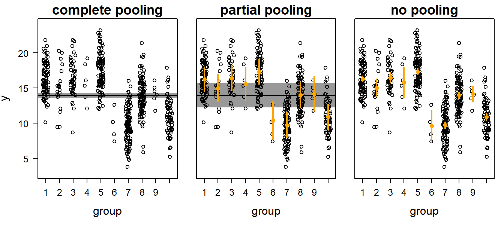
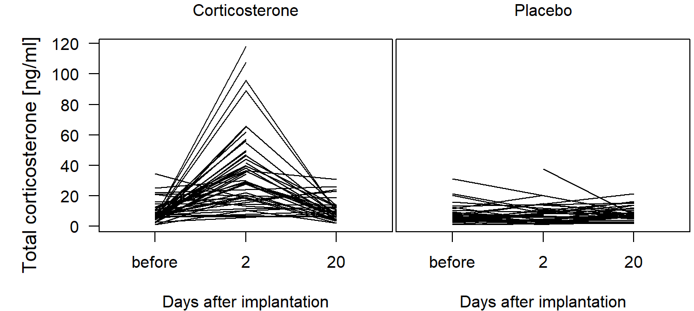

# Linear Mixed Effect Models{#lmer}


<a href="" target="_blank"></a>

------


## Background


### Why Mixed Effects Models?

Mixed effects models (or hierarchical models @Gelman2007 for a discussion on the terminology) are used to analyze nonindependent, grouped, or hierarchical data. For example, when we measure growth rates of nestlings in different nests by taking mass measurements of each nestling several times during the nestling phase, the measurements are grouped within nestlings (because there are repeated measurements of each) and the nestlings are grouped within nests. Measurements from the same individual are likely to be more similar than measurements from different individuals, and individuals from the same nest are likely to be more similar than nestlings from different nests. Measurements of the same group (here, the “groups” are individuals or nests) are not independent. If the grouping structure of the data is ignored in the model, the residuals do not fulfill the independence assumption.  

Further, predictor variables can be measured on different hierarchical levels. For example, in each nest some nestlings were treated with a hormone implant whereas others received a placebo. Thus, the treatment is measured at the level of the individual, while clutch size is measured at the level of the nest. Clutch size was measured only once per nest but entered in the data file more than once (namely for each individual from the same nest). Repeated measure results in pseudoreplication if we do not account for the hierarchical data structure in the model. Mixed models allow modeling of the hierarchical structure of the data and, therefore, account for pseudoreplication.  

Mixed models are further used to analyze variance components. For example, when the nestlings were cross-fostered so that they were not raised by their genetic parents, we would like to estimate the proportions of the variance (in a measurement, e.g., wing length) that can be assigned to genetic versus to environmental differences.  

The three problems, grouped data, repeated measure and interest in variances are solved by adding further variance parameters to the model. As a result, the linear predictor of such models contain parameters that are fixed and parameters that vary among levels of a grouping variable. The latter are called "random effects". Thus, a mixed model contains fixed and random effects. Often the grouping variable, which is a categorical variable, i.e., a factor, is called the random effect, even though it is not the factor that is random. The levels of the factor are seen as a random sample from a bigger population of levels, and a distribution, usually the normal distribution, is fitted to the level-specific parameter values. Thus, a random effect in a model can be seen as a model (for a parameter) that is nested within the model for the data.   

Predictors that are defined as fixed effects are either numeric or, if they are categorical, they have a finite (“fixed”) number of levels. For example, the factor “treatment” in the Barn owl study below has exactly two levels "placebo" and "corticosterone" and nothing more. In contrast, random effects have a theoretically infinite number of levels of which we have measured a random sample. For example, we have measured 10 nests, but there are many more nests in the world that we have not measured. Normally, fixed effects have a low number of levels whereas random effects have a large number of levels (at least 3!). For fixed effects we are interested in the specific differences between levels (e.g., between males and females), whereas for random effects we are only interested in the between-level (between-group, e.g., between-nest) variance rather than in differences between specific levels (e.g., nest A versus nest B).
Typical fixed effects are: treatment, sex, age classes, or season. Typical random effects are: nest, individual, field, school, or study plot. It depends sometimes on the aim of the study whether a factor should be treated as fixed or random. When we would like to compare the average size of a corn cob between specific regions, then we include region as a fixed factor. However, when we would like to know how the size of a corn cob is related to the irrigation system and we have several measurements within each of a  sample of regions, then we treat region as a random factor.


### Random Factors and Partial Pooling

In a model with fixed factors, the differences of the group means to the mean of the reference group are separately estimated as model parameters. This produces $k-1$ (independent) model parameters, where $k$ is the number of groups (or number of factor levels). In contrast, for a random factor, the between-group variance is estimated and the $k$ group-specific means are assumed to be normally distributed around the population mean. These $k$ means are thus not independent. We usually call the differences between the specific mean of group $g$ and the mean of all groups $b_g$. They are assumed to be realizations of the same (in most cases normal) distribution with a mean of zero. They are like residuals. The variance of the $b_g$ values is the among-group variance. 

Treating a factor as a random factor is equivalent to partial pooling of the data. There are three different ways to obtain means for grouped data. First, the grouping structure of the data can be ignored. This is called complete pooling (left panel in Figure \@ref(fig:pooling)).  

Second, group means may be estimated separately for each group. In this case, the data from all other groups are ignored when estimating a group mean. No pooling occurs in this case (right panel in Figure \@ref(fig:pooling)).  

Third, the data of the different groups can be partially pooled (i.e., treated as a random effect). Thereby, the group means are weighted averages of the population mean and the unpooled group means. The weights are proportional to sample size and the inverse of the variance (see @Gelman2007, p. 252). Further, the estimated mean of all group equals the mean of the group specific means, thus, every group is weighed similarly for calculating the overall mean. In contrast, in the complete pooling case, the groups get weights proportional to their sample sizes. 


Complete pooling    | Partial pooling       | No pooling        | 
:-------------------|:----------------------|:------------------|
 $\hat{y_i} = \beta_0$ \ $y_i \sim normal(\hat{y_i}, \sigma^2)$ | $\hat{y_i} = \beta_0 + b_{g[i]}$ \ $b_g \sim normal(0, \sigma_b^2)$ \ $y_i \sim normal(\hat{y_i}, \sigma^2)$  | $\hat{y_i} = \beta_{0[g[i]]}$ \ $y_i \sim normal(\hat{y_i}, \sigma_g^2)$ |  


<div class="figure">

<p class="caption">(\#fig:pooling)Three possibilities to obtain group means for grouped data: complete pooling, partial pooling, and no pooling. Open symbols = data, orange dots with vertical bars = group means with 95% uncertainty intervals, horizontal black line with shaded interval = population mean with 95% uncertainty interval.</p>
</div>


What is the advantage of analyses using partial pooling (i.e., mixed, hierarchical, or multilevel modelling) compared to the complete or no pooling analyses? Complete pooling ignores the grouping structure of the data. As a result, the uncertainty interval of the population mean may be too narrow. We are too confident in the result because we assume that all observations are independent when they are not. This is a typical case of pseudoreplication. On the other hand, the no pooling method (which is equivalent to treating the factor as fixed) has the danger of overestimation of the among-group variance because the group means are estimated independently of each other. The danger of overestimating the among-group variance is particularly large when sample sizes per group are low and within-group variance large. In contrast, the partial pooling method assumes that the group means are a random sample from a common distribution. Therefore, information is exchanged between groups. Estimated means for groups with low sample sizes, large variances, and means far away from the population mean are shrunk towards the population mean. Thus, group means that are estimated with a lot of imprecision (because of low sample size and high variance) are shrunk towards the population mean. How strongly they are shrunk depends on the precision of the estimates for the group specific means and the population mean. 

An example will help make this clear. Imagine that we measured 60 nestling birds from 10 nests (6 nestlings per nest) and found that the average nestling mass at day 10 was around 20 g with a among-nest standard deviation of 2 g. Then, we measure only one nestling from one additional nest (from the same population) whose mass was 12 g. What do we know about the average mass of this new nest? The mean of the measurements for this nest is 12 g, but with n = 1 uncertainty is high. Because we know that the average mass of the other nests was 20 g, and because the new nest belonged to the same population, a value higher than 12 g is a better estimate for an average nestling mass of the new nest than the 12 g measurement of one single nestling, which could, by chance, have been an exceptionally light individual. This is the shrinkage that partial pooling allows in a mixed model. Because of this shrinkage, the estimates for group means from a mixed model are sometimes called shrinkage estimators. A consequence of the shrinkage is that the residuals are positively correlated with the fitted values. 
To summarize, mixed models are used to appropriately estimate among-group variance, and to account for non-independency among data points.

## Fitting a normal linear mixed model in R

To introduce the linear mixed model, we use repeated hormone measures at nestling Barn Owls *Tyto alba*. The cortbowl data set contains stress hormone data (corticosterone, variable ‘totCort’) of nestling Barn owls which were either treated with a corticosterone-implant, or with a placebo-implant as the control group. The aim of the study was to quantify the corticosterone increase due to the corticosterone implants [@Almasi.2009]. In each brood, one or two nestlings were implanted with a corticosterone-implant and one or two nestlings with a placebo-implant (variable ‘Implant’). Blood samples were taken just before implantation, and at days 2 and 20 after implantation. 


```r
data(cortbowl)
dat <- cortbowl
dat$days <- factor(dat$days, levels=c("before", "2", "20")) 
str(dat)  # the data was sampled in 2004,2005, and 2005 by the Swiss Ornithologicla Institute
```

```
## 'data.frame':	287 obs. of  6 variables:
##  $ Brood  : Factor w/ 54 levels "231","232","233",..: 7 7 7 7 8 8 9 9 10 10 ...
##  $ Ring   : Factor w/ 151 levels "898054","898055",..: 44 45 45 46 31 32 9 9 18 19 ...
##  $ Implant: Factor w/ 2 levels "C","P": 2 2 2 1 2 1 1 1 2 1 ...
##  $ Age    : int  49 29 47 25 57 28 35 53 35 31 ...
##  $ days   : Factor w/ 3 levels "before","2","20": 3 2 3 2 3 1 2 3 2 2 ...
##  $ totCort: num  5.76 8.42 8.05 25.74 8.04 ...
```

In total, there are 287 measurements of 151 individuals (variable ‘Ring’) of 54 broods. Because the measurements from the same individual are non-independent, we use a mixed model to analyze these data: Two additional arguments for a mixed model are: a) the mixed model allows prediction of corticosterone levels for an ‘average’ individual, whereas the fixed effect model allows prediction of corticosterone levels only for the 151 individuals that were sampled; and b) fewer parameters are needed. If we include individual as a fixed factor, we would use 150 parameters, while the random factor needs a much lower number of parameters.
We first create a graphic to show the development for each individual, separately for owls receiving corticosterone versus owls receiving a placebo (Figure \@ref(fig:corttest)).


<div class="figure">

<p class="caption">(\#fig:corttest)Total corticosterone before and at day 2 and 20 after implantation of a corticosterone or a placebo implant. Lines connect measurements of the same individual.</p>
</div>

We fit a normal linear model with ‘Ring’ as a random factor, and ‘Implant’, ‘days’ and the interaction of ‘Implant’ $\times$ ‘days’ as fixed effects. Note that both ‘Implant’ and ‘days’ are defined as factors, thus R creates indicator variables for all levels except the reference level. Later, we will also include ‘Brood’ as a grouping level; for now, we ignore this level and start with a simpler (less perfect) model for illustrative purposes.

$\hat{y_i} = \beta_0 + b_{Ring[i]} + \beta_1I(days=2) + \beta_2I(days=20) + \beta_3I(Implant=P) + \beta_4I(days=2)I(Implant=P) + \beta_5I(days=20)I(Implant=P)$  
$b_{Ring} \sim normal(0, \sigma_b)$  
$y_i \sim normal(\hat{y_i}, \sigma)$  

Several different functions to fit a mixed model have been written in R: `lme`, `gls`, `gee` have been the first ones. Then `lmer` followed, and now, `stan_lmer` and `brm` allow to fit a large variety of hierarchical models. We here start w `ith using lmer` from the package lme4 (which is automatically loaded to the R-console when loading arm), because it is a kind of basis function also for `stan_lmer`and `brm`. Further, `sim` can treat lmer-objects but none of the earlier ones.

The function `lmer` is used similarly to the function `lm`. The only difference is that the random factors are added in the model formula within parentheses. The ’1’ stands for the intercept and the ‘|’ means ‘grouped by’. ‘(1|Ring)’, therefore, adds the random deviations for each individual to the average intercept. These deviations are the b_{Ring} in the model formula above. Corticosterone data are log transformed to achieve normally distributed residuals. 

After having fitted the model, in real life, we always first inspect the residuals, before we look at the model output. However, that is a dilemma for this text book. Here, we would like to explain how the model is constructed just after having shown the model code. Therefore, we do the residual analyses later, but in real life, we would do it now.


```r
mod <- lmer(log(totCort) ~ Implant + days + Implant:days + (1|Ring), 
            data=dat, REML=TRUE)
mod
```

```
## Linear mixed model fit by REML ['lmerMod']
## Formula: log(totCort) ~ Implant + days + Implant:days + (1 | Ring)
##    Data: dat
## REML criterion at convergence: 611.9053
## Random effects:
##  Groups   Name        Std.Dev.
##  Ring     (Intercept) 0.3384  
##  Residual             0.6134  
## Number of obs: 287, groups:  Ring, 151
## Fixed Effects:
##     (Intercept)         ImplantP            days2           days20  
##         1.91446         -0.08523          1.65307          0.26278  
##  ImplantP:days2  ImplantP:days20  
##        -1.71999         -0.09514
```


The output of the lmer-object tells us that the model was fitted using the REML-method, which is the restricted maximum likelihood method. The ‘REML criterion’ is the statistic describing the model fit for a model fitted by REML. The model output further contains the parameter estimates. These are grouped into a random effects and fixed effects section. The random effects section gives the estimates for the among-individual standard deviation of the intercept ($\sigma_{Ring} =$ 0.34) and the residual standard deviation ($\sigma =$ 0.61). The fixed effects section gives the estimates for the intercept ($\beta_0 =$ 1.91), which is the mean logarithm of corticosterone for an ‘average’ individual that received a corticosterone implant at the day of implantation. The other model coefficients are defined as follows: the difference in the logarithm of corticosterone between placebo- and corticosterone-treated individuals before implantation ($\beta_1 =$ -0.09), the difference between day 2 and before implantation for the corticosterone-treated individuals ($\beta_2 =$ 1.65), the difference between day 20 and before implantation for the corticosterone-treated individuals ($\beta_3 =$ 0.26), and the interaction parameters which tell us how the differences between day 2 and before implantation ($\beta_4 =$ -1.72), and day 20 and before implantation ($\beta_5 =$ -0.1), differ for the placebo-treated individuals compared to the corticosterone treated individuals.  

Neither the model output shown above nor the summary function (not shown) give any information about the proportion of variance explained by the model such as an $R^2$. The reason is that it is not straightforward to obtain a measure of model fit in a mixed model, and different definitions of $R^2$ exist [@Nakagawa.2013]. 

The function `fixef` extracts the estimates for the fixed effects, the function `ranef` extracts the estimates for the random deviations from the population intercept for each individual. The `ranef`-object is a list with one element for each random factor in the model. We can extract the random effects for each ring using the `$Ring` notation. 


```r
round(fixef(mod), 3)
```

```
##     (Intercept)        ImplantP           days2          days20  ImplantP:days2 
##           1.914          -0.085           1.653           0.263          -1.720 
## ImplantP:days20 
##          -0.095
```

```r
head(ranef(mod)$Ring) # print the first 6 Ring effects
```

```
##        (Intercept)
## 898054  0.24884979
## 898055  0.11845863
## 898057 -0.10788277
## 898058  0.06998959
## 898059 -0.08086498
## 898061 -0.08396839
```

## Restricted maximum likelihood estimation (REML)
<!-- we have not yet explained the ML-method. in the old book, chapter 5. we need to find a place for ML-method-->
For a mixed model the restricted maximum likelihood method is used by default instead of the maximum likelihood (ML) method. The reason is that the ML-method underestimates the variance parameters because this method assumes that the fixed parameters are known without uncertainty when estimating the variance parameters. However, the estimates of the fixed effects have uncertainty. The REML method uses a mathematical trick to make the estimates for the variance parameters independent of the estimates for the fixed effects. We recommend reading the very understandable description of the REML method in @Zuur.2009. For our purposes, the relevant difference between the two methods is that the ML-estimates are unbiased for the fixed effects but biased for the random effects, whereas the REML-estimates are biased for the fixed effects and unbiased for the random effects. However, when sample size is large compared to the number of model parameters, the differences between the ML- and REML-estimates become negligible. As a guideline, use REML if the interest is in the random effects (variance parameters), and ML if the interest is in the fixed effects. The estimation method can be chosen by setting the argument ‘REML’ to ‘FALSE’ (default is ‘TRUE’).


```r
mod <- lmer(log(totCort) ~ Implant + days + Implant:days + (1|Ring), 
            data=dat, REML=FALSE)  # using ML
```

When we fit the model by `stan_lmer` from the rstanarm-package or `brm` from the brms-package, i.e., using the Bayes theorem instead of ML or REML, we do not have to care about this choice (of course!). The result from a Bayesian analyses is unbiased for all parameters (at least from a mathematical point of view - also parameters from a Bayesian model can be biased if the model violates assumptions or is confounded). 


