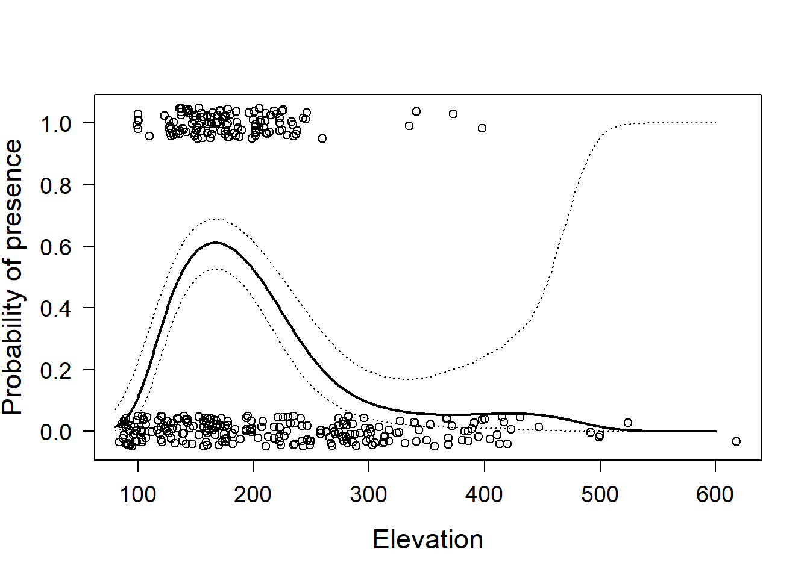
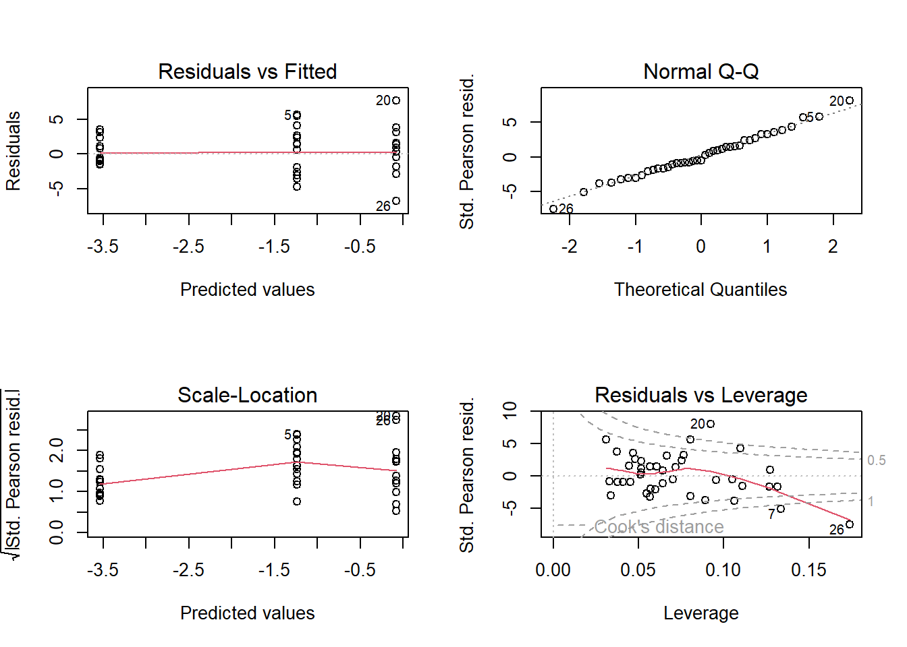
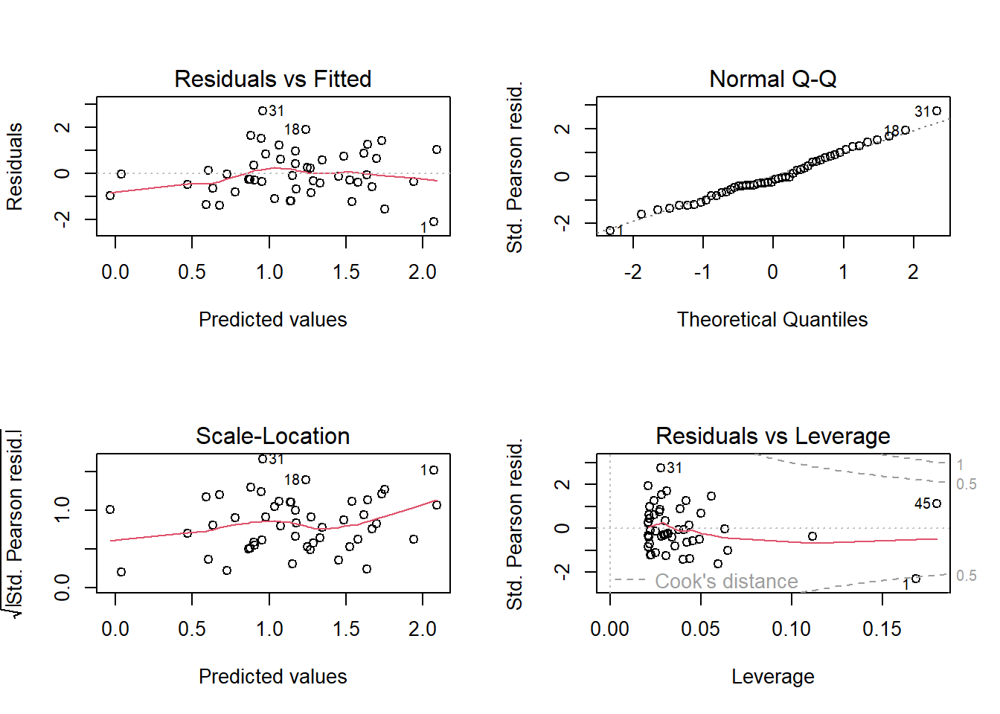

# Generalized linear models {#glm}
<!-- Fraenzis draft 29.9.2024-->

## Introduction

Up to now, we have dealt with models that assume normally distributed residuals. Sometimes the nature of the outcome
variable makes it impossible to fulfill this assumption as might occur with binary variables (e.g., alive/dead, a specific behavior occurred/did not occur), proportions (which are confined to be between 0 and 1), or counts that cannot have negative values. For such cases, models for distributions other than the normal distribution are needed; such models are called generalized linear models (GLM). They consist of three elements:  

1. the linear predictor $\bf X \boldsymbol \beta$   
2. the link function $g()$  
3. the data distribution  

The linear predictor is exactly the same as in normal linear models. It is a linear function that defines the relationship between the dependent and the explanatory variables. The link function transforms the expected values of the outcome variable into the range of the linear predictor, which ranges from $-\infty$ to $+\infty$. Or, perhaps more intuitively, the inverse link function transforms the values of the linear predictor into the range of the outcome variable. Table \@ref(tab:linkfunD) gives a list of possible link functions that work with different data distributions. 
Then, a specific data distribution, for example, binomial or Poisson, is used to describe how the observations scatter around the expected values. A general model formula for a generalized linear model is:
$$\bf y \sim ExpDist(\bf\hat y, \boldsymbol\theta)$$
$$g(\bf\hat y) = \bf X\boldsymbol \beta $$
where *ExpDist* is a distribution of the exponential family and $g()$ is the link function. The vector $\bf y$ contains the observed values of the outcome variable, $\bf \beta$ contains the model parameters in the linear predictor (also called the model coefficients), and $\bf X$ is the model matrix containing the values of the predictor variables. $\boldsymbol \theta$ is an optional vector of additional parameters needed to define the data distribution (e.g., the number of trials in the binomial distribution or the variance in the normal distribution).
The normal linear model is a specific case of a generalized linear model, namely when *ExpDist* equals the normal distribution and $g()$ is the identity function ($g(x) = x$). Statistical distributions of the exponential family are normal, Bernoulli, binomial, Poisson, inverse-normal, gamma, negative binomial, among others. The normal, Bernoulli, binomial, Poisson or negative binomial distributions are by far the most often used distributions. Most, but not all, data we gather in the life sciences can be analyzed assuming one of these few distributions.


Table: (\#tab:linkfunD)Frequently used distributions for the glm function with their default (D) link functions and other link functions that are possible.

|link            |Gaussian |Binomial |Gamma |Inv_Gauss |Poisson |Negative_binomial |
|:---------------|:--------|:--------|:-----|:---------|:-------|:-----------------|
|logit           |         |D        |      |          |        |                  |
|probit          |         |x        |      |          |        |                  |
|cloglog         |         |x        |      |          |        |                  |
|identity        |D        |         |x     |          |x       |x                 |
|inverse         |         |         |D     |          |        |                  |
|log             |         |         |x     |          |D       |D                 |
|1/mu^2          |         |         |      |D         |        |                  |
|sqrt            |         |         |      |          |        |x                 |
|cauchit         |         |x        |      |          |x       |                  |
|exponent (mu^a) |x        |         |      |          |        |                  |

Paul Buerkner has implemented many different distributions and link function in the package brms, [see here ](https://paulbuerkner.com/brms/reference/brmsfamily.html).


## Bernoulli model

### Background

If the outcome variable can only take one of two values (e.g., a species is present or absent, or the individual survived or died; coded as 1 or 0) we use a Bernoulli model, also called logistic regression. The [Bernoulli distribution](#bernoulli-dist) only allows for the values zero and ones and it has only one parameter $p$, which defines the probability that the value is 1. 

When fitting a Bernoulli model to data, we have to estimate $p$. Often we are interested in correlations between $p$ and one or several explanatory variables. Therefore, we model $p$ as linearly dependent on the explanatory variables. Because the values of $p$ are squeezed between 0 and 1 (because it is a probability), $p$ is transformed by the link-function before the linear relationship is modeled.
$$g(p_i) = \bf X\boldsymbol \beta $$
Functions that can transform a probability into the scale of the linear
predictor ($-\infty$ to $+\infty$) are, for example, logit, probit, cloglog, or cauchit. These link functions differ slightly in the way they link the outcome variable to the explanatory variables (Figure \@ref(fig:illlink)). The logit link function is the most often
used link function in binomial models. However, sometimes another link
function might fit the data better. [Kevin S. Van Horn gives useful tipps when to use which link function](https://bayesium.com/wp-content/uploads/2015/08/logit-probit-cloglog.pdf).


<div class="figure">

<p class="caption">(\#fig:illlink)Left panel: Shape of different link functions commonly used for modelling probabilities. Right panel: The relationship between the predictor x (x-axis) and p on the scale of the link function (y-axis) is assumed to be linear.</p>
</div>

### Fitting a Bernoulli model in R

Functions to fit a Bernoulli model are `glm`, `stan_glm`, `brm`, and there are many more that we do not know so well as the three we focus on in this book. 

We start by using the function `glm`. It uses the “iteratively reweighted least-squares method” which is an adaptation of the least-square (LS) method for fitting generalized linear models. The argument `family`allows to choose a data distribution. For fitting a Bernoulli model, we need to specify `binomial`. That is because the Bernoulli distribution is equal to the binomial distribution with only one trial (size parameter = 1). Note, if we forget the `family` argument, we fit a normal linear model, and there is no warning by R!

With the specification of the distribution, we also choose the link-function. The default link function for the binomial or Bernoulli model is the logit-function. To change the link-function, use e.g. `family=binomial(link=cloglog)`.

As an example, we use presence-absence data of little owls *Athene noctua* in nest boxes during the breeding season. The original data are published in @Gottschalk.2011; here we use only parts of these data. The variable `PA` contains the presence of a little owl: 1 indicates a nestbox used by little owls, whereas 0 stands for an empty nestbox. The variable `elevation` has the elevation in meters above sea level. We are interested in how the presence of the little owl is associated with elevation within the study area, that is, how the probability of presence changes with elevation. Our primary interest, therefore, is the slope $\beta_1$ of the regression line.

$$ y_i \sim Bernoulli(p_i) $$
$$ logit(p_i) = \beta_0 + \beta_1 elevation$$
where $logit(p_i) = log(p_i/(1-p_i))$.


```r
data(anoctua) # Athene noctua data in the blmeco package
mod <- glm(PA~elevation, data=anoctua, family=binomial)
mod
```

```
## 
## Call:  glm(formula = PA ~ elevation, family = binomial, data = anoctua)
## 
## Coefficients:
## (Intercept)    elevation  
##    0.579449    -0.006106  
## 
## Degrees of Freedom: 360 Total (i.e. Null);  359 Residual
## Null Deviance:	    465.8 
## Residual Deviance: 445.6 	AIC: 449.6
```


### Assessing model assumptions in a Bernoulli model

As for the normal linear model, the Bernoulli model (and any oder statistical model) assumes that the residuals are independent and identically distributed (iid). Independent means that every observation $i$ is independent of the other observations. Particularly, there are no groups in the data and no temporal or spatial correlation.

For generalised linear model different residuals exist. The standard
residual plots obtained by `plot(mod)` produce the same four plots as for an `lm` object, but it uses the deviance residuals for the first
three plots (residuals versus fitted values, QQ plot, and residual variance versus fitted values) and the Pearson’s residuals for the last (residuals versus leverage). The deviance residuals are the contribution of each observation to the deviance of the model. This is the default type when the residuals are extracted from the model using the function `resid`. The Pearson’s residual for observation $i$ is the difference between the observed and the fitted number of successes divided by the standard deviation given the number of trials and the fitted success probability: $\epsilon_i = \frac{y_i-n_i \hat{p_i}}{\sqrt{n_i \hat{p_i}(1-\hat{p_i})}}$. Other types of residuals are “working,” “response,” or “partial” (see @Davison.1991). For the residual plots, R chooses the type of residuals so that each plot should look roughly like the analogous plot for the normal linear model. However, in most cases the plots look awkward due to the discreteness of the data, especially when success probabilities are close to 0 or 1. We recommend thinking about why they do not look perfect; with experience, serious violations of model assumptions can be recognized. But often [posterior predictive model checking](#modelchecking) or graphical comparison of fitted values to the data are better suited to assess model fit in GLMs.

For Bernoulli models, the residual plots normally look quite awful because the residual distribution very often has two peaks, a negative and a positive one resulting from the binary nature of the outcome variable. However, it is still good to have a look at these plots using `plot(mod)`. At least the average should roughly be around zero and not show a trend. 
An often more informative plot to judge model fit for a binary logistic regression is to compare the fitted values with the data. To better see the observations, we slightly jitter them in the vertical direction.
If the model would fit the data well, the data would be, on average, equal to the fitted values. Thus, we add the $y = x$-line to the plot using the `abline` function with intercept 0 and slope 1.
Of course, binary data cannot lie on this line because they can only take on the two discrete values 0 or 1. However, the mean of the 0 and 1 values should lie on the line if the model fits well. Therefore, we calculate the mean for suitably selected classes of fitted values. In our example, we choose a class width of 0.1. Then, we calculate means per class and add these to the plot, together with a classical standard error that tells us how reliable the means are. This can be an indication whether our arbitrarily chosen class width is reasonable.


```r
plot(fitted(mod), jitter(anoctua$PA, amount=0.05), 
     xlab="Fitted values", ylab="Probability of presence", 
     las=1, cex.lab=1.2, cex=0.8)
abline(0,1, lty=3)

t.breaks <- cut(fitted(mod), seq(0,1, by=0.1))
means <- tapply(anoctua$PA, t.breaks, mean)
semean <- function(x) sd(x)/sqrt(length(x))
means.se <- tapply(anoctua$PA, t.breaks, semean)
points(seq(0.05, 0.95, by=0.1), means, pch=16, col="orange")
segments(seq(0.05, 0.95, by=0.1), means-2*means.se,
seq(0.05, 0.95,by=0.1), means+2*means.se,lwd=2, col="orange")

mod <- glm(PA ~ elevation + I(elevation^2) + I(elevation^3) +
             I(elevation^4), data=anoctua, family=binomial)
t.breaks <- cut(fitted(mod), seq(0,1, by=0.1))
means <- tapply(anoctua$PA, t.breaks, mean)
semean <- function(x) sd(x)/sqrt(length(x))
means.se <- tapply(anoctua$PA, t.breaks, semean)
points(seq(0.05, 0.95, by=0.1)+0.01, means, pch=16, col="lightblue", cex=0.7)
segments(seq(0.05, 0.95, by=0.1)+0.01, means-2*means.se,
seq(0.05, 0.95,by=0.1)+0.01, means+2*means.se,lwd=2, col="lightblue")
```

<div class="figure">

<p class="caption">(\#fig:lrgof)Goodness of fit plot for the Bernoulli model fitted to little owl presence-absence data. Open circles = observed presence (1) or absence (0) jittered in the vertical direction; orange dots = mean (and 95% compatibility intervals given as vertical bards) of the observations within classes of width 0.1 along the x-axis. The dotted line indicates perfect coincidence between observation and fitted values. Orange larger points are from the model assuming a linear effect of elevation, wheras the smaller light blue points are from a model assuming a non-linear effect.</p>
</div>

The means of the observed data (orange dots) do not fit well to the data (Figure \@ref(fig:lrgof)). For low presence probabilities, the model overestimates presence probabilities whereas, for medium presence probabilities, the model underestimates presence probability. This indicates that the relationship between little owl presence and elevation may not be linear. After including polynomials up to the fourth degree, we obtained a reasonable fit (light blue dots in Figure \@ref(fig:lrgof)). 

Further aspects of model fit that may be checked in Bernoulli models:  

Are all observations independent?  
May spatial or temporal correlation be an issue?  
Are all parameters well informed by the data? Some parameters may not be identifiable due to complete separation, i.e. when there is no overlap between the 0 and 1's regarding one of the predictor variables. In such cases `glm` may fail to fit the model. However, Bayesian methods (`stan_glm` or `brm`) do not fail but the result may be highly influenced by the prior distributions. A prior sensitivity analysis is recommended.

Note, we do not have to worry about overdispersion when the outcome variable is binary, even though the variance of the Bernoulli distribution is defined by p and no separate variance parameter exists. However, because the data can only take the values 0 and 1, there is no possibility that the data can show a higher variance than the one assumed by the Bernoulli distribution. 

### Visualising the results

When we are ready to report and visualise the results (i.e. after assessing the model fit, when we think the model reasonably well describes the data generating process). We can simulate the posterior distribution of $\beta_1$ and obtain the 95% compatibility interval.


```r
library(arm)
nsim <- 5000
bsim <- sim(mod, n.sim=nsim) # sim from package arm
apply(bsim@coef, 2, quantile, prob=c(0.5, 0.025, 0.975))
```

```
##       (Intercept) elevation I(elevation^2) I(elevation^3)      I(elevation^4)
## 50%     -24.29795 0.3969243   -0.002186237 0.000004819823 -0.0000000037551571
## 2.5%    -35.04641 0.1892489   -0.003492464 0.000001193223 -0.0000000071580098
## 97.5%   -13.17001 0.5943964   -0.000840353 0.000008361637 -0.0000000002608181
```

To interpret this polynomial function, an effect plot is helpful. To that end, and as we have done before, we calculate fitted values over the range of the covariate, together with compatibility intervals.


```r
newdat <- data.frame(elevation = seq(80,600,by=1))
Xmat <- model.matrix(~elevation+I(elevation^2)+I(elevation^3)+
                       I(elevation^4), data=newdat) # the model matrix
fitmat <- matrix(nrow=nrow(newdat), ncol=nsim)
for(i in 1:nsim) fitmat[,i] <- plogis(Xmat %*% bsim@coef[i,])
newdat$lwr <- apply(fitmat,1,quantile,probs=0.025)
newdat$fit <- plogis(Xmat %*% coef(mod))
newdat$upr <- apply(fitmat,1,quantile,probs=0.975)
```

We now can plot the data together with the estimate and its compatibility interval. We, again, use the function `jitter` to slightly scatter the points along the y-axis to make overlaying points visible.


```r
plot(anoctua$elevation, jitter(anoctua$PA, amount=0.05), 
     las=1, cex.lab=1.4, cex.axis=1.2, xlab="Elevation",
     ylab="Probability of presence")
lines(newdat$elevation, newdat$fit, lwd=2)
lines(newdat$elevation, newdat$lwr, lty=3)
lines(newdat$elevation, newdat$upr, lty=3)
```

<div class="figure">

<p class="caption">(\#fig:unnamed-chunk-4)Little owl presence data versus elevation with regression line and 95% compatibility interval (dotted lines). Open circles = observed presence (1) or abesnce (0) jittered in the vertical direction.</p>
</div>


### Some remarks 

Binary data do not contain a lot of information. Therefore, large sample sizes are needed to obtain robust results.


Often presence/absence data are obtained by visiting plots several times during a distinct period, for example, a breeding period, and then it is reported whether a species has been seen or not. If it has been seen and if there is no misidentification in the data, it is present, however, if it has not been seen we
are usually not sure whether we have not detected it or whether it is absent. In the case of repeated visits to the same plot, it is possible to estimate the detection probability using occupancy models @MacKenzie.2002 or point count models @Royle.2004b. 
Finally, logistic regression can be used in the sense of a discriminant function analysis that aims to find predictors that discriminate members of two groups @Anderson.1974. However, if one wants to use the fitted value from such an analysis to assign group membership of a new subject, one has to take the prevalence of the two groups in the data into account. 


## Binomial model

### Background
The binomial model is usesd when the response variable is a count with an upper limit, e.g., the number of seeds that germinated among a total number of seeds in a pot, or the number of chicks hatching from the total number of eggs. Thus, we can use the binomial model always when the response is the sum of a predefined number of Bernoulli trials. Whether a seed germinates or not is a Bernoulli trial. If we have more than one seed, the number of germinated seeds follow a [binomial distribution](#binomial-dist).


As an example, we use data from a study on the effects of anthropogenic fire regimes traditionally applied to savanna habitat in Gabon, Central Africa [@Walters.2012]. Young trees survive fires better or worse depending, among other factors, on the fuel load, which, in turn, depends heavily on the time since the last fire happened. Thus, plots were burned after different lengths of time since the previous fire (4, 9, or 12 months ago). Trees that resprouted after the previous (first) fire were counted before and after the experimental (second) fire to estimate their survival of the experimental fire depending on the time since the previous fire.  
The outcome variable is the number of surviving trees among the total number of trees per plot $y_i$. The explanatory variable is the time since the previous fire, a factor with three levels: “4m”, “9m”, and “12m”. Assuming that the data follow a binomial distribution, the following model can be fitted to the data:

$$ y_i \sim binomial(p_i, n_i) $$

$$ logit(p_i) = \beta_0 + \beta_1 I(treatment_i=9m) + \beta_2 I(treatment_i=12m)$$
where $p_i$ being the survival probability and $n_i$ the total number of tree sprouts on plot $i$. Note that $n_i$ should not be confused with the sample size of the data set, i.e. the number of rows in the data table. 


### Fitting a binomial model in R

We normally use `glm`, `stan_glm` or `brm` for fitting a binomial model depending on the complexity of the predictors and correlation structure.

We here, again, start with using the `glm` function. 

A peculiarity with binomial models is that the outcome is not just one number, it is the number of trees still live $y_i$ out of $n_i$ trees that were alive before the experimental fire. Therefore, the outcome variable has to be given as a matrix with two columns.
The first column contains the number of successes (number of survivors $y_i$) and the second column contains the number of failures (number of trees killed by the fire, $n_i - y_i$). We build this matrix using `cbind` (“column bind”).


```r
data(resprouts) # example data from package blmeco
resprouts$succ <- resprouts$post
resprouts$fail <- resprouts$pre - resprouts$post

mod <- glm(cbind(succ, fail) ~ treatment, data=resprouts,
family=binomial)
mod
```

```
## 
## Call:  glm(formula = cbind(succ, fail) ~ treatment, family = binomial, 
##     data = resprouts)
## 
## Coefficients:
##  (Intercept)   treatment9m  treatment12m  
##       -1.241         1.159        -2.300  
## 
## Degrees of Freedom: 40 Total (i.e. Null);  38 Residual
## Null Deviance:	    845.8 
## Residual Deviance: 395 	AIC: 514.4
```

Experienced readers will be alarmed because the residual deviance is much larger than the residual degrees of freedom, which indicates overdispersion. We will soon discuss overdispersion, but, for now, we continue with the analysis for the sake of illustration.

The estimated model parameters are $\hat{b_0} =$ -1.24,  $\hat{b_1} =$ 1.16, and  $\hat{b_2} =$ -2.3. These estimates tell us that tree survival was higher for the 9-month fire lag treatment compared to the 4-month treatment (which is the reference level), but lowest in the 12-month treatment. To obtain the mean survival probabilities per treatment, some math is needed because we have to back-transform the linear predictor to the scale of the outcome variable. The mean survival probability for the 4-month treatment is $logit^{-1}($-1.24$) = \frac{e^{-1.24}}{1+e^{-1.24}}=$0.22, for the 9-month treatment it is $logit^{-1}($-1.24$ +$ 1.16$) =$ 0.48, and for the 12-month treatment it is $logit^{-1}($-1.24$ +$ -2.3$) =$ 0.03. The function `plogis` gives the inverse of the logit function and can be used to estimate the survival probabilities, for example:


```r
plogis(coef(mod)[1]+ coef(mod)[2]) # for the 9month treatment
```

```
## (Intercept) 
##   0.4795799
```


The direct interpretation of the model coefficients $\beta_1$ and $\beta_2$ is that they are the log of the ratio of the odds of two treatment levels (i.e., the log odds ratio). The odds for treatment “4 months” are 0.22/(1-0.22)=0.29 (calculated using non rounded values), which is the estimated ratio of survived to killed trees in this treatment. For treatment “9 months,” the odds are 0.48/(1-0.48) = 0.92, and the log odds ratio is log(0.92/0.29) = 1.16 = $beta_1$.

The model output includes the null deviance and the residual deviance. Deviance is a measure of the difference between the data and a model. It corresponds to the sum of squares in the normal linear model. The smaller the residual deviance the better the model fits to the data. Adding a predictor reduces the deviance, even if the predictor does not have any relation to the outcome variable. The Akaike information criterion (AIC) value in the model output (last line) is a deviance measure that is penalized for the number of model parameters. It can be used for [model comparison](#model_comparison).  
The residual deviance is defined as minus two times the difference of the log-likelihoods of the saturated model and our model. The saturated model is a model that uses the observed proportion of successes as the success probability for each observation $y_i \sim binomial(y_i/n_i, n_i)$. The saturated model has the highest possible likelihood (given the data set and the binomial model). This highest possible likelihood is compared to the likelihood of the model at hand,
$y_i \sim binomial(p_i, n_i)$ with $p_i$ dependent on some predictor variables. The null deviance is minus two times the difference of the log-likelihoods of the saturated model, and a model that contains only one overall mean success probability, the null model $y_i \sim binomial(p, n_i)$. The null deviance corresponds to the total sum of squares, that is, it is a measure of the total variance in the data.

### Assessing assumptions in a binomial model

In the standard residual plots, we see that in our example data there are obviously a number of influential points (especially the data points with row numbers 7, 20, and 26; Figure \@ref(fig:diagplotsprout)). The corresponding data points may be inspected for errors, or additional predictors may be identified that help to explain why these points are extreme (Are they close/far from the village? Were they grazed? etc.). 


```r
par(mfrow=c(2,2))
plot(mod)
```

<div class="figure">

<p class="caption">(\#fig:diagplotsprout)The four standard residual plots obtained by using the plot-function.</p>
</div>

For whatever reason, the variance in the data is larger than assumed by the binomial distribution. We detect this higher variance in the mean of the absolute values of the standardized residuals that is clearly larger than one (lower left panel in Figure \@ref(fig:diagplotsprout)). This is called overdispersion, which we mentioned earlier and deal with next.

The variance of a binomial model is defined by $n$ and $p$, that is, there is no separate variance parameter. In our example $p$ is fully
defined by $\beta_0$, $\beta_1$, and $\beta_2$: $p_i = logit^{-1}(\beta_0 +  \beta_1 I(treatment_i = 9m)  + \beta_2 I(treatment_i = 12m))$, and $n_i$ is part of the data. Similarly, in a Poisson model (which we will introduce in the next chapter) the variance is defined by the mean. Unfortunately, real data, as in our example, often show higher and sometimes lower variance than expected by a binomial (or a Poisson) distribution (Figure \@ref(fig:overdisp)). When the variance in the data is higher than expected by the binomial (or the Poisson) distribution we have overdispersion. The uncertainties for the parameter estimates will be underestimated if we do not take overdispersion into account. Overdispersion is indicated when the residual deviance is substantially larger than the residual degrees of freedom.
This always has to be checked in the output of a binomial or a Poisson model. In our example, the residual deviance is 10 times larger than the residual degrees of freedom, thus, we have strong overdispersion.

<div class="figure">

<p class="caption">(\#fig:overdisp)Histogram of a binomial distribution without overdispersion (orange) and one with the same total number of trials and average success probability, but with overdispersion (blue).</p>
</div>


What can we do when we have overdispersion? The best way to deal with overdispersion is to find the reason for it. Overdispersion is common in biological data because animals do not behave like random objects but their behavior is sensitive to many factors that we cannot always measure such as social relationships, weather, habitat, experience, and genetics. In most cases, overdispersion is caused by influential factors that were not included in the model. If we find them and can include them in the model (as fixed or as random variables) overdispersion may disappear. If we do not find such predictor variables, we have at least three options.  

- use a quasi-binomial model  
- add an observation level random factor  
- use a beta-binomial model or in case of an overdispersed Poisson model, the negative binomial model may be a good option  

Fit a quasibinomial or quasi-Poisson model by specifying “quasibinomial” or
“quasipoisson” in the family-argument.


```r
mod <- glm(cbind(succ,fail) ~  treatment, data=resprouts,
family=quasibinomial)
```

This will fit a binomial model that estimates, in addition to the other model
parameters, a dispersion parameter, $u$, that is multiplied by the binomial or Poisson variance to obtain the residual variance: $var(y_i) = u n_i p_i(1 - p_i)$, or $var(y_i)= u\lambda_i$, respectively.
This inflated variance is then used to obtain the standard errors of the
parameter estimates.However, the quasi-distributions are unnatural distributions (there is no physical justification for these distributions, such as number of coin flips that are tails among a defined number of coin flips). Quasi-models do not differ from the binomial or the Poisson model in any parameter except that the variance is stretched so that fits to the variance in the data. We can see quasi-models as a kind of post-hoc correction for overdispersion. Thus, it is better to use the quasi-model instead of an overdispersed model to draw inference. However, the point estimates may be highly influenced by a few extreme observations.
Therefore, we prefer to use options that explicitly model the additional
variance.

Adding an observation-level random factor (i.e., a factor with the levels 1 to $n$, the sample size) models the additional variance as a normal distribution (in the scale of the link function). Adding such an additional variance parameter to the model allows and accounts for extra variance in the data [@Harrison.2014]. To do that, we have to fit a [generalized linear mixed model (GLMM)](#glmm) instead of a GLM.


What do we have to do when the residual deviance is smaller than the residual degrees of freedom, that is, when we have “underdispersion”? Some statisticians do not bother about underdispersion, because, when the variance in the data is smaller than assumed by the model, uncertainty is overestimated. This means that conclusions will be conservative (i.e., on the “safe” side). However, we think that underdispersion should bother us as biologists (or other applied scientists). In most cases, underdispersion means that the variance in the data is smaller than expected by a random process, that is, the variance may be constrained by something. Thus, we should be interested in thinking about the factors that constrain the variance in the data. An example is the number of surviving young in some raptor species, (e.g., in the lesser spotted eagle *Aquila pomarina*). Most of the time two eggs are laid, but the first hatched young will usually kill the second (which was only a “backup” in case the first egg does not yield a healthy young). Because of this behavior, the number of survivors among the number of eggs laid will show much less variance than expected from $n_i$ and $p_i$, leading to underdispersion. Clutch size is another example of data that often produces underdispersion (but it is a Poisson rather than a binomial process, because there is no $n_i$).

Sometimes, apparent under- or overdispersion can be caused by too many 0s in the data than assumed by the binomial or Poisson model. For example, the number of black stork $Ciconia nigra$ nestlings that survived the nestling phase is very often 0, because the whole nest was depredated or fell from the tree (black storks nest in trees). If the nest survives, the number of survivors varies between 0 and 5 depending on other factors such as food availability or weather conditions. A histogram of these data shows a bimodal distribution with one peak at 0 and another peak around 2.5. It looks like a Poisson distribution, but with a lot of additional 0 values. This is called zero-inflation.
Zero-inflation is often the result of two different processes being involved in producing the data.
The process that determines whether a nest survives differs from the process that determines how many nestlings survive, given the nest survives. When we analyze such data using a model that assumes only one single process it will be very hard to understand the system and the results are likely to be biased because the distributional assumptions are violated. In such cases, we will be more successful when our model explicitly models the two different processes. Such models are zero-inflated binomial or [zero-inflated Poisson models](#zeroinflated-poisson-lmm). 

We normally check whether zero-inflation may be an issue by [posterior predictive model checking](#modelchecking). If we find zero-inflation in binomial data, we try using a zero-inflated binomial model as provided by [Paul Buerkner in the package brms](http://paulbuerkner.com/brms/reference/ZeroInflated.html).


### Visualising the results

For the moment, we use the quasibinomial GLM to analyze the tree sprout data.  
We simulate 2000 values from the joint posterior distribution of the model parameters.


```r
nsim <- 2000
bsim <- sim(mod, n.sim=nsim) # simulate from the posterior distr.
```

For each set of simulated model parameters, we derive the linear predictor by multiplying the model matrix with the corresponding set of model parameters.
Then, the inverse logit function ($logit^{-1}(x) = \frac{e^x}{(1+ e^x)}$; R function `plogis`) is used to obtain the fitted value for each fire lag treatment. Lastly, we extract, for each treatment level, the 2.5% and 97.5% quantile of the posterior distribution of the fitted values and plot it together with the estimates (the fitted values) per treatment and the raw data.


```r
newdat <- data.frame(treatment=factor(c("4m","9m","12m"),levels=c("4m","9m","12m")))
Xmat <- model.matrix(~treatment, newdat)
fitmat <- matrix(nrow=nrow(newdat), ncol=nsim)
for(i in 1:nsim) fitmat[,i] <- plogis(Xmat %*% bsim@coef[i,])
newdat$lwr <- apply(fitmat, 1, quantile, prob=0.025)
newdat$upr <- apply(fitmat, 1, quantile, prob=0.975)
newdat$fit <- plogis(Xmat%*%coef(mod))


newdat$lag <- c(4,9,12)  # used for plotting
resprouts$lag <- c(4,9,12)[match(resprouts$treatment,c("4m","9m","12m"))]  # used for plotting

plot(newdat$lag, newdat$fit, type="n", xlab="Fire lag [months]", ylab="Tree survival",
     las=1, cex.lab=1.4, cex.axis=1, xaxt="n", xlim=c(0, 13), ylim=c(0,0.6))
axis(1, at=c(0,4,9,12), labels=c("0","4","9","12"))
segments(newdat$lag, newdat$lwr, newdat$lag, newdat$upr, lwd=2)
points(newdat$lag, newdat$fit, pch=21, bg="gray")

points(resprouts$lag+0.3,resprouts$succ/resprouts$pre, cex=0.7)  # adds the raw data to the plot
```

<div class="figure">

<p class="caption">(\#fig:fittree1)Proportion of surviving trees (circles) for three fire lag treatments with estimated mean proportion of survivors using a quasi-binomial model. Gray dots = fitted values. Vertical bars = 95% compatibility intervals. </p>
</div>


## Poisson model

### Background
The [Poisson distribution](#poisson) is a discrete probability distribution that naturally describes the distribution of count data. If we know how many times something happened, but we do not know how many times it did not happen (in contrast to the binomial model, where we know the number of trials), such counts usually follow a Poisson distribution. Count data are positive integers ranging from 0 to $+\infty$. 

A Poisson distribution is positive-skewed (long tail to the right) if the mean $\lambda$ is small and it approximates a normal distribution for large $\lambda$. The Poisson distribution constitutes the stochastic part of a Poisson model. The deterministic part describes how $\lambda$ is related to predictors. $\lambda$ can only take on positive values. Therefore, we need a link function that transforms $\lambda$ into the scale of the linear predictor (or, alternatively, an inverse link function that transforms the value from the linear predictor to nonnegative values). The most often used link function is the natural logarithm (log-link function).

This link function transforms all $\lambda$-values between 0 and 1 to the interval $-\infty$ to 0, and all $\lambda$-values higher than 1 are projected into the interval 0 to $+\infty$. Sometimes, the identity link function is used instead of the log-link function, particularly when the predictor variable only contains positive values and the effect of the predictor is additive rather than multiplicative, that is, when a change in the predictor produces an addition of a specific value in the outcome rather than a multiplication by a specific value. Further, the cauchit function can also be used as a link function for
Poisson models.

### Fitting a Poisson model in R

The same R functions that fit binomial models also fit Poisson models. 
As an example, we fit a Poisson model with log-link function to a simulated data set containing the number of (virtual) aphids on a square centimeter ($y$) and a numeric predictor variable representing, for example, an aridity index ($x$). Real ecological data without overdispersion or zeroinflation and with no random structure are rather rare. Therefore, we illustrate this model, which is the basis for more complex models, with simulated data. The model is: 
$$y_i \sim Poisson(\lambda_i)$$

$$log(\lambda_i = \bf X_i \boldsymbol \beta)$$

We use, similar to the R function `log`, the notation $log$ for the natural logarithm. We fit the model in R using the function `glm` and use the argument “family” to specify that we assume a Poisson distribution as the error distribution.
The log-link is used as the default link function. Then we add the regression line to the plot using the function `curve`. Further add the compatibility interval to the plot (of course only after having checked the model assumptions).


```r
set.seed(196855)
n <- 50         # simulate 50 sampling sites, where we count aphids
x <- rnorm(n)   # the number of aphids depends, among others, on the aridity index x
b0 <- 1         # intercept and
b1 <- 0.5       # slope of the linear predictor
y <- rpois(n, lambda=exp(b0+b1*x))


mod <- glm(y~x, family="poisson")

n.sim <- 2000
bsim <- sim(mod, n.sim=n.sim)

par(mar=c(4,4,1,1))
plot(x,y, pch=16, las=1, cex.lab=1.4, cex.axis=1.2)
curve(exp(coef(mod)[1] + coef(mod)[2]*x), add=TRUE, lwd=2)
newdat <- data.frame(x=seq(-3, 2.5, length=100))
Xmat <- model.matrix(~x, data=newdat)
b <- coef(mod)
newdat$fit <- exp(Xmat%*%b)
fitmat <- matrix(ncol=n.sim, nrow=nrow(newdat))
for(i in 1:n.sim) fitmat[,i] <- exp(Xmat%*%bsim@coef[i,])
newdat$lwr <- apply(fitmat, 1, quantile, prob=0.025)
newdat$upr <- apply(fitmat, 1, quantile, prob=0.975)
lines(newdat$x, newdat$fit, lwd=2)
lines(newdat$x, newdat$lwr, lty=3)
lines(newdat$x, newdat$upr, lty=3)
```

<div class="figure">

<p class="caption">(\#fig:simpois)Simulated data (dots) with a Poisson regression line (solid) and the lower and upper bound of the 95% compatibility interval.</p>
</div>

### Assessing model assumptions

Because the residual variance in the Poisson model is defined by $\lambda$ (the fitted value), it is not estimated as a separate parameter from the data. Therefore, we always have to check whether overdispersion is present. Ecological data are often overdispersed because not all influencing factors can be measured and included in the model. As with the binomial model, in a Poisson model overdispersion is present when the residual deviance is larger than the residual degrees of freedom. This is because if we add one independent observation to the data, the deviance increases, on average, by one if the variance equals $\lambda$. If the variance is larger, the contribution of each observation to the deviance is, on average, larger than one.
We can check this in the model output:


```r
mod
```

```
## 
## Call:  glm(formula = y ~ x, family = "poisson")
## 
## Coefficients:
## (Intercept)            x  
##      1.1329       0.4574  
## 
## Degrees of Freedom: 49 Total (i.e. Null);  48 Residual
## Null Deviance:	    85.35 
## Residual Deviance: 52.12 	AIC: 198.9
```

The residual deviance is 52 compared to 48 degrees of freedom. This is perfect (of course, because the model is fit to simulated data). If we are not sure, we could do a [posterior predictive model checking](#modelchecking) and compare the variance in the data with the variance in data that were simulated from the model. If there is substantial overdispersion, we could fit a quasi-Poisson model that includes a dispersion parameter. However, as explained previously, we prefer to explicitly model the variance. A good alternative for overdispersed count data that we now like very much (in contrast to what we wrote in the first printed edition of this book) is the negative binomial model. 

The standard residual plots (Figure \@ref(fig:diagpois)) are obtained in the usual way.


```r
par(mfrow=c(2,2))
plot(mod)
```

<div class="figure">

<p class="caption">(\#fig:diagpois)Standard residual plots for the Poisson model fitted to simulated data, thus they fit perfectly.</p>
</div>


Of course, again, they look perfect because we used simulated data. In a Poisson model, as for the binomial model, it is easier to detect lack of model fit using [posterior predictive model checking](#modelchecking). For example, data could be simulated from the model and the proportion of 0 values in the simulated data could be compared to the proportion of 0 values in the observations to assess whether zero-inflation is present or not. 

### Visualising results

We can look at the posterior distributions of the model parameters. 


```r
apply(bsim@coef, 2, quantile, prob=c(0.5, 0.025, 0.975))
```

```
##       (Intercept)         x
## 50%     1.1370430 0.4569485
## 2.5%    0.9692098 0.2974446
## 97.5%   1.3000149 0.6143244
```

The 95% compatibility interval of $\beta_1$ is 0.3-0.6. Given that an effect of 0.2 or larger on the aridity scale would be considered biologically relevant, we can be quite confident that aridity has a relevant effect on aphid abundance given our data and our model. With the simulations from the posterior distributions of the model parameters (stored in the object `bsim`) we obtained samples of the posterior distributions of fitted values for each of 100 x-values along the x-axis and we have drawn the 95% compatibility interval of the regression line in Figure \@ref(fig:simpois).


### Modeling rates and densities: Poisson model with an offset

Many count data are measured in relation to a reference, such as an area or a time period or a population. For example, when we count animals on plots of different sizes, the most important predictor variable will likely be the size of the plot. Or, in other words, the absolute counts do not make much sense when they are not corrected for plot size: the relevant measure is animal density. Similarly, when we count how many times a specific behavior occurs and we follow the focal animals during time periods of different lengths, then the interest is in the rate of occurrence rather than in the absolute number counted. One way to analyze rates and densities is to divide the counts by the reference value and assume that this rate (or a transformation thereof) is normally distributed. However, it is usually hard to obtain normally distributed residuals using rates or densities as dependent variables.

A more natural approach to describe rates and densities is to use a Poisson model that takes the reference into account within the model. This is called an offset. To do so, $\lambda$ is multiplied by the reference $T$ (e.g., time interval, area, population). Therefore, $log(T)$ has to be added to the linear predictor. Adding $log(T)$ to the linear predictor is like adding a new predictor variable (the log of $T$) to the model with its model parameter (the slope) fixed to 1. The term “offset”
says that we add a predictor but do not estimate its effect because it is fixed to 1.
$$y_i \sim Poisson(\lambda_i T_i)$$
$$ log(\boldsymbol \lambda \boldsymbol T) = log(\boldsymbol  \lambda) + log(\boldsymbol T) = \boldsymbol X \boldsymbol \beta + log(\boldsymbol T)$$

In R, we can use the argument “offset” within the function `glm` to specify an offset. We illustrate this using a breeding bird census on wildflower fields in Switzerland in 2007 conducted by @Zollinger.2013. We focus on the common whitethroat *Silvia communis*, a bird of field margins and fallow lands that has become rare in the intensively used agricultural landscape. Wildflower fields are an ecological compensation measure to provide food and nesting grounds for species such as the common whitethroat. Such fields are sown and then left unmanaged for several years except for the control of potentially problematic species (e.g., some thistle species, *Carduus spp.*). The plant composition and the vegetation structure in the field gradually changes over the years, hence the interest in this study was to determine the optimal age of a wildflower field for use by the common whitethroat.

We use the number of breeding pairs (bp) as the outcome variable and field size as an offset, which means that we model breeding pair density. We include the age of the field (age) as a linear and quadratic term because we expect there to be an optimal age of the field (i.e., a curvilinear relationship between the breeding pair density and age). We also include field size as a covariate (in addition to using it as the offset) because the size of the field may have an effect on the density; for example, small fields may have a higher density if the whitethroat can also use surrounding areas but uses the field to breed. Size (in hectares) was z-transformed before the model fit.


```r
data(wildflowerfields) # in the package blmeco
dat <- wildflowerfields[wildflowerfields$year==2007,] # select data
dat$size.ha <- dat$size/100 # change unit to ha
dat$size.ha.z <- scale(dat$size.ha)
mod <- glm(bp ~ age + I(age^2) + size.ha.z, offset=log(size.ha),
data=dat, family=poisson)
mod
```

```
## 
## Call:  glm(formula = bp ~ age + I(age^2) + size.ha.z, family = poisson, 
##     data = dat, offset = log(size.ha))
## 
## Coefficients:
## (Intercept)          age     I(age^2)    size.ha.z  
##     -4.2294       1.5241      -0.1408      -0.5397  
## 
## Degrees of Freedom: 40 Total (i.e. Null);  37 Residual
## Null Deviance:	    48.5 
## Residual Deviance: 27.75 	AIC: 70.2
```

For the residual analysis and for drawing conclusions, we can proceed in the same way we did in the Poisson model. From the model output we see that the residual deviance is smaller than the corresponding degrees of freedom, thus we have some degree of underdispersion. But the degree of underdispersion is not very extreme so we accept that the compatibility intervals will be a bit larger than “necessary” and proceed in this case.
After residual analyses, we can produce an effect plot of the estimated whitethroat density against the age of the wildflower field (Figure \@ref(fig:wildfl)). And we see that the expected whitethroat density is largest on wildflower fields of age 4 to 7 years.


```r
n.sim <- 5000
bsim <- sim(mod, n.sim=n.sim)
apply(bsim@coef, 2, quantile, prob=c(0.025,0.5,0.975))
```

```
##       (Intercept)       age    I(age^2)   size.ha.z
## 2.5%    -7.006715 0.3158791 -0.26708865 -1.14757192
## 50%     -4.196504 1.5118620 -0.14034083 -0.54749587
## 97.5%   -1.445242 2.7196036 -0.01837473  0.02976658
```

```r
par(mar=c(4,4,1,1))
plot(jitter(dat$age,amount=0.1),jitter(dat$bp/dat$size.ha,amount=0.1), pch=16, las=1, cex.lab=1.2, cex.axis=1, cex=0.7,
     xlab="Age of wildflower field [yrs]", ylab="Density of Whitethroat [bp/ha]")

# add credible/compatibility interval
newdat <- data.frame(age=seq(1, 9, length=100), size.ha.z=0)
Xmat <- model.matrix(~age + I(age^2) + size.ha.z, data=newdat)
b <- coef(mod)
newdat$fit <- exp(Xmat%*%b)
fitmat <- matrix(ncol=n.sim, nrow=nrow(newdat))
for(i in 1:n.sim) fitmat[,i] <- exp(Xmat%*%bsim@coef[i,])
newdat$lwr <- apply(fitmat, 1, quantile, prob=0.025)
newdat$upr <- apply(fitmat, 1, quantile, prob=0.975)
lines(newdat$age, newdat$fit, lwd=2)  
lines(newdat$age, newdat$lwr, lty=3)
lines(newdat$age, newdat$upr, lty=3)
```

<div class="figure">

<p class="caption">(\#fig:wildfl)Whitethroat densities are highest in wildflower fields that are around 4 to 6 years old. Dots are the raw data, the bold line give the fitted values (with the 95% compatibility interval given with dotted lines) for wildflower fields of different ages (years). The fitted values are given for average field sizes of 1.4 ha.</p>
</div>

