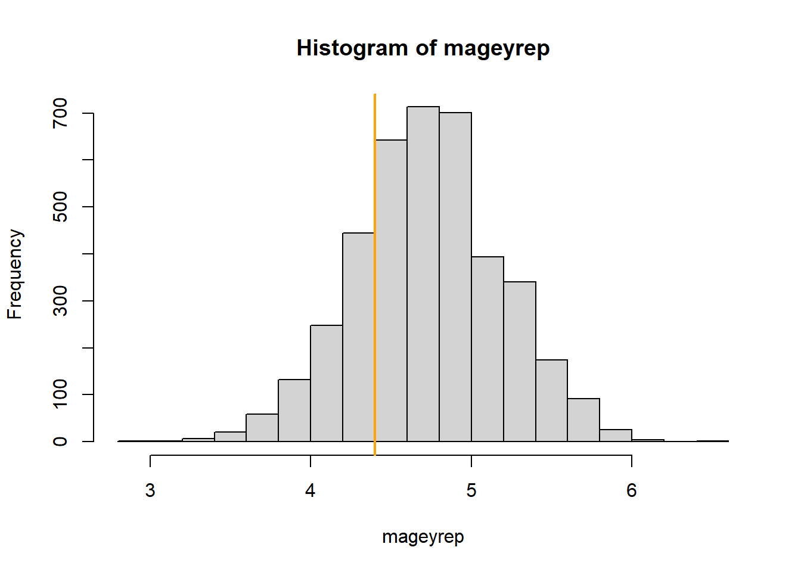

# Posterior predictive model checking {#modelchecking}

<!--Draft of Fraenzi 29.9.2024-->

Only if the model describes the data-generating process sufficiently accurately can we draw relevant conclusions from the model. It is therefore essential to assess model fit: our goal is to describe how well the model fits the data with respect to different aspects of the model. In this book, we present three ways to assess how well a model reproduces the data-generating process: (1) [residual analysis](#residualanalysis), 
(2) posterior predictive model checking (this chapter)
and (3) [prior sensitivity analysis](#priors).

Posterior predictive model checking is the comparison of replicated data generated under the model with the observed data. The aim of posterior predictive model checking is similar to the aim of a residual analysis, that is, to look at what data structures the model does not explain. However, the possibilities of residual analyses are limited, particularly in the case of non-normal data distributions. For example, in a logistic regression, positive residuals are always associated with $y_i = 1$ and negative residuals with $y_i = 0$. As a consequence, temporal and spatial patterns in the residuals will always look similar to these patterns in the observations and it is difficult to judge whether the model captures these processes adequately. In such cases, simulating data from the posterior predictive distribution of a model and comparing these data with the observations (i.e., predictive model checking) gives a clearer insight into the performance of a model.

We follow the notation of @Gelman2014 in that we use “replicated
data”, $y^{rep}$ for a set of $n$ new observations drawn from the posterior predictive distribution for the specific predictor variables $x$ of the $n$ observations in our data set. When we simulate new observations for new values of the predictor variables, for example, to show the prediction interval in an effect plot, we use $y^{new}$.

The first step in posterior predictive model checking is to simulate a replicated data set for each set of simulated values of the joint posterior distribution of the model parameters. Thus, we produce, for example, 2000 replicated data sets. These replicated data sets are then compared graphically, or more formally by test statistics, with the observed data. The Bayesian p-value offers a way for formalized testing. It is defined as the probability that the replicated data from the model are more extreme than the observed data, as measured by a test statistic. In case of a perfect fit, we expect that the test statistic from the observed data is well in the middle of the ones from the replicated data. In other words, around 50% of the test statistics from the replicated data are higher than the one from the observed data, resulting in a Bayesian p-value close to 0.5. Bayesian p-values close to 0 or close to 1, on the contrary, indicate that the aspect of the model measured by the specific test statistic is not well represented by the model. 

Test statistics have to be chosen such that they describe important data structures that are not directly measured as a model parameter. Because model parameters are chosen so that they fit the data well, it is not surprising to find p-values close to 0.5 when using model parameters as test statistics. For example, extreme values or quantiles of $y$ are often better suited than the mean as test statistics, because they are less redundant with the model parameter that is fitted to the data. Similarly, the number of switches from 0 to 1 in binary data is suited to check for autocorrelation whereas the proportion of 1s among all the data may not give so much insight into the model fit. Other test statistics could be a measure for asymmetry, such as the relative difference between the 10 and 90% quantiles, or the proportion of zero values in a Poisson model.

We like predictive model checking because it allows us to look at different, specific aspects of the model. It helps us to judge which conclusions from the model are reliable and to identify the limitation of a model. Predictive model checking also helps to understand the process that has generated the data.

We use an analysis of the whitethroat breeding density in wildflower fields of different ages for illustration. The aim of this analysis was to identify an optimal age of wildflower fields that serves as good habitat for the whitethroat. 

Because the Stan developers have written highly convenient user friendly functions to do posterior predictive model checks, we fit the model with Stan using the function `stan_glmer` from the package `rstanarm`. 


```r
data("wildflowerfields")
dat <- wildflowerfields
dat$size.ha <- dat$size/100 # change unit to ha
dat$size.z <- scale(dat$size) # z-transform size
dat$year.z <- scale(dat$year)
age.poly <- poly(dat$age, 3) # create orthogonal polynomials 
dat$age.l <- age.poly[,1]    # to ease convergence of the model fit
dat$age.q <- age.poly[,2]
dat$age.c <- age.poly[,3]

library(rstanarm)
mod <- stan_glmer(bp ~ year.z + age.l + age.q + age.c + size.z +
(1|field) + offset(log(size.ha)), family=poisson, data=dat)
```

The R-package `shinystan` [@StanDevelopmentTeam.2017b] provides an easy way to do model checking. Therefore, there is no excuse to not do posterior predictive model checking. The R-code `launch_shinystan(mod)` opens a html-file that contains all kind of diagnostics of a model. Besides many statistics and diagnostic plots to assess how well the MCMC worked we also find a menu "PPcheck". There, we can click through many of the plots that we, below, produce in R.

The function `posterior_predict` simulates many (exactly as many as there are draws from the posterior distributions of the model parameters, thus 4000 if the default number of iteration has been used in Stan) different data sets from a model fit. Specifically, for each single set of parameter values of the joint posterior distribution it simulates one replicated data set. We can look at histograms of the data and the replicated  (Figure \@ref(fig:histpp)). The real data (bp) look similar to the replicated data.  


```r
set.seed(2352) # to make sure that the ylim and breaks of the histograms below can be used
yrep <- posterior_predict(mod)
par(mfrow=c(3,3), mar=c(2,1,2,1))
for(i in 1:8) hist(yrep[i,], col="blue", 
                   breaks=seq(-0.5, 18.5, by=1), ylim=c(0,85))
hist(dat$bp, col="blue", 
     breaks=seq(-0.5, 18.5, by=1), ylim=c(0,85))
```

<div class="figure">

<p class="caption">(\#fig:histpp)Histograms of 8 out of 4000 replicated data sets and of the observed data (dat$bp). The arguments breaks and ylim have been used in the function hist to produce the same scale of the x- and y-axis in all plots. This makes comparison among the plots easier.</p>
</div>

Let's look at specific aspects of the data. The proportion of zero counts could be a sensitive test statistic for this data set. First, we define a function “propzero” that extracts the proportion of zero counts from a vector of count data. Then we apply this function to the observed data and to each of the 4000 replicated data sets. At last, we extract the 1 and 99% quantile of the proportion of zero values of the replicated data.


```r
propzeros <- function(x) sum(x==0)/length(x)
propzeros(dat$bp) # prop. zero values in observed data
```

```
## [1] 0.4705882
```

```r
pzeroyrep <- apply(yrep, 2, propzeros) # prop. zero values in yrep
quantile(pzeroyrep, prob=c(0.01, 0.99))
```

```
##        1%       99% 
## 0.0307500 0.9562625
```

The observed data contain 47% zero values, which is well within the 98%-range of what the model predicted (3 - 96%). the Bayesian p-value is 0.6.


```r
mean(pzeroyrep>=propzeros(dat$bp))
```

```
## [1] 0.6029412
```

What about the upper tail of the data? Let’s look at the 90% quantile.


```r
quantile(dat$bp, prob=0.9) # for observed data
```

```
## 90% 
##   2
```

```r
q90yrep <- apply(yrep, 2, quantile, prob=0.9) # for simulated data
table(q90yrep)
```

```
## q90yrep
##                  0 0.0999999999999091                  1                  2 
##                  8                  1                 39                 47 
##                  3                  4                  5                  6 
##                 23                  7                  7                  1 
##                  7                  8 
##                  2                  1
```

Also, the 90% quantile of the data is within what the model predicts. 

We also can look at the spatial distribution of the data and the replicated data. The variables X and Y are the coordinates of the wildflower fields. We can use them to draw transparent gray dots sized according to the number of breeding pairs.


```r
par(mfrow=c(3,3), mar=c(1,1,1,1))
plot(dat$X, dat$Y, pch=16, cex=dat$bp+0.2, col=rgb(0,0,0,0.5), axes=FALSE)
box()
r <- sample(1:nrow(yrep), 1) # draw 8 replicated data sets at random
for(i in r:(r+7)){
plot(dat$X, dat$Y, pch=16, cex=yrep[i,]+0.2,
col=rgb(0,0,0,0.5), axes=FALSE)
box()
}
```

<div class="figure">

<p class="caption">(\#fig:spatpp)Spatial distribution of the whitethroat breeding pair counts and of 8 randomly chosen replicated data sets with data simulated based on the model. the smallest dot correspond to a count of 0, the largest to a count of 20 breeding pairs. The panel in the upper left corner shows the data, the other panels are replicated data from the model.</p>
</div>

The spatial distribution of the replicated data sets seems to be similar to the observed one at first look (Figure \@ref(fig:spatpp)). With a second look, we may detect in the middle of the study area the model may predict slightly larger numbers than observed. This pattern may motivate us to find the reason for the imperfect fit if the main interest is whitethroat density estimates. Are there important elements in the landscape that influence whitethroat densities and that we have not yet taken into account in the model? However, our main interest is finding the optimal age of wildflower fields for the whitethroat. Therefore, we look at the mean age of the 10% of the fields with the highest breeding densities.
To do so, we first define a function that extracts the mean field age of the 10% largest whitethroat density values, and then we apply this function to the observed data and to the 4000 replicated data sets.


```r
magehighest <- function(x) {
q90 <- quantile(x/dat$size.ha, prob=0.90)
index <- (x/dat$size.ha)>=q90
mage <- mean(dat$age[index])
return(mage)
}

magehighest(dat$bp)
```

```
## [1] 4.4
```

```r
mageyrep <- apply(yrep, 1, magehighest)
quantile(mageyrep, prob=c(0.01, 0.5,0.99))
```

```
##       1%      50%      99% 
## 3.714286 4.714286 5.812946
```

The mean age of the 10% of the fields with the highest whitethroat densities is 4.4 years in the observed data set. In the replicated data set it is between 3.71 and 5.81 years. The Bayesian p-value is 0.79. Thus, in around 79% of the replicated data sets the mean age of the 10% fields with the highest whitethroat densities was higher than the observed one (Figure \@ref(fig:agepp)).


```r
hist(mageyrep)
abline(v=magehighest(dat$bp), col="orange", lwd=2)
```

<div class="figure">

<p class="caption">(\#fig:agepp)Histogram of the average age of the 10% wildflower fields with the highest breeding densities in the replicated data sets. The orange line indicates the average age for the 10% fields with the highest observed whithethroat densities.</p>
</div>

In a publication, we could summarize the results of the posterior predictive model checking in a table or give the plots in an appendix. Here, we conclude that the model fits in the most important aspects well. However, the model may predict too high whitethroat densities in the central part of the study area. 
