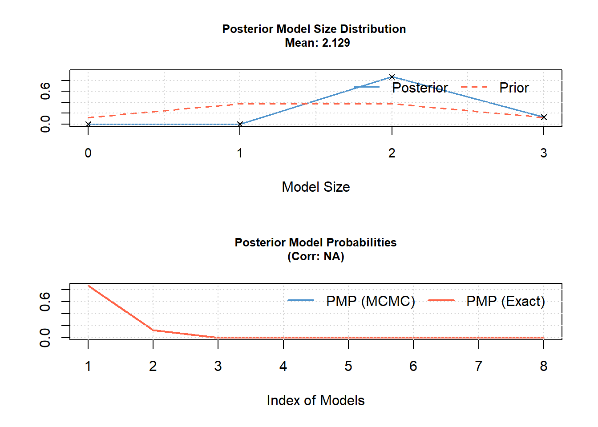

# Model comparison and multimodel inference {#model_comparison}

<!--Draft of Fraenzi 1.10.2024-->


## When and why we compare models and why model selection is difficult

Model selection and multimodel inference are delicate topics! During the data analysis process we sometimes come to a point where we have more than one model that adequately describes the data (according to [residual analyses](#residualanalysis) and [posterior predictive model checking](#modelchecking)), and that are potentially interpretable in a sensible way. The more complex a model is, the better it fits the data and residual plots and predictive model checking look even better. But, at what point do we want to stop adding complexity? There is no unique answer to this question, except that the choice of a model is central to science, and that this choice may be based on expert knowledge on the mechanisms that have produced the data. Mathematical criteria may help in finding a useful model, however, they may also misguide researchers [@bornmann_opium_2024]. Scientists should build meaningful models based on their experience of the subject. Consequently, thinking about the processes that have generated the data is a central aspect of model selection (e.g., @Gelman.1999; @Anderson.2008; @Claeskens.2008; @Link.2010; @Gelman2014; and many more).
Why is model selection difficult? With increasing complexity of the model, the bias (i.e., the systematic difference between a parameter estimate and its true values) decreases, whereas the uncertainty of the parameter estimates increases. To reduce bias, we would like to increase the complexity of the model (e.g., by increasing the number of predictors and building more realistic models) but with models that are too complex (compared to sample size) the uncertainty in the parameter estimates becomes so large that the model will not be useful. Hence, if the process studied is complex, a large sample size is needed. However, sample sizes are usually low compared to the complexity of the processes that have generated them. Then, less complex models may capture the information in the data, at least for some of the processes, more clearly than a model too complex for the data at hand. Where the optimum in the trade-off between bias and uncertainty lies depends on the purpose and the context of the study. In some studies, it is extremely important to keep bias small, whereas in other studies high precision is more useful. The first type of models are sometimes called “confirmatory” and the latter “predictive” [@Shmueli.2010]. Mathematical techniques for selecting a model or for basing the inference on several models simultaneously (multimodel inference) are particularly helpful for constructing predictive models. For example, estimation of the total population of wallcreepers *Tichodroma muraria* in Switzerland may be done based on a habitat model fitted to population count data on a sample of 1 km2 plots (e.g., from a monitoring program). The purpose of the model is to predict wallcreeper abundance for the non-sampled plots. The sum of the predicted abundances over all plots gives an estimate for the total population of wallcreepers in Switzerland. The aim of the model in this example is to produce precise predictions. Therefore, we aim at selecting, among the available habitat variables, the ones that produce the most reliable predictions of wallcreeper abundance. In this case, the predictive performance of a model is more important than the estimation of unbiased effect sizes, hence, we aim at reducing the uncertainty of the estimates, rather than including all possible relevant predictors. Many of the widely available habitat variables will not have a direct relationship with the biology of the wallcreeper and their estimated effect sizes will be difficult to interpret anyway. Therefore, it is less of a problem when the estimated effects are biased as long as the predictions are reliable.

In contrast, in a study that aims at better understanding a system, for example, when we are interested in how temperature influences the timing of breeding in the snowfinch, it is important to measure the effect of temperature on the timing of the broods with minimal bias, i.e. corrected for other environmental influences such as snow conditions. Because bias decreases the more realistic the model is, we may prefer to use more complex models in such cases. Then, we would use predictive model checking and biological reasoning about the process that generated the data, rather than a mathematical criterion that measures the predictive performance of a model. Using the latter method, final models often contain structures (e.g. fixed effects) that are only characteristic for the specific data set but have no general validity (even if out-of-data predictive performance has been used, the model is still fitted to a finite number of observations).  
Theoretically, we should construct the model before looking at the data. However, to do so, we need to know the system that we study in advance, which may be difficult since we often collect data to learn about the system in the first place.  
Bias enters in scientific studies at many places ranging from what questions we ask, to the tools that are available for data collection, to the way we present the results. The data we collect are the ones we think are important (or the ones that can be logistically and physically collected) but not the ones that may be relevant in the system. A non-biased study therefore may be one that does not start with a question, where exceptionally all data are collected and then mathematical criteria are used to sort out the relationships. Of course, it is impossible to collect data for all factors relevant to the system. Therefore, we formulate specific questions and carefully design our study, at the cost of introducing bias due to the way we think about the system. Selecting models after having collected the data introduces another bias. At this stage, the bias is due to specificity of the data (overfit). But sometimes it is useful to reduce model complexity by a formal model selection or multimodel inference method. Table 11-1 lists some situations that evoke a model selection or multimodel inference problem and how we may address the problem.  
The out-of-data predictive performance of a model is certainly very important in studies such as the preceding wallcreeper example. But also in basic research studies measurements of the predictive performance can help in understanding a model. A model that is too simple will lead us to make poor predictions in many cases because it does not account for all important processes, whereas a too complex model (compared to the sample size) will make poor predictions because parameter estimates are uncertain. Unfortunately (or fortunately?), there does not yet exist a single method for measuring predictive performance that is generally considered the gold standard. That makes model selection difficult. Here, we try to summarize and present some methods that we found useful for specific problems. A plenitude of articles and books discuss model selection and multimodel inference much more exhaustively than we do here. 

Table: (\#tab:modsel) Situations (after residual analyses and predictive model checking) that evoke model selection or multi-model inference with methods that we consider in the specific situation. This list is neither intended to be exhaustive nor dogmatic.

Situation                   | Useful method           | 
:---------------------------|:------------------------|
Describe a nonlinear effect using polynomials: How many polynomials should be included? | WAIC, or cross-validation; consider using a GAM(M) or non-linear model | 
Finding an appropriate smoothness in GAM(M) | cross-validation, WAIC |  
Omit interactions from a model for better interpretability | Decide whether the interaction is biologically relevant, compare effect sizes, or use WAIC, or cross-validation |  
Computing problems that may be produced by too many random factors: which random factor should be deleted?  | Assess the importance of the random factors by visualising among-group variance in plots or by fitting the model using Bayesian methods (priors may help fitting the model). Do not delete random factors when there was a good reason to include them. Also, WAIC may be helpful. |  
The residuals are spatially correlated and no theory about the shape of the correlation function exists: choose a correlation function (e.g., linear, exponential, spherical)   | WAIC may help, but as it has difficulties in structured models, such as spatial models [@Gelman2014], AIC may be a pragmatic alternative. Use predictive model-checking to see which model best captures the data’s spatial distribution. |  
Different models represent different biological hypotheses, which mutually exclude each other. It should be measured which one has the highest support given the data  | Bayes factor and posterior model probabilities are nice tools for that. However, results are more easily interpreted if prior information is available. In case of no prior information, WAIC may be a better alternative. If the interest is in derived parameters (e.g., fitted values, predictions, population estimates), model averaging may be considered.  |  
Many explanatory variables and only the important ones should be included to reduce uncertainty  | Do not remove variables of interest (aim of the study) from the model. For nuisance variables, cross-validation, WAIC, LASSO, ridge regression, or inclusion probabilities may be useful. Choose method depending on the purpose of the study.   |  
There are more explanatory variables than observations  | LASSO and ridge regression may be helpful.  |  


In many cases, models have specific purposes. Based on results from a statistical model, decisions are made and actions are started. These decisions and actions are associated with benefits and risks. The benefits and risks define the “utility function”. Useful models are associated with high values of the utility function. Such methods are beyond the scope of this book, but we highly recommend focusing on the purpose of the model when comparing (or selecting) models. A primer to decision analysis can be found in Yokomizo et al. (2014).

## Methods for model commparison

### Cross-validation

The principle of cross-validation is to fit the model using only a part of the data (training data) and to make predictions based on the data that are held out. The differences between the observed and predicted values are measured. Frequentists use the mean squared differences (MSE) or the root of the MSE (RMSE) as a measure of predictive fit (cross-validation score). Bayesians sum the logarithm of the predictive density values of the hold-out data points using the model fitted to the training data (see following). To do a cross-validation, one observation at a time can be held out (leave-one-out cross-validation) or several observations can be held out simultaneously ($k$-fold cross-validation, where $k$ is the number of groups held out in turn). How many observations should be held out in turn depends on the data structure. The holdout data should be independent of the training data (e.g., leave out an entire level of a random factor; the data held out should not be spatially or temporally correlated with the training data). In the case of unstructured (independent) data, each single observation is left out in turn. For hierarchical or grouped data (mixed models) the cross-validation procedure has to be programmed in R by hand, because the way the data are partitioned into training and holdout sets is unique to each data set.  
For independent observations (LM or GLM), the function `loo.cv` calculates the Bayesian leave-one-out cross-validation estimate of predictive fit (described in @Gelman2014). It leaves out one observation $y_i$ at a time, and fits the model to the remaining data $y_{-i}$. Then, it integrates the predictive density of $y_i$ over the posterior distribution of the model parameters. The log of this value is summed over all observations (i.e., leaving out each observation in turn) to return the leave-one-out cross-validation estimate of predictive fit. The larger this value is, the better the prediction fits the left-out observations.  
Because all $n$ models are based on $n - 1$ observations only, the predictive fit is underestimated, especially when sample size is small. This bias can be corrected by setting the argument “bias.corr” to TRUE.

<!-- wäre schön, ein richtiges Beispiel zu verwenden, z.B. Christians Atlas-Daten?-->
We illustrate Bayesian leave-one-out cross-validation using the “pondfrog1” data. This data set contains the size of frog populations in different ponds with different characteristics. It includes simulated data. Therefore, the “true” model is known and model comparison using different methods may be illustrative. Let’s say that we need to estimate the total frog population in a large area with around 5000 small ponds. It is not feasible to count the number of frogs in 5000 ponds. Therefore, we would like to predict the number of frogs for the 5000 ponds from a sample of 130 ponds, for which the frog populations have been counted, and pH, water depth, and average temperature have been measured. The aim is to use these variables as predictors for the number of frogs for the remaining 4870 ponds. Measuring water depth, pH, and temperature is expensive. Therefore, we would like to include only those
predictors that are really necessary.

For example, say it was well known that waterdepth and temperature are important factors determining how many frogs inhabit a pont. However we are unsure about ph. We need to decide whether we would like to consider ph as a predictor.  First, we fit two models, one including ph and one excluding ph as predictor.


```r
data(pondfrog1) # data in the package blmeco
mod1 <- glm(frog ~ waterdepth + temp + ph, data= pondfrog1,
family=poisson)
mod2 <- glm(frog ~ waterdepth + temp, data=pondfrog1,
family=poisson)
```

The leave-one-out cross-validation predictive performance of the different models can be compared.


```r
loo1 <- loo.cv(mod1, bias.corr=TRUE) # increase nsim for more precise results
loo2 <- loo.cv(mod2, bias.corr=TRUE)
loo1$bias.corrected.LOO.CV; loo2$bias.corrected.LOO.CV
```

```
## [1] -402.4619
```

```
## [1] -404.467
```

```r
loo1$est.peff; loo2$est.peff
```

```
## [1] 4.611909
```

```
## [1] 3.105838
```


The output gives the leave-one-out cross-validation estimate of predictive fit. The bias-corrected leave-one-out cross-validation, which is recommended for small sample sizes. We also get an estimate for the number of effective parameters (est.peff), which is the difference between the non-cross-validated predictive fit and the cross-validated predictive fit (LOO.CV). It measures “overfit”, that is, how much the model fits better to the data used for model fitting compared to new data. The model without ph seems to have
the higher out-of data predictive fit.

Cross-validation in a Bayesian framework is extremely computing time intensive, because $n$ models have to be fitted, and for each model the posterior distribution of the parameter estimates needs to be simulated. Frequentist cross-validation requires less computing time, because no posterior distributions have to be simulated. And, for normal linear models, a leave-one-out cross-validation can be computed using matrix algebra without having to refit any model (e.g., see @Wood.2017). This may be a fast alternative.

### Information Criteria: Akaike information citerion and widely applicable information criterion

The Akaike information criterion (AIC) and the widely applicable information criterion (WAIC) are asymptotically equivalent to cross-validation [@Stone.1977, @Gelman2014]. AIC is minus two times the log likelihood (the “frequentist” likelihood<!-- fk: insert reference to chapter likelihood!!-->) plus two times the number of model parameters [@Akaike.1974]:
<!-- fk: Das Hut-Zeichen sollte über alle 3 Zeichen theta, M und L, nicht nur über M!! -->
$$AIC = -2log(L(\hat{\theta^{ML}}|y)) + 2K = -2log(p(y|\hat{\theta^{ML}})) $$
where $\hat{\theta^{ML}}$ is the vector of maximum likelihood estimates of the model parameters and $K$ is the number of parameters.

The first quantity measures the model fit. Because of the factor “-2”, the smaller the value, the better the model fits the data. The second quantity penalizes for overfit: for each parameter, a value of two is added. Generally, the smaller the AIC, the “better” is the predictive performance of the model.
Philosophically, AIC is an estimate of the expected relative distance between the fitted model and the unknown true mechanism that actually generated the observed data [@Burnham2002].

When sample size is small, a higher penalty term is needed and a corrected AIC value is more reliable:
$$ AIC_c = AIC + 2 \frac{K(K+1)}{n-K-1}$$
As $AIC_c$ approximates $AIC$ for large samples, it is recommended to us $AICc$ in all cases. 

The $AIC$ can be used to rank models similar to the cross-validation estimate of predictive fit. Different models can be weighted according to their $AIC$ values and $AIC$ weights are used to obtain an averaged model, or averaged derived parameters. Because $AIC$ is based on point estimates of the model parameters rather than their posterior distribution, the $WAIC$ is preferred by Bayesians. Further, $AIC$ does not work in cases with informative prior distributions and for hierarchical models ($AIC$-variants have been proposed for hierarchical models; @Burnham2002; @Vaida.2005). AIC weights correspond to Bayesian posterior model probabilities given specific prior model probabilities [@Anderson.2008].

The WAIC is a Bayesian version of the AIC. It behaves asymptotically similar to the Bayesian cross-validation [@Watanabe.2010]. It also works for hierarchical models and when informative priors are used. Its formula looks similar to the one for the AIC, but instead of the log-likelihood for the ML-point estimates of the model parameters, WAIC uses the logarithm of the pointwise predictive density (the likelihood function averaged over the posterior distribution of the model parameters and its logarithm summed over all observations, <!-- fk: füge Referenz zu Likelihood chapter -->). The penalization term for overfit is an estimate of the number of effective parameters.

$$ WAIC = -2log(p(y|\theta_{post})) + 2p_{WAIC}$$
where $\theta_{post}$ is the joint posterior distribution of the model parameters and $p_{WAIC}$ an estimate of the number of effective parameters. $p_{WAIC}$ can be calculated in two different ways, therefore, two different $WAIC$ values exist [@Gelman2014]. Both are implemented in the function `WAIC` (from the package `blmeco`) but the WAIC2 more strongly resembles the cross-validation and is, therefore, recommended.


```r
WAIC(mod1, nsim=1000)
```

```
## $lppd
## [1] -397.9724
## 
## $pwaic1
## [1] 4.244922
## 
## $pwaic2
## [1] 4.667219
## 
## $WAIC1
## [1] 804.4346
## 
## $WAIC2
## [1] 805.2792
```

The `lppd` is the log pointwise posterior predictive density (a measure of fit; the better the model fits the data the larger it is). `pwaic1` and `pwaic2` are the two estimates for the effective number of parameters, a measure for the increase in model fit that is solely due to the number of parameters, and that is used to estimate WAIC1 and WAIC2. The WAIC2 values for the second model in our frog example was 809.8. Thus the conclusion is similar as with the cross-validation.  
A technical warning: To compare models, the models must have been fitted using the same data set. R omits observations with missing values when fitting a linear model! Thus, if a predictor variable contains missing values, R fits the model to data excluding the missing cases. We only see this in a small note in the summary output, which is easily overlooked. When excluding the predictor variable with missing values from the model, R fits the model to a larger data set. As a result, the two models cannot be compared because they have been fitted to different data. Therefore, we have to make sure that all models we compare have been fitted to the same data set. Such a line of code may prevent unjustified comparisons:


```r
dat2 <- dat[complete.cases(dat),]
```

where "dat" contains the outcome variable and all predictors (but no other variables with NAs, or too many cases might be deleted).   
We are not aware of anyone who has used WAIC weights in a way similar to AIC weights. This may be because WAIC is quite new or because, in a Bayesian framework, posterior model probabilities are available. These probabilities quantify, based on probability theory, the probability that a model is the "true" (or, better, "the most realistic") model given a set of models, the data, and the prior model probabilities.

### Other information criteria

The Bayesian information criterion (BIC) was introduced by @Schwarz.1978 and discussed by @Hoeting.1999. Its purpose is not to measure the predictive performance of a model, but to obtain posterior model probabilities. The results obtained by BIC approximate results obtained by Bayes factors given specific conditions (e.g., see @Link.2010). It is no longer considered to be a Bayesian method [@Gelman.1995]. It differs from the AIC only in the penalization term that takes sample size into account.

$$ BIC = -2log(p(y|\hat{\theta^{ML}}))+log(n)K$$
Even though it is similar to $AIC$, its purpose is different. The assumptions made by $BIC$, particularly concerning the prior model probabilities, are so specific that in many cases it may not do what we expect. Thus, constructing Bayes factors using specific prior model probabilities may be preferred.  

The deviance information criterion $DIC$ [@Spiegelhalter2002] corresponds to the $AIC$ for models fitted in a Bayesian framework. However, unlike the $WAIC$, it conditions on the point estimates of the model parameters $\bar\theta$ rather than averages over their posterior distribution. It is
$$ DIC = -2log(p(y|\bar\theta))+2p_D$$
where $p_D$ is the effective number of parameters. The first term is the deviance calculated for the mean of the posterior distribution. The effective number of parameters is the difference between the posterior mean deviance and the deviance of the mean parameters. The smaller the $DIC$, the higher the predictive performance of the model. For some hierarchical models $DIC$ does not seem to behave reliably (e.g., Millar, 2009)<!-- fk: search for reference!-->.

### Bayes factors and posterior model probabilities

The Bayes factor corresponds to the likelihood ratio, but instead of evaluating the likelihood function for the ML-estimates, the likelihood function is integrated over the posterior distribution of the model parameters. The Bayes factor is useful when choosing one model over another when these models represent discrete, mutually exclusive hypotheses. This is a very rare situation. Furthermore, based on Bayes factors, posterior model probabilities for each model in a set of models can be calculated. Such posterior model probabilities are useful because they reflect the support in the data for each model.
Unfortunately, Bayes factors and the posterior model probabilities are very sensitive to the specification of prior model probabilities, and even to the specification of prior distributions for the model parameters. Therefore, we recommend applying Bayes factors only with informative priors. Applying Bayes factors requires some experience with prior distributions; an introduction to Bayes factors is given in, for example, @Link.2010 or @Gelman2014. In the next chapter, we introduce the R package BMS, which allows calculation of posterior model probabilities. There, we also show that the specification of the prior distributions for the model coefficients and the models is essential.

### Model-based methods to obtain posterior model probabilities and inclusion probabilities

Model-based selection methods include the process of model selection in the model fitting process. Many techniques exist to do model-based model selection. @OHara.2009 and @Hooten.2015 review a number of these techniques. In the next section, we introduce the least absolute shrinkage and selection operator (LASSO) and ridge regression. Here, we briefly introduce reversible jump Markov chain Monte Carlo simulation (RJMCMC), an indicator variable selection to obtain inclusion probabilities and posterior model probabilities.
RJMCMC is a simulation technique that allows sampling from the posterior distribution of the model parameters of different models simultaneously. The simulation algorithm jumps between the different models in such a way that the number of “visits” it spends at the different models is proportional to their posterior model probabilities. Model averaging <!-- fk: insert link--> can be done based on such simulations. The posterior inclusion probability is the posterior probability that a specific variable is included in the model given the prior distributions for the parameters, the set of models, and the data. These probabilities correspond to the proportion of RJMCMC iterations from the models with the specific variable. The software WinBUGS provides RJMCMC for linear regression type models (see e.g., @Gimenez.2009). For other types of models, RJMCMC algorithms have to be programmed in R or another programming language (e.g., see @King.2002; @Gimenez.2009).

Another method to obtain predictor inclusion probabilities is to multiply each parameter in the model by a latent (unobserved) indicator variable. This latent indicator variable is assumed to be Bernoulli distributed. The parameter of the Bernoulli distribution corresponds to the inclusion probability and can be estimated in addition to the parameter values. This method has been called “indicator variable selection”. Because such models contain a lot of parameters, informative prior information for the model parameters helps to obtain a reliable model fit (e.g., @Carlin.1995; BUGS code is presented in the supplementary material of @OHara.2009 or @Royle.2009).

### Least absolute shrinkage and selection operator (LASSO) and ridge regression

In this section, we introduce two model-based methods that can be used to reduce the model dimension (i.e., the number of parameters): the LASSO (least absolute shrinkage and selection operator; @Tibshirani.1996) and ridge regression. The principle of these methods is to constrain the model coefficients within the model, so that some of them either shrink toward zero or become zero. This reduces the model dimensions because explanatory variables whose coefficients become zero are “omitted” from the model. An advantage of these methods compared to information criteria such as WAIC is that the data analyst can choose the degree of dimension reduction.

To illustrate, we apply LASSO to a multiple regression with the logarithm of the number of frogs as the outcome variable and pH, temperature, and water depth as numeric predictors (data “pondfrog1”):
$$ y_i \sim normal(\mu_i, \sigma_i) $$
$$\mu_i = \beta_0 + \beta_1pH_i + \beta_2waterdepth_i + \beta_3temperature_i $$
Amphibian specialists would leave all three variables in the model because they know that these variables are important limiting factors for amphibians. However, to illustrate LASSO, let’s imagine for the moment that we had no idea about which of these variables are important (and we could have over 100 such variables!). To filter out the important variables, we add the constraint that the sum of the absolute values for the slope parameters does not exceed a specific value. The mathematical notation for this constraint is:
$$ \sum_{i=1}^3 |\beta_i| \leq t$$
As a result, depending on $t$, some of the coefficients collapse to zero. Note that we do not add any constraint for the intercept. Also, it is important that all variables, including the outcome variable, are z-transformed so that the scale of all variables is the same. The R package `lasso2` provides functions to fit LASSO in a frequentist framework. The Bayesian LASSO is constructed by specifying a Laplace distribution as a prior distribution for the model coefficients $\beta_i$ instead of having independent prior distributions for each bi (e.g., see @Hooten.2015). Bayesian LASSO models can be fitted in BUGS or Stan (@Ohara.2009). 

<!-- fk: add a lasso example in a Bayesian framework-->


Ridge regression is similar to LASSO. The difference is the form of the constraint. Instead of constraining the sum of the absolute values of the model coefficients, the sum of the squared model coefficients is constraint:

$$ \sum_{i=1}^3 \beta_i^2 \leq t$$

In ridge regression, model coefficients do not become exactly zero but they are shrunk toward zero. Thus, the coefficients of “unimportant” predictors will be closer to zero than when they are estimated without the constraint (i.e., simply using `lm`). The Bayesian equivalent to ridge regression is to specify a prior distribution for the $\beta_i$, for example, $\beta_i \sim normal(0, \sigma_i)$. The priors for $\sigma_i$ then specify how strongly the parameter estimates are shrunk toward zero. Different types of prior distributions for the coefficients and for $\sigma_i$ have been used; see, for example, @Brown.2002, @MacLehose.2007, or @Armagan.2010.  
LASSO and ridge regression can handle situations with more predictor variables than observations. Such data sets are common in genetics, for example, when the expression of >10,000 genes is measured in a sample of $n$ individuals with $n$ typically much smaller than 10,000, and the aim is to pinpoint the genes whose expressions correlate with specific phenotypes of the individuals. Another advantage of LASSO and ridge regression is that the degree of the constraint can be chosen in relation to what the model is used for, that is, in a decision theoretic framework (e.g., @Brown.2002; @Wan.2002).

## Multimodel inference

Multimodel inference is the process of drawing inference while taking model selection uncertainty into account. The principle is to average the model parameters over all (or at least several) possible models weighted by model probabilities. Often, people have used $AIC$ weights [@Burnham2002]. Here, we show how to do model averaging in R based on posterior model probabilities using the R package `BMS` [@Zeugner.2011]. But the R code given in the following also works when the posterior model probabilities are replaced with $AIC$ weights if these are preferred.  
Bayesian multimodel inference provides much flexibility in how to weigh different aspects of the model via the priors. The priors for the model parameters and the model probabilities strongly influence posterior model probabilities often in not so easily understandable ways. For example, when we use flat priors for all parameters, we would expect that larger models would get higher posterior model probabilities. However, this can interfere with the prior for the model probabilities, when we specify these to favor smaller models and vice versa. Here, it is not possible to give a comprehensive overview of all the possible priors and their usage. We only give a simple example to communicate the principles of Bayesian multimodel inference. To start using Bayesian multimodel inference, we recommend @Hoeting.1999 as well as the tutorials and the online material for the `BMS` package [@Zeugner.2011].   
Model averaging yields averaged parameter estimates, but it is also possible to obtain averaged model predictions, or averaged estimates for any other derived parameter, with credible intervals. 

In the following, we show how to obtain averaged model predictions with credible intervals according to the methods described in @Hoeting.1999 using the package `BMS` and the function `sim`. We again use the pond frog example.


```r
library(BMS)
```

First, create the data matrix with the dependent variable in the first column and all other columns containing numeric values of the predictors; factors, if present, need to be transformed to dummy variables.


```r
pondfrog1$y <- log(pondfrog1$frog+1) # transform for reaching better the normal distribution
X <- pondfrog1[, c("y", "ph", "waterdepth", "temp")]
```

Before we start doing multimodel inference using the function `bms`, we need to specify priors for the model coefficients and for the model probabilities. The priors for the model probabilities are given in the argument mprior. “uniform” means uniform prior probabilities for all models $M_i$, $p(M_i) \propto 1$ (a horizontal line at 1, which is an improper prior, see [Chapter on priors](#priors)). For the intercept and the residual variance, the function `bms` also uses improper priors, that is, $\propto 1$ for the intercept and $\proto 1/\sigma$ for the residual standard deviation.
For the model coefficients, the function `bms` uses the so-called Zellner’s g prior, which is defined by the parameter $g$. It describes a multivariate normal distribution for the coefficients, with expected values of zero for all coefficients and a variance-covariance structure defined by the variance in the data and the parameter $g$. The larger $g$ is, the less certain the researcher is that the coefficients are zero. A Zellner’s g prior results in t-distributions for the posterior distributions for the coefficients with means equal to $g/(1 - g) \hat{\beta^{LS}}$, where $\hat{\beta^{LS}}$ is the ordinary least-squares estimate that we would obtain using `lm`. The default “UIP” (unit information prior) sets $g = n$ (sample size). Using $g = n$ and uniform priors for the model probabilities leads to asymptotically equal results as when using $BIC$.  
The function `bms` fits all possible models and calculates posterior inclusion probabilities (PIP) of each variable as well as the posterior means and standard deviations of the model-averaged parameters.


```r
bmsmod <- bms(X, mprior="uniform", g="UIP")
```

```
##                  PIP    Post Mean     Post SD Cond.Pos.Sign Idx
## waterdepth 1.0000000 -0.302381905 0.010771244             0   2
## temp       1.0000000  0.191626285 0.003888324             1   3
## ph         0.1290152  0.006211641 0.023388692             1   1
## 
## Mean no. regressors               Draws             Burnins                Time 
##            "2.1290"                 "8"                 "0"   "0.01147389 secs" 
##  No. models visited      Modelspace 2^K           % visited         % Topmodels 
##                 "8"                 "8"               "100"               "100" 
##            Corr PMP            No. Obs.         Model Prior             g-Prior 
##                "NA"               "130"     "uniform / 1.5"               "UIP" 
##     Shrinkage-Stats 
##         "Av=0.9924" 
## 
## Time difference of 0.01147389 secs
```



The variables in the output are ordered according to their PIP. The (according to the inclusion probabilities) most important variables come first. The second column gives the posterior means of the parameters averaged over the models. It corresponds to a weighted mean of the estimates from the models with the model probabilities as weights. By default, the posterior mean is calculated over all models using the value 0 for models excluding the variable (unconditional posterior mean).

By setting the argument `condi.coef = TRUE`, only the models including a variable are used to calculate the posterior mean. The column Post SD is the posterior standard deviation of the parameter estimates. The next column gives the posterior probability that the parameter value is positive conditional on the inclusion of this parameter. Thus, we can infer from the output that water depth and temperature are important predictors (inclusion probabilities close to 1), and that water depth has a negative and temperature a positive effect on the size of the frog population in a pond.  


```r
#fk: for some reasons, this does no longer work well
topmodels.bma(bmsmod)[,1:5] # we extract only the 5 "best" models
```

```
##                        3            7            1            5        2
## ph          0.000000e+00 1.000000e+00 0.000000e+00 1.000000e+00    0.000
## waterdepth  1.000000e+00 1.000000e+00 0.000000e+00 0.000000e+00    1.000
## temp        1.000000e+00 1.000000e+00 1.000000e+00 1.000000e+00    0.000
## PMP (Exact) 8.085053e+86 1.197603e+86 4.529691e+32 4.302559e+31 7889.719
## PMP (MCMC)  8.085053e+86 1.197603e+86 4.529691e+32 4.302559e+31 7889.719
```

The posterior model probabilities are nearly zero, which is completely different from what the same R-code produced when we used it 10 years ago. We have to find out what changed, and then will revise this chapter.


Another remark we would like to add: It has been questioned whether it makes sense to assign the hypothesis $H: \beta = 0$ a positive value (e.g., @Gelman2014), because the probability that a continuous parameter is exactly 0 is always 0. This is at odds with the notion of posterior inclusion probabilities lower than 1. For this reason, it may be preferable to use a model that shrinks the coefficients toward 0 (rather than excluding predictors), such as in ridge regression.

## Which method to choose and which strategy to follow?

As outlined in the first section of this chapter, before starting model selection and multimodel inference a few questions should be asked: What is the type of the study? Maybe the model is defined by the study design and a formal model selection method is not needed or may even be harmful because model selection increases bias. Is the sample size large compared to the number of model parameters? If yes, a formal model selection process may also not be necessary because precision is sufficiently high to draw conclusions from the model. If sample size is low, formal model selection may be important to extract the relevant information in the data. What is the aim of a study? For a basic research study that aims to understand the system, we may be more reluctant to apply a formal model selection method, because unbiased estimates of the effects are important. In contrast, if the study has an applied purpose, formal model selection, particularly in combination with decision theoretic approaches, can strongly increase the usefulness of a model.

<!-- fk: Unten habe ich notdürftig eingesetzt, Beschreibung der Abbildung fehlt und Abbildung soll neu gemacht werden!-->
A parsimonious model does not necessarily perform best in all situations. On one hand, if important factors have to be ignored in a model just because of parsimony, the parameter estimates can be biased. Therefore, it may be better to include more parameters and accept that the uncertainty is increased (Gelman & Rubin, 1995; Forstmeier & Schielzeth, 2011). On the other hand, if we would like to extract the information inherent in the data (i.e., identify factors that are important based on the information in the data), we may go for the most parsimonious model and admit that we cannot say anything about the factors deleted from the model, and that estimated effect sizes of the remaining factors may have some bias, that is, they may be less reliable (Burnham & Anderson, 2002; Anderson, 2008).

## Further reading
<!-- fk: further reading im alten Buch ist sehr nützlich, sollte hier noch eingefügt werden-->
@Hooten.2015
@Tredennick2021


