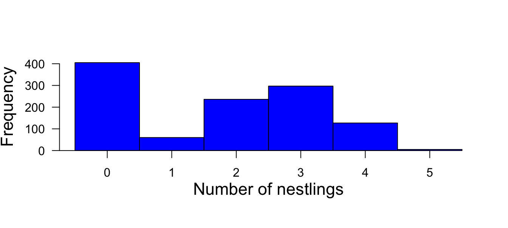

# Zero-inflated Poisson Mixed Model {#zeroinflated-poisson-lmm}

## Introduction
Usually we describe the outcome variable with a single distribution, such as the normal distribution in the case of linear (mixed) models, and Poisson or binomial distributions in the case of generalized linear (mixed) models. In life sciences, however, quite often the data are actually generated by more than one process. In such cases the distribution of the data could be the result of two or more different distributions. If we do not account for these different processes our inferences are likely to be biased. In this chapter, we introduce a mixture model that explicitly include two processes that generated the data. The zero-inflated Poisson model is a mixture of a binomial and a Poisson distribution. We belief that two (or more)-level models are very useful tools in life sciences because they can help uncover the different processes that generate the data we observe.

## Example data
We used the `blackstork` data from the `blmeco`-package. They contain the breeding success of Black-stork in Latvia. The data was collected and kindly provided by Maris Stradz. The data contains the number of nestlings of more then 300 [Black-stork](https://en.wikipedia.org/wiki/Black_stork) nests in different years.

Counting animals or plants is a typical example of data that contain a lot of zero counts. For example, the number of nestlings produced by a breeding pair is often zero because the whole nest was depredated or because a catastrophic event occurred such as a flood. However, when the nest succeeds, the number of nestlings varies among the successful nests depending on how many eggs the female has laid, how much food the parents could bring to the nest, or other factors that affect the survival of a nestling in an intact nest. Thus the factors that determine how many zero counts there are in the data differ from the factors that determine how many nestlings there are, if a nest survives. Count data that are produced by two different processes--one produces the zero counts and the other the variance in the count for the ones that were not zero in the first process--are called zero-inflated data. Histograms of zero-inflated data look bimodal, with one peak at zero (Figure \@ref(fig:histblackstork)).

(\#fig:histblackstork)Histogram of the number of nestlings counted in black stork nests *Ciconia nigra* in Latvia (n = 1130 observations of 279 nests).

## Model
The Poisson distribution does not fit well to such data, because the data contain more zero counts than expected under the Poisson distribution. Mullahy (1986) and Lambert (1992) formulated two different types of models that combine the two processes in one model and therefore account for the zero excess in the data and allow the analysis of the two processes separately.

The hurdle model (Mullahy, 1986) combines a left-truncated count data model (Poisson or negative binomial distribution that only describes the distribution of data larger than zero) with a zero-hurdle model that describes the distribution of the data that are either zero or nonzero. In other words, the hurdle model divides the data into two data subsets, the zero counts and the nonzero counts, and fits two separate models to each subset of the data. To account for this division of the data, the two models assume left truncation (all measurements below 1 are missing in the data) and right censoring (all measurements larger than 1 have the value 1), respectively, in their error distributions. A hurdle model can be fitted in R using the function hurdle from the package pscl (Jackman, 2008). See the tutorial by Zeileis et al. (2008) for an introduction.

In contrast to the hurdle model, the zero-inflated models (Mullahy, 1986; Lambert, 1992) combine a Bernoulli model (zero vs. nonzero) with a conditional Poisson model; conditional on the Bernoulli process being nonzero. Thus this model allows for a mixture of zero counts: some zero counts are zero because the outcome of the Bernoulli process was zero (these zero counts are sometimes called structural zero values), and others are zero because their outcome from the Poisson process was zero. The function `zeroinfl from the package pscl fits zero-inflated models (Zeileis et al., 2008).

The zero-inflated model may seem to reflect the true process that has generated the data closer than the hurdle model. However, sometimes the fit of zero-inflated models is impeded because of high correlation of the model parameters between the zero model and the count model. In such cases, a hurdle model may cause less troubles.

Both functions (hurdle and zeroinfl) from the package pscl do not allow the inclusion of random factors. The functions MCMCglmm from the package MCMCglmm (Hadfield, 2010) and glmmadmb from the package glmmADMB (http://glmmadmb.r-forge.r-project.org/) provide the possibility to account for zero-inflation with a GLMM. However, these functions are not very flexible in the types of zero-inflated models they can fit; for example, glmmadmb only includes a constant proportion of zero values. A zero-inflation model using BUGS is described in Ke ́ry and Schaub (2012). Here we use Stan to fit a zero- inflated model. Once we understand the basic model code, it is easy to add predictors and/or random effects to both the zero and the count model.

The example data contain numbers of nestlings in black stork Ciconia nigra nests in Latvia collected by Maris Stradz and collaborators at 279 nests be- tween 1979 and 2010. Black storks build solid and large aeries on branches of large trees. The same aerie is used for up to 17 years until it collapses. The black stork population in Latvia has drastically declined over the last decades. Here, we use the nestling data as presented in Figure 14-2 to describe whether the number of black stork nestlings produced in Latvia decreased over time. We use a zero-inflated Poisson model to separately estimate temporal trends for nest survival and the number of nestlings in successful nests. Since the same nests have been measured repeatedly over 1 to 17 years, we add nest ID as a random factor to both models, the Bernoulli and the Poisson model. After the first model fit, we saw that the between-nest variance in the number of nest- lings for the successful nests was close to zero. Therefore, we decide to delete the random effect from the Poisson model. Here is our final model:

zit is a latent (unobserved) variable that takes the values 0 or 1 for each nest i during year t. It indicates a “structural zero”, that is, if zit 1⁄4 1 the number of nestlings yit always is zero, because the expected value in the Poisson model lit(1   zit) becomes zero. If zit 1⁄4 0, the expected value in the Poisson model becomes lit.

To fit this model in Stan, we first write the Stan model code and save it in a separated text-file with name “zeroinfl.stan”.

Here is a handy package:
https://cran.r-project.org/web/packages/GLMMadaptive/vignettes/ZeroInflated_and_TwoPart_Models.html
