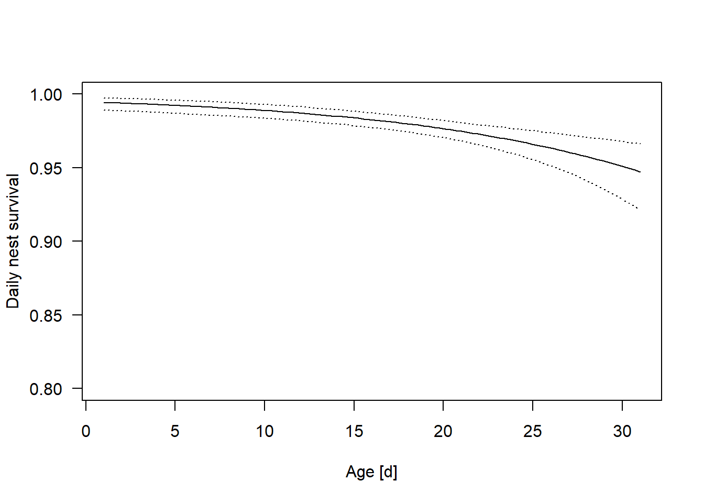

# Daily nest survival {#dailynestsurv}

## Background

Analyses of nest survival is important for understanding the mechanisms of population dynamics. The life-span of a nest could be used as a measure of nest survival. However, this measure very often is biased towards nests that survived longer because these nests are detected by the ornithologists with higher probability [@Mayfield1975]. Therefore, instead of estimating overall nest survival it is better to estimate daily nest survival conditional on survival to the previous day. 


## Models for estimating daily nest survival
Using a simple logistic regression with an indicator for whether a nest is alive or not at day $t$ is not appropriate for estimating nest survival because its result is directly dependent on the time point when the nest has been detected. This time point is not biologically relevant. The conditional logistic regression `clogit` from the `survival` package could be used to describe correlations of the mortality with environmental variables but it does not provide an estimate for the daily survival probability. 
A natural model that allows estimating daily nest survival is the known-fate survival model. It is a Markov model that models the state of a nest $i$ at day $t$ (whether it is alive, $y_{it}=1$ or not $y_{it}=0$) as a Bernoulli variable dependent on the state of the nest the day before.  
$$ y_{it} \sim Bernoulli(y_{it-1}S_{it})$$
The daily nest survival $S_{it}$ can be linearly related to predictor variables that are measured on the nest or on the day level.

$$logit(S_{it}) = \textbf{X} \beta$$
It is also possible to add random effects if needed.


## The Stan model {#dailynestsurvstan}
The following Stan model code is saved as `daily_nest_survival.stan`.


```stan
data {
  int<lower=0> Nnests;                  // number of nests
  int<lower=0> last[Nnests];            // day of last observation (alive or dead)
  int<lower=0> first[Nnests];           // day of first observation (alive or dead)
  int<lower=0> maxage;                  // maximum of last
  int<lower=0> y[Nnests, maxage];       // indicator of alive nests
  real cover[Nnests];                 // a covariate of the nest
  real age[maxage];                   // a covariate of the date
}

parameters {
  vector[4] b;                          // coef of linear pred for S
}

model {
  real S[Nnests, maxage-1];             // survival probability
                
  for(i in 1:Nnests){  
    for(t in first[i]:(last[i]-1)){ 
      S[i,t] = inv_logit(b[1] + b[2]*cover[i] + b[3]*age[t] + b[4]*pow(age[t], 2)); 
    }
  }

  // priors
  b[1]~normal(0,5);
  b[2]~normal(0,3);
  b[3]~normal(0,3);  
  b[4]~normal(0,3);

  // likelihood
  for (i in 1:Nnests) {
    for(t in (first[i]+1):last[i]){
      y[i,t]~bernoulli(y[i,t-1]*S[i,t-1]);
    }
  }
}

```


## Prepare data and run Stan

Read data DESCRIPTION OF ORIGIN INCL REFERENCE MISSING


```r
load("RData/nest_surv_data.rda")
str(datax)
```

```
## List of 7
##  $ y     : int [1:156, 1:31] 1 NA 1 NA 1 NA NA 1 1 1 ...
##  $ Nnests: int 156
##  $ last  : int [1:156] 26 30 31 27 31 30 31 31 31 31 ...
##  $ first : int [1:156] 1 14 1 3 1 24 18 1 1 1 ...
##  $ cover : num [1:156] -0.943 -0.215 0.149 0.149 -0.215 ...
##  $ age   : num [1:31] -1.65 -1.54 -1.43 -1.32 -1.21 ...
##  $ maxage: int 31
```

```r
datax$y[is.na(datax$y)] <- 0  # Stan does not allow for NA's in the outcome
```


```r
# Run STAN
library(rstan)

mod <- stan(file = "stanmodels/daily_nest_survival.stan", data=datax, 
            chains=5, iter=2500, control=list(adapt_delta=0.9), verbose = FALSE)
```

```
## 
## SAMPLING FOR MODEL 'daily_nest_survival' NOW (CHAIN 1).
## Chain 1: 
## Chain 1: Gradient evaluation took 0.001181 seconds
## Chain 1: 1000 transitions using 10 leapfrog steps per transition would take 11.81 seconds.
## Chain 1: Adjust your expectations accordingly!
## Chain 1: 
## Chain 1: 
## Chain 1: Iteration:    1 / 2500 [  0%]  (Warmup)
## Chain 1: Iteration:  250 / 2500 [ 10%]  (Warmup)
## Chain 1: Iteration:  500 / 2500 [ 20%]  (Warmup)
## Chain 1: Iteration:  750 / 2500 [ 30%]  (Warmup)
## Chain 1: Iteration: 1000 / 2500 [ 40%]  (Warmup)
## Chain 1: Iteration: 1250 / 2500 [ 50%]  (Warmup)
## Chain 1: Iteration: 1251 / 2500 [ 50%]  (Sampling)
## Chain 1: Iteration: 1500 / 2500 [ 60%]  (Sampling)
## Chain 1: Iteration: 1750 / 2500 [ 70%]  (Sampling)
## Chain 1: Iteration: 2000 / 2500 [ 80%]  (Sampling)
## Chain 1: Iteration: 2250 / 2500 [ 90%]  (Sampling)
## Chain 1: Iteration: 2500 / 2500 [100%]  (Sampling)
## Chain 1: 
## Chain 1:  Elapsed Time: 5.6274 seconds (Warm-up)
## Chain 1:                6.14757 seconds (Sampling)
## Chain 1:                11.775 seconds (Total)
## Chain 1: 
## 
## SAMPLING FOR MODEL 'daily_nest_survival' NOW (CHAIN 2).
## Chain 2: 
## Chain 2: Gradient evaluation took 0.000507 seconds
## Chain 2: 1000 transitions using 10 leapfrog steps per transition would take 5.07 seconds.
## Chain 2: Adjust your expectations accordingly!
## Chain 2: 
## Chain 2: 
## Chain 2: Iteration:    1 / 2500 [  0%]  (Warmup)
## Chain 2: Iteration:  250 / 2500 [ 10%]  (Warmup)
## Chain 2: Iteration:  500 / 2500 [ 20%]  (Warmup)
## Chain 2: Iteration:  750 / 2500 [ 30%]  (Warmup)
## Chain 2: Iteration: 1000 / 2500 [ 40%]  (Warmup)
## Chain 2: Iteration: 1250 / 2500 [ 50%]  (Warmup)
## Chain 2: Iteration: 1251 / 2500 [ 50%]  (Sampling)
## Chain 2: Iteration: 1500 / 2500 [ 60%]  (Sampling)
## Chain 2: Iteration: 1750 / 2500 [ 70%]  (Sampling)
## Chain 2: Iteration: 2000 / 2500 [ 80%]  (Sampling)
## Chain 2: Iteration: 2250 / 2500 [ 90%]  (Sampling)
## Chain 2: Iteration: 2500 / 2500 [100%]  (Sampling)
## Chain 2: 
## Chain 2:  Elapsed Time: 5.80243 seconds (Warm-up)
## Chain 2:                8.11391 seconds (Sampling)
## Chain 2:                13.9163 seconds (Total)
## Chain 2: 
## 
## SAMPLING FOR MODEL 'daily_nest_survival' NOW (CHAIN 3).
## Chain 3: 
## Chain 3: Gradient evaluation took 0.000676 seconds
## Chain 3: 1000 transitions using 10 leapfrog steps per transition would take 6.76 seconds.
## Chain 3: Adjust your expectations accordingly!
## Chain 3: 
## Chain 3: 
## Chain 3: Iteration:    1 / 2500 [  0%]  (Warmup)
## Chain 3: Iteration:  250 / 2500 [ 10%]  (Warmup)
## Chain 3: Iteration:  500 / 2500 [ 20%]  (Warmup)
## Chain 3: Iteration:  750 / 2500 [ 30%]  (Warmup)
## Chain 3: Iteration: 1000 / 2500 [ 40%]  (Warmup)
## Chain 3: Iteration: 1250 / 2500 [ 50%]  (Warmup)
## Chain 3: Iteration: 1251 / 2500 [ 50%]  (Sampling)
## Chain 3: Iteration: 1500 / 2500 [ 60%]  (Sampling)
## Chain 3: Iteration: 1750 / 2500 [ 70%]  (Sampling)
## Chain 3: Iteration: 2000 / 2500 [ 80%]  (Sampling)
## Chain 3: Iteration: 2250 / 2500 [ 90%]  (Sampling)
## Chain 3: Iteration: 2500 / 2500 [100%]  (Sampling)
## Chain 3: 
## Chain 3:  Elapsed Time: 7.47198 seconds (Warm-up)
## Chain 3:                6.89072 seconds (Sampling)
## Chain 3:                14.3627 seconds (Total)
## Chain 3: 
## 
## SAMPLING FOR MODEL 'daily_nest_survival' NOW (CHAIN 4).
## Chain 4: 
## Chain 4: Gradient evaluation took 0.000501 seconds
## Chain 4: 1000 transitions using 10 leapfrog steps per transition would take 5.01 seconds.
## Chain 4: Adjust your expectations accordingly!
## Chain 4: 
## Chain 4: 
## Chain 4: Iteration:    1 / 2500 [  0%]  (Warmup)
## Chain 4: Iteration:  250 / 2500 [ 10%]  (Warmup)
## Chain 4: Iteration:  500 / 2500 [ 20%]  (Warmup)
## Chain 4: Iteration:  750 / 2500 [ 30%]  (Warmup)
## Chain 4: Iteration: 1000 / 2500 [ 40%]  (Warmup)
## Chain 4: Iteration: 1250 / 2500 [ 50%]  (Warmup)
## Chain 4: Iteration: 1251 / 2500 [ 50%]  (Sampling)
## Chain 4: Iteration: 1500 / 2500 [ 60%]  (Sampling)
## Chain 4: Iteration: 1750 / 2500 [ 70%]  (Sampling)
## Chain 4: Iteration: 2000 / 2500 [ 80%]  (Sampling)
## Chain 4: Iteration: 2250 / 2500 [ 90%]  (Sampling)
## Chain 4: Iteration: 2500 / 2500 [100%]  (Sampling)
## Chain 4: 
## Chain 4:  Elapsed Time: 6.47079 seconds (Warm-up)
## Chain 4:                6.46567 seconds (Sampling)
## Chain 4:                12.9365 seconds (Total)
## Chain 4: 
## 
## SAMPLING FOR MODEL 'daily_nest_survival' NOW (CHAIN 5).
## Chain 5: 
## Chain 5: Gradient evaluation took 0.000556 seconds
## Chain 5: 1000 transitions using 10 leapfrog steps per transition would take 5.56 seconds.
## Chain 5: Adjust your expectations accordingly!
## Chain 5: 
## Chain 5: 
## Chain 5: Iteration:    1 / 2500 [  0%]  (Warmup)
## Chain 5: Iteration:  250 / 2500 [ 10%]  (Warmup)
## Chain 5: Iteration:  500 / 2500 [ 20%]  (Warmup)
## Chain 5: Iteration:  750 / 2500 [ 30%]  (Warmup)
## Chain 5: Iteration: 1000 / 2500 [ 40%]  (Warmup)
## Chain 5: Iteration: 1250 / 2500 [ 50%]  (Warmup)
## Chain 5: Iteration: 1251 / 2500 [ 50%]  (Sampling)
## Chain 5: Iteration: 1500 / 2500 [ 60%]  (Sampling)
## Chain 5: Iteration: 1750 / 2500 [ 70%]  (Sampling)
## Chain 5: Iteration: 2000 / 2500 [ 80%]  (Sampling)
## Chain 5: Iteration: 2250 / 2500 [ 90%]  (Sampling)
## Chain 5: Iteration: 2500 / 2500 [100%]  (Sampling)
## Chain 5: 
## Chain 5:  Elapsed Time: 6.54065 seconds (Warm-up)
## Chain 5:                6.73006 seconds (Sampling)
## Chain 5:                13.2707 seconds (Total)
## Chain 5:
```


## Check convergence

We love exploring the performance of the Markov chains by using the function `launch_shinystan` from the package `shinystan`. 

## Look at results
It looks like cover does not affect daily nest survival, but daily nest survival decreases with the age of the nestlings.


```r
print(mod)
```

```
## Inference for Stan model: daily_nest_survival.
## 5 chains, each with iter=2500; warmup=1250; thin=1; 
## post-warmup draws per chain=1250, total post-warmup draws=6250.
## 
##         mean se_mean   sd    2.5%     25%     50%     75%   97.5% n_eff
## b[1]    4.14    0.00 0.20    3.77    4.00    4.13    4.27    4.55  3731
## b[2]   -0.01    0.00 0.13   -0.25   -0.09   -0.01    0.08    0.25  5691
## b[3]   -0.67    0.00 0.16   -0.99   -0.77   -0.66   -0.55   -0.38  4164
## b[4]   -0.12    0.00 0.17   -0.45   -0.24   -0.13   -0.01    0.23  3318
## lp__ -299.07    0.03 1.42 -302.70 -299.77 -298.75 -298.03 -297.30  2668
##      Rhat
## b[1]    1
## b[2]    1
## b[3]    1
## b[4]    1
## lp__    1
## 
## Samples were drawn using NUTS(diag_e) at Sat Sep 21 10:39:37 2019.
## For each parameter, n_eff is a crude measure of effective sample size,
## and Rhat is the potential scale reduction factor on split chains (at 
## convergence, Rhat=1).
```


```r
# effect plot
bsim <- as.data.frame(mod)
nsim <- nrow(bsim)

newdat <- data.frame(age=seq(1, datax$maxage, length=100))
newdat$age.z <- (newdat$age-mean(1:datax$maxage))/sd((1:datax$maxage))
Xmat <- model.matrix(~age.z+I(age.z^2), data=newdat)
fitmat <- matrix(ncol=nsim, nrow=nrow(newdat))
for(i in 1:nsim) fitmat[,i] <- plogis(Xmat%*%as.numeric(bsim[i,c(1,3,4)]))
newdat$fit <- apply(fitmat, 1, median)
newdat$lwr <- apply(fitmat, 1, quantile, prob=0.025)
newdat$upr <- apply(fitmat, 1, quantile, prob=0.975)

plot(newdat$age, newdat$fit, ylim=c(0.8,1), type="l",
     las=1, ylab="Daily nest survival", xlab="Age [d]")
lines(newdat$age, newdat$lwr, lty=3)
lines(newdat$age, newdat$upr, lty=3)
```

<div class="figure">

<p class="caption">(\#fig:effplots)Estimated daily nest survival probability in relation to nest age. Dotted lines are 95% uncertainty intervals of the regression line.</p>
</div>


## Further reading {-}
ADD EXAMPLE STUDIES!!


