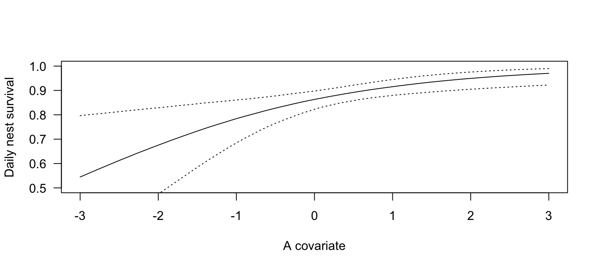

# Daily nest survival {#dailynestsurv}

## Background

Analyses of nest survival is important for understanding the mechanisms of population dynamics. The life-span of a nest could be used as a measure of nest survival. However, this measure very often is biased towards nests that survived longer because these nests are detected by the ornithologists with higher probability (@Mayfield1975). Therefore, instead of estimating overall nest survival it is better to estimate daily nest survival conditional on survival to the previous day. 


## Models for estimating daily nest survival
Using a simple logistic regression with an indicator for whether a nest is alive or not at day $t$ is not appropriate for estimating nest survival because its result is directly dependent on the time point when the nest has been detected. This time point is not biologically relevant. The conditional logistic regression `clogit` from the `survival` package could be used to describe correlations of the mortality with environmental variables but it does not provide an estimate for the daily survival probability. 
A natural model that allows estimating daily nest survival is the known-fate survival model. It is a Markov model that models the state of a nest $i$ at day $t$ (whether it is alive, $y_{it}=1$ or not $y_{it}=0$) as a Bernoulli variable dependent on the state of the nest the day before.  
$$ y_{it} \sim Bernoulli(y_{it-1}S_{it})$$
The daily nest survival $S_{it}$ can be linearly related to predictor variables that are measured on the nest or on the day level.

$$logit(S_{it}) = \textbf{X} \beta$$
It is also possible to add random effects if needed.


## The Stan model {#dailynestsurvstan}
The following Stan model code is saved as `daily_nest_survival.stan`.


```stan
data {
  int<lower=0> Nnests;                  // number of nests
  int<lower=0> last[Nnests];            // day of last observation (alive or dead)
  int<lower=0> maxage;                  // maximum of last
  int<lower=0> y[Nnests, maxage];       // indicator of alive nests
  real x[Nnests];                       // a covariate
}

parameters {
  vector[2] b;                          // coef of linear pred for S
}

model {
  real S[Nnests, maxage-1];             // survival probability
                
  for(i in 1:Nnests){  
    for(t in 1:(last[i]-1)){ 
      S[i,t] = inv_logit(b[1] + b[2]*x[i]); 
    }
  }

  // priors
  b[1]~normal(0,5);
  b[2]~normal(0,5);

  // likelihood
  for (i in 1:Nnests) {
    for(t in 2:last[i]){
      y[i,t]~bernoulli(y[i,t-1]*S[i,t-1]);
    }
  }
}
```


## Prepare data and run Stan

It would be much nicer to have a real data example!!

```r
library(rstan)

# Simulate fake data 
Nnests <- 50
maxage <-  30
x <- rnorm(Nnests)
b0 <- 2; b1 = 0.5
S <- matrix(NA, ncol=maxage-1, nrow=Nnests)
for(i in 1:Nnests) S[i,] <- plogis(b0+b1*x[i])
y <- matrix(NA, ncol=maxage, nrow=Nnests)
y[,1] <- 1
for(i in 1:Nnests){
  for(t in 2:maxage){
    y[i,t] <- rbinom(1, size=1, prob=y[i,t-1]*S[i,t-1])
  }
}

last <- apply(y, 1, sum)+1
last[last>30] <- 30

datax <- c("y", "Nnests", "last", "maxage", "x")

# Run STAN
mod <- stan(file = "stanmodels/daily_nest_survival.stan", data=datax, 
            chains=5, iter=2500, control=list(adapt_delta=0.9))
```


## Check convergence

We love exploring the performance of the Markov chains by using the function `launch_shinystan` from the package `shinystan`. 

## Look at results


```r
print(mod)
```

```
## Inference for Stan model: daily_nest_survival.
## 5 chains, each with iter=2500; warmup=1250; thin=1; 
## post-warmup draws per chain=1250, total post-warmup draws=6250.
## 
##         mean se_mean   sd    2.5%     25%     50%     75%   97.5% n_eff
## b[1]    1.98    0.00 0.16    1.67    1.87    1.97    2.08    2.30  4434
## b[2]    0.51    0.00 0.14    0.24    0.42    0.51    0.60    0.78  4248
## lp__ -146.30    0.02 1.04 -149.14 -146.70 -145.98 -145.57 -145.30  2355
##      Rhat
## b[1]    1
## b[2]    1
## lp__    1
## 
## Samples were drawn using NUTS(diag_e) at Tue Dec 11 22:56:12 2018.
## For each parameter, n_eff is a crude measure of effective sample size,
## and Rhat is the potential scale reduction factor on split chains (at 
## convergence, Rhat=1).
```


```r
# effect plot

bsim <- as.data.frame(mod)
nsim <- nrow(bsim)

newdat <- data.frame(x=seq(-3, 3, length=100))
Xmat <- model.matrix(~x, data=newdat)
fitmat <- matrix(ncol=nsim, nrow=nrow(newdat))
for(i in 1:nsim) fitmat[,i] <- plogis(Xmat%*%as.numeric(bsim[i,1:2]))
newdat$fit <- apply(fitmat, 1, median)
newdat$lwr <- apply(fitmat, 1, quantile, prob=0.025)
newdat$upr <- apply(fitmat, 1, quantile, prob=0.975)

plot(newdat$x, newdat$fit, ylim=c(0.5,1), type="l",
     las=1, ylab="Daily nest survival", xlab="A covariate")
lines(newdat$x, newdat$lwr, lty=3)
lines(newdat$x, newdat$upr, lty=3)
```

<div class="figure">

<p class="caption">(\#fig:effplots)Estimated daily nest survival probability in relation to a covariable x. Dotted lines are 95% uncertainty intervals of the regression line.</p>
</div>


## Further reading {-}
Can we add some example studies that have used the above model to estimate daily nest survival?


